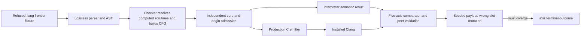

<user_constraints>
## User Constraints (from CONTEXT.md)

### Implementation Decisions

#### Computed scrutinee and source boundary

- **D-18-01:** Follow the ratified Phase 18 form: a linear body's terminal
  `match` may discriminate any in-scope place of a `data` type, including a
  value introduced by `let`; do not add `if`/`else` or a separate branch form.
  Keep the accepted type, arm, and body shape within the Phase 18 requirements.
- **D-18-02:** Start fixture-first. Check in the refused frontier `.lang`
  fixture and pin its current diagnostic before implementation; close by proving
  that diagnostic moved on the production source-to-core path.

#### Ownership, calls, and native evidence

- **D-18-03:** S-010 is answered clean by spike 007 for the specified CFG
  topology: the existing `edge` and `point` endpoint kinds suffice and the
  mutation control kills an invented third kind. Treat that as permission to
  plan, not as production-path proof; satisfy Phase 18 success criterion 4 on
  production code and retain the declared liveness work bound.
- **D-18-04:** Preserve all three CTL requirements. In particular, exercise a
  Result-returning callee across the existing five comparator axes, return a
  destructured payload place, and make the seeded wrong-slot write observable
  at `axis:terminal-outcome`. Do not substitute seam-only or prose-only proof
  for source-level fixtures and executable controls.
- **D-18-05:** Automate objective acceptance by default: add focused source,
  integration, differential, smoke, and mutation-kill checks where each has
  recurring regression value; run recurring checks in CI when their
  maintenance and runtime cost are justified. Reserve human UAT for judgment
  or access the agent cannot supply. This carries forward the user's standing
  GSD preference recorded in `.planning/PROJECT.md`.

### the agent's Discretion

Parser/core representation, helper boundaries, execution ordering, fixture
names, and test factoring are open to the planner, provided the requirements,
independent admission checks, existing endpoint vocabulary, five-axis evidence,
and zero-external-production-dependency constraint are preserved. Prefer one
authoritative control-flow law and do not retain a parallel legacy law.

### Deferred Ideas (OUT OF SCOPE)

- `if`/`else`, `Bool`, arithmetic operators, and loops remain outside M003 per
  the roadmap; do not pull them into this phase.
- Keep the source/API surface within the established single-argument and
  closed-data-alternative limits.
</user_constraints>

<phase_requirements>
## Phase Requirements

| ID | Description | Research Support |
|----|-------------|------------------|
| CTL-01 | A branch discriminates a value the function computed, not only the function's own parameter. | Extend the source fixture/parser/checking path and core scrutinee-place validation to admit a terminal match over an in-scope computed `data` place. |
| CTL-02 | A program that calls a `Result`-returning callee and matches on the result agrees across all five axes. | Reuse the call/type-contract and session differential harness; validate through interpreter, production C emitter, and independent admission peers. |
| CTL-03 | An arm returns a destructured payload place, and a seeded wrong-slot write is observed on a comparator axis, constructing D-12-43. | Extend payload return path and existing mutation harness so wrong-slot corruption changes `axis:terminal-outcome`; retain explicit mutation-kill evidence. |
</phase_requirements>

# Phase 18: Branch on a Computed Value - Research

**Researched:** 2026-09-24  
**Domain:** Go compiler front end, typed control-flow core, ownership liveness, interpreter and C17 backend  
**Confidence:** HIGH for in-repository architecture and constraints; MEDIUM for implementation sizing because no production computed-scrutinee path exists yet.

## Summary

Phase 18 is a source-to-native control-flow extension. The language already parses a terminal `match`, creates arm blocks, propagates ownership facts, interprets the resulting core, and emits branch-shaped native C. The key restriction is admission: today the checker requires the scrutinee name to equal the function parameter, the core validators encode that same assumption, and the branch builder seeds arm analysis from that parameter. Generalizing the source syntax alone would leave the production path unsound or unreachable. [VERIFIED: `internal/compiler/check/check.go:295-330`; `internal/compiler/corevalidate/corevalidate.go:891-949`; `internal/compiler/check/check.go:2211-2238`]

The clean S-010 spike establishes a useful but narrow result: for the probed CFG topology, existing `edge` and `point` loan endpoints classify a pre-branch loan whose use differs across arms, and an injected third endpoint kind is rejected. It does not exercise source parsing, production CFG construction, core validation, execution, or native lowering. Phase 18 must therefore carry the same shape through the real source pipeline and respect the existing fail-closed liveness work bound. [VERIFIED: `.planning/spikes/007-loan-across-branch/README.md`; `internal/compiler/check/check.go:2714-2732,2784-2852`]

Plan fixture-first: add a refused `.lang` frontier program and assert its current diagnostic before changing production admission, then prove the pinned refusal moves through production parsing/checking. Keep separate source witnesses for a computed `data` binding, a called `Result` value, a destructured payload return, and the borrow-across-branch topology where factoring them together would obscure which claim failed. Make the wrong-slot mutation observable specifically through the terminal outcome axis; the existing payload probe documents an older blind spot where alternative tags agreed despite corrupted payload bytes. [VERIFIED: `.planning/phases/18-branch-on-a-computed-value/18-CONTEXT.md:25-50`; `.planning/ROADMAP.md:140-151`; `internal/compiler/session/session_payload_control_test.go:220-277`]

**Primary recommendation:** Preserve one terminal `match` control-flow law and extend each independent admission/execution layer to reason about the actual scrutinee place and its type/liveness. Keep the Go standard-library implementation and installed Clang native path; extend existing tests, comparator, and CI aggregate only for recurring checks with justified cost. [VERIFIED: `AGENTS.md` project/workflow constraints; `.planning/config.json`; `.github/workflows/ci.yml:35-79`]

## Architectural Responsibility Map

| Capability | Primary Tier | Secondary Tier | Rationale |
|------------|-------------|----------------|-----------|
| Parse terminal match over computed place | Compiler frontend (syntax/AST) | — | Parser currently records a named scrutinee and terminal match shape; keep new syntax inside the existing form. |
| Resolve scrutinee name/type and construct CFG | Semantic checker | — | `checkBranch` creates typed places, blocks, edges, and arm operations. |
| Independently admit computed-place invariants | Core validator and origin validator | — | Both are independent production admission boundaries; neither should rely on checker-only facts. |
| Preserve borrow validity through prefix and arms | Checker liveness/endpoint analysis | Core validation | Production run must retain `point`/`edge` endpoint vocabulary and the checked work ceiling. |
| Execute and compare results | Interpreter/session evidence harness | Independent execution peer | The interpreter is the semantic oracle; peer admission and five-axis comparison guard against producer-only agreement. |
| Lower branches and payload returns | `cgen` program emitter | Installed Clang | `emitProgram` is the native path used for new source-to-native evidence. |

## Standard Stack

### Core

| Library/tool | Version | Purpose | Why Standard |
|--------------|---------|---------|--------------|
| Go toolchain | 1.24 (module declares `go 1.24`) | Compiler, validators, interpreter, test harness | Project bootstrap/runtime decision; standard-library-only production dependency policy. |
| Installed Clang | Host-provided; current research host reports Apple clang 21.0.0 | Compile emitted C17 for native comparison | Existing native backend contract and CI's explicit `clang --version` gate. |

### Supporting

| Library/tool | Version | Purpose | When to Use |
|--------------|---------|---------|-------------|
| Go standard library | Go 1.24 toolchain | Parser/compiler/test implementation | All production code; no new external production package is allowed by context. |
| GitHub Actions | Existing workflow | Recurring macOS/Linux verification | Run focused recurring checks in existing jobs only when runtime and maintenance cost justify it. |

### Alternatives Considered

| Instead of | Could Use | Tradeoff |
|------------|-----------|----------|
| Existing terminal `match` law | New `if`/`else` or second branch form | Out of scope and creates a second control-flow law before the first serves computed values. |
| Go stdlib / existing C emitter | New parser, CFG, or codegen dependency | No demonstrated value; violates the zero-external-production-dependency constraint. |

**Installation:** None. Use the repository Go toolchain and installed Clang.

## Architecture Patterns

### System Architecture Diagram

### Recommended Project Structure

Use existing ownership boundaries; add Phase 18 `.lang` fixtures under a dedicated `testdata/phase18/` directory if consistent with current phase fixture organization, and add focused tests beside the owning package (`syntax`, `check`, `corevalidate`, `originvalidate`, `interp`, `cgen`, `session`). Do not create a parallel matcher or test-only semantic implementation. [VERIFIED: `.planning/phases/18-branch-on-a-computed-value/18-CONTEXT.md:103-113`; existing packages and fixtures under `internal/compiler/` and `testdata/phase12`, `testdata/phase17`]

### Pattern 1: Fixture-first admission frontier

**What:** Check in a source fixture for the exact computed-place behavior while it still refuses, and pin the diagnostic. Then extend production code and change the same end-to-end expectation to prove the frontier moved.

**When to use:** Before production implementation of every CTL behavior; the milestone constructibility gate explicitly requires the fixture and diagnostic first. [VERIFIED: `.planning/REQUIREMENTS.md:13-21`; `.planning/phases/18-branch-on-a-computed-value/18-CONTEXT.md:25-31`]

**Example:** Use the current `check` refusal for a non-parameter match scrutinee as the pinned starting point; later require parsing, checking, core admission, and execution to reach the fixture's intended branch. The exact diagnostic must be taken from the test run and source of truth during planning, not guessed here. [VERIFIED: `internal/compiler/check/check.go:307-308`]

### Pattern 2: Extend all admission peers independently

**What:** Update checker construction and each independent validator's own derivation so an admitted core program cannot exploit a checker-only computed-scrutinee assumption. [VERIFIED: `.planning/phases/18-branch-on-a-computed-value/18-CONTEXT.md:40-44`; `.planning/spikes/007-loan-across-branch/README.md`]

**When to use:** Whenever computed places affect ownership, type identity, arm aliases, payload origin, or return paths.

### Pattern 3: Make the mutation fail on the promised axis

**What:** Seed the existing wrong-slot write through the actual emitted branch/payload route, assert injection occurred, and compare the resulting engines. Require disagreement at `axis:terminal-outcome`; a mutation that merely changes generated text or an internal seam is insufficient. [VERIFIED: `internal/compiler/session/session_payload_control_test.go:220-277`; `internal/compiler/session/session_phase5_compare.go:14-27`]

**When to use:** CTL-03 and any recurring guard claimed as mutation-killed.

### Anti-Patterns to Avoid

- **Relaxing only the checker's parameter-name guard:** validators still refuse or misclassify computed scrutinees, leaving the feature unreachable or peer-invalid.
- **Treating spike 007 as production acceptance:** it uses an already-authored CFG topology and does not prove a source fixture reaches that CFG.
- **Seam-only mutation evidence:** does not prove a source-level payload corruption is observed by a comparator axis.
- **Maintaining old and generalized control-flow laws in parallel:** creates split semantics and delayed drift.
- **Adding features excluded by the phase boundary:** no `if`/`else`, `Bool`, arithmetic, loops, aggregates, arity-N calls, or separate compilation.

## Don't Hand-Roll

| Problem | Don't Build | Use Instead | Why |
|---------|-----------|-------------|-----|
| Branch CFG construction | A second CFG builder or alternative branch IR | Extend `checkBranch` and the existing `core.Block`/`core.Edge` representation | The existing checker already constructs arm blocks, join edges, and liveness inputs. |
| Borrow-across-branch reasoning | A new endpoint kind or per-arm state merge without a failing production witness | Existing `loanLivenessFixpoint` and `materializeLoanEndpoints` with current `point`/`edge` kinds | Spike 007's tested topology passes and kills a third-kind mutation; production source path still must rerun it. |
| Cross-engine acceptance | A new comparator or a reduced subset of outcome fields | Existing session differential/evidence path | The requirement explicitly preserves five axes, including diagnostic ID and exit status. |
| Native branch lowering | A feature-specific emitter alongside the unified emitter | Existing `emitProgram` / `emitProgramFunction` path | Phase 16 established the surviving native emission law. |
| Payload slot validation | A hand-written expected-output check alone | Existing payload mutation injector plus comparator divergence | Must prove a seeded fault is detected and identify the promised axis. |

**Key insight:** The difficult part is carrying a computed place's identity, type, payload, and loan liveness consistently through checker construction, independent validators, interpreter, and the sole native emitter.

## Common Pitfalls

### Pitfall 1: Scrutinee type is still derived from the parameter

**What goes wrong:** A computed result is parsed but branch arms are checked against the parameter's `data` alternatives or core validation insists it is the parameter.

**Why it happens:** Current `check` looks up `types[function.Parameter.Type.Constructor]` and rejects a body scrutinee that differs from `function.Parameter.Name`; core validator contains equivalent parameter equality guards. [VERIFIED: `internal/compiler/check/check.go:295-308`; `internal/compiler/corevalidate/corevalidate.go:891-949`]

**How to avoid:** Plan explicit independent tests where parameter and computed scrutinee have distinguishable identities, and validators resolve the named place and its type from admitted facts.

**Warning signs:** Checker accepts a test-built core that `corevalidate` or `originvalidate` rejects; Result-returning-callee fixture cannot reach comparator.

### Pitfall 2: Shared prefix places invalidate arm-local uniqueness reasoning

**What goes wrong:** Each arm gets an independent alias, but prefix places and loan facts are absent or collide in the flattened global place/operation ordering.

**Why it happens:** Existing `analyzeArmBody` comments justify disjoint arm places because each arm starts with a fresh alias of the parameter; computed terminal match requires a straight-line prefix. [VERIFIED: `internal/compiler/check/check.go:2961-2994`]

**How to avoid:** Preserve stable globally unique place/operation ordinals; model prefix and arm CFG ownership inputs explicitly; include one loan created before the match and used in exactly one arm.

**Warning signs:** Duplicate IDs, arm-specific false use-after-move, dropped pre-branch loan endpoints, or fixpoint hits `check.loan_liveness_bound_exceeded`.

### Pitfall 3: Endpoint spike result is overgeneralized

**What goes wrong:** S-010 is called closed without running its fixture on the production source-to-core path.

**Why it happens:** The spike validates an explicit CFG algorithm test, not computed match admission.

**How to avoid:** Preserve criterion 4: source `borrow` before the computed branch, live in exactly one arm; production endpoint kinds remain existing `point` and `edge`; fixpoint terminates within `4 × blocks × (loans+1)`. [VERIFIED: `.planning/ROADMAP.md` Phase 18 success criterion 4; `.planning/spikes/007-loan-across-branch/README.md`; `internal/compiler/check/check.go:2714-2732`]

### Pitfall 4: Wrong-slot corruption does not affect terminal outcome

**What goes wrong:** Mutation is injected, but comparator sees the same result because a payload-carrying return is projected to its alternative tag.

**Why it happens:** The existing Phase 12 probe documents that payload corruption was invisible on the terminal axis in its tested shape. [VERIFIED: `internal/compiler/session/session_payload_control_test.go:220-277`]

**How to avoid:** Build CTL-03 so the arm returns the destructured payload place and terminal evidence exposes its bytes/value; require a precise terminal-axis disagreement and an anti-vacuity count for the mutation.

### Pitfall 5: Five-axis claim is only four execution axes

**What goes wrong:** A test calls only `Phase5CompareEngines` and describes the result as covering all five axes.

**Why it happens:** Execution comparison covers four execution-bearing axes; reject-program diagnostic IDs use the companion comparator path. [VERIFIED: `internal/compiler/session/session_phase5_compare.go:14-27,66-89`]

**How to avoid:** CTL-02's accepted execution fixture must use the established full session/program comparator and peer validation; keep diagnostic-ID refusal controls for the frontier fixture.

## Code Examples

No external code examples apply. Existing in-repository patterns to extend:

- AST models `Body` as a closed match/linear shape and `MatchExpr` stores the scrutinee identifier. [VERIFIED: `internal/compiler/ast/ast.go:101-117`]
- `checkBranch` creates a linear body, CFG entry/join, arm blocks, and edges. Extend this representation for a prefix rather than adding a second branch abstraction. [VERIFIED: `internal/compiler/check/check.go:2211-2250`]
- Liveness is bounded and refuses with a named diagnostic instead of returning partial facts. Keep that fail-closed behavior. [VERIFIED: `internal/compiler/check/check.go:2780-2852`]
- The session comparison path validates evidence and compares engine pairs. [VERIFIED: `internal/compiler/session/session_phase5_compare.go:66-106`]

## State of the Art

Not applicable as an external framework survey: this is an internal compiler-semantics phase with locked in-repository architecture and no external dependencies. The current boundary is that terminal matches parse, but source admission only recognizes the parameter as a scrutinee. [VERIFIED: `internal/compiler/ast/ast.go:101-117`; `internal/compiler/check/check.go:295-330`]

## Assumptions Log

| # | Claim | Section | Risk if Wrong |
|---|-------|---------|---------------|
| A1 | A dedicated `testdata/phase18/` directory is the clearest place for new phase fixtures. | Architecture Patterns | Low; follow established testdata phase grouping if another local convention applies. |
| A2 | A fast recurring CI lane should run focused CTL acceptance tests while broader Go/race suites retain whole-repository safety. | Validation Architecture | Medium; measure added test cost and use CI only where recurring regression value exceeds maintenance/runtime cost, per D-18-05. |

## Resolved Planning Questions

1. **Source grammar for a terminal match after a linear prefix — RESOLVED.**
   Extend the existing `Body` representation with one narrowly scoped terminal
   branch field/variant alongside its current linear prefix. Keep terminal
   `match` as the only branch law and preserve spans through the existing
   lossless parser. Wave 0 freezes the accepted source shape by checking in the
   refused computed-place fixture and pinning the current checker diagnostic;
   Plan 02 moves that same fixture through the production parser/checker.
   Evidence: `ast.Body` is currently a closed `MatchExpr`/`Linear` form and the
   parser round-trip test already exercises generated branch bodies;
   `18-01-PLAN.md` pins before admission changes and `18-02-PLAN.md` extends the
   existing body representation rather than adding `if`/`else` or another CFG
   law. Preserve this as the implementation boundary if the exact parser
   spelling changes while producing the pinned fixture.

2. **Core location for prefix operations — RESOLVED.**
   Lower the linear-prefix operations into the existing core entry block before
   its terminal `Match`; do not add a parallel prefix block or second branch
   representation. Preserve stable global operation/place ordinals across the
   prefix and all arms. `corevalidate` and `originvalidate` must independently
   derive the resulting place/type/ownership/origin facts from the admitted
   core inputs. Evidence: `checkBranch` already owns entry/join/arm block
   construction, core already represents the terminal match, and the two peers
   intentionally keep independent admission boundaries. Plans 02, 03, and 06
   make those three obligations explicit.

3. **Observable wrong-slot mutation route — RESOLVED.**
   The CTL-03 source fixture will match a computed data value, destructure the
   selected payload, and return that payload place. The full session evidence
   path must put a stable representation of the returned payload value/bytes
   into the terminal outcome compared by `Phase5CompareEngines`. Existing
   comparison checks `Outcome.Value`, but the Phase 12 mutation witness records
   that the current payload-return projection exposes only the alternative tag
   and therefore cannot observe the wrong-slot write. Plan 05 consequently
   extends the CTL-03 session evidence projection/adapters as needed, within the
   existing language construct and session evidence boundary, until the seeded
   write produces exactly `axis:terminal-outcome`; its unmutated companion must
   agree and injection must be positive. Evidence: `session_phase5_compare.go`
   compares `Outcome.Value`; `session_payload_control_test.go` documents the
   current tag-only blind spot and the mutation seam. No new language construct
   or relaxation of CTL-03 is permitted.

## Environment Availability

| Dependency | Required By | Available | Version | Fallback |
|------------|------------|-----------|---------|----------|
| Go | Compiler and test suite | Yes | go1.24.0 on research host; `go.mod` declares 1.24 | None; this is the project host runtime. |
| Clang | Native C17 execution and differential tests | Yes | Apple clang 21.0.0 on research host | CI currently fails loudly if unavailable; do not count native evidence as passed without it. |
| GitHub Actions | macOS/Linux recurring checks | Configured in repo | Existing workflow | Local focused checks aid iteration; CI still provides cross-host evidence. |

## Validation Architecture

### Test Framework

| Property | Value |
|----------|-------|
| Framework | Go `testing` package (Go 1.24) |
| Config file | `go.mod`; GitHub Actions config at `.github/workflows/ci.yml` |
| Quick run command | `go test ./internal/compiler/syntax ./internal/compiler/check ./internal/compiler/corevalidate ./internal/compiler/originvalidate -count=1` |
| Full suite command | `go test ./...` and `go test -race ./...` |

### Phase Requirements → Test Map

| Req ID | Behavior | Test Type | Automated Command | File Exists? |
|--------|----------|-----------|-------------------|-------------|
| CTL-01 | Computed in-scope `data` place is matched after a binding; pinned refusal moves through production parsing/checking; interpreter/native result agrees. | Fixture, unit, integration, differential | `go test ./internal/compiler/check ./internal/compiler/session -count=1` | No — fixture and named tests are Wave 0 |
| CTL-02 | Result-returning callee output is matched and admitted across interpreter, `-O0`, `-O3`, `-O3 -flto`; all five axes and independent peer checks are exercised. | Integration, differential, smoke | `go test ./internal/compiler/session -count=1` | No — add source fixture and test |
| CTL-03 | Destructured payload place returns; seeded wrong-slot write is injected and causes `axis:terminal-outcome` mismatch. | Integration, mutation-kill | `go test ./internal/compiler/session -count=1` | No — add fixture/control |
| S-010 production rerun | Pre-match borrow live in exactly one arm uses existing endpoints and bounded fixpoint on production source path. | Source integration, ownership | `go test ./internal/compiler/check ./internal/compiler/session -count=1` | Existing spike is CFG-only; production source test is new |

**Axis note:** `Phase5CompareEngines` covers the four execution-bearing axes, while diagnostic-ID comparison covers refusal equivalence. CTL-02's “all five” acceptance must use the established full session/program comparator and its peer validation, not a bare engine helper. [VERIFIED: `internal/compiler/session/session_phase5_compare.go:14-27,66-89`]

### Sampling Rate

- **Per task commit:** run the narrow owning-package test(s) for the changed parser/checker/validator/backend path.
- **Per wave merge:** run Phase 18 computed-place and mutation-kill session tests plus `go test ./...`.
- **Phase gate:** `go vet ./...`, `go build ./...`, `go test ./...`, `go test -race ./...`, and native differential tests on available Clang; recurring macOS/Linux checks already exist in CI. Do not turn whole-suite evidence into a human-only UAT step.

### Wave 0 Gaps

- [ ] Add and pin the refused CTL-01 computed-place `.lang` frontier fixture before production admission changes.
- [ ] Add source fixtures for Result-returning computed match, payload-place arm return, and pre-branch loan live in one arm.
- [ ] Add focused tests for requirement acceptance, peer behavior, and wrong-slot mutation axis movement.
- [ ] Ensure all five comparator axes are covered by the full evidence route; `Phase5CompareEngines` alone is four execution axes.

## Security Domain

Security enforcement is enabled in `.planning/config.json`; this phase has no authentication/session/cryptography surface. Its relevant security boundary is untrusted source text and generated native code.

### Applicable ASVS Categories

| ASVS Category | Applies | Standard Control |
|---------------|---------|-----------------|
| V2 Authentication | No | No authentication or identity boundary is introduced. |
| V3 Session Management | No | No session state is introduced. |
| V4 Access Control | No | No authorization policy is introduced. |
| V5 Input Validation | Yes | Keep parser/compiler limits and independent typed-core admission; malformed or forged core must fail closed. |
| V6 Cryptography | No | No cryptographic operation is introduced. |

### Known Threat Patterns for compiler and native backend

| Pattern | STRIDE | Standard Mitigation |
|---------|--------|---------------------|
| Malicious source drives unbounded parsing or CFG/liveness work | Denial of service | Retain input/AST limits, max block bound, cycle refusal, and work bound `4 × blocks × (loans+1)`; never accept partial liveness results. |
| Checker admits a computed-place core that an independent peer interprets differently | Tampering / Elevation of privilege | Independently derive scrutinee place/type/ownership facts in core and origin validators; mutation controls must prove guards fail. |
| Wrong payload field emitted by native code | Tampering | Differentially execute seeded wrong-slot control and require terminal-outcome divergence, alongside correct native/interpreter agreement. |

## Project Constraints (from AGENTS.md)

- Codename Lang targets AI-authored, human-audited production software, with a first milestone focused on one source-to-native semantic spine.
- Optimize total generate/verify/run/observe/repair latency; report cold and warm distributions rather than one favorable sample when measuring.
- Safe code must have defined behavior; optimizer and FFI guarantees derive from checked facts.
- Keep ownership, borrowing, deterministic cleanup, target layout, and C interop in scope as first-class concerns.
- Go 1.24 standard library hosts Stage 0; readable C17 emitted to installed Clang is the development native path.
- Prefer standard-library-only and shallow audited boundaries; every dependency must justify itself.
- Text remains Git-friendly and formatter-owned; parsing should preserve comments and stable recovery.
- Distinguish deterministic fixtures, negative controls, properties, mutation, differential execution, and sanitizers, with explicit cost lanes.
- Initial host priorities are macOS and Linux; avoid encoding current Apple arm64 facts into target-neutral contracts.
- Keep untrusted input, unsafe operations, FFI, secrets, and build authority explicit.
- Before file-changing work, start through GSD (`$gsd-quick`, `$gsd-debug`, or `$gsd-execute-phase`); do not edit directly outside a GSD workflow unless explicitly asked.

## Sources

### Primary (HIGH confidence)

- `.planning/phases/18-branch-on-a-computed-value/18-CONTEXT.md` — locked scope, S-010 production rerun, automated acceptance, and implementation discretion.
- `.planning/ROADMAP.md` Phase 18 and pre-phase spike section — hard gate, contingency, success criteria, and liveness bound.
- `.planning/REQUIREMENTS.md` Control section — exact CTL-01 through CTL-03 requirements.
- `.planning/spikes/007-loan-across-branch/README.md` — validated scope and mutation witness for S-010.
- `.planning/research/M003/ADVERSARIAL-SYNTHESIS.md` — risk analysis; its earlier concern is addressed only for the tested topology, consistent with the later spike and locked context.
- `internal/compiler/ast/ast.go`, `internal/compiler/syntax/parser.go`, `internal/compiler/check/check.go` — source surface, parameter-only scrutinee guard, CFG and liveness.
- `internal/compiler/core/core.go`, `internal/compiler/corevalidate/`, `internal/compiler/originvalidate/` — core representation and independent admission peers.
- `internal/compiler/interp/`, `internal/compiler/cgen/cgen_program.go` — interpreter and production native lowering.
- `internal/compiler/session/session_phase5_compare.go`, `session_payload_control_test.go` — comparator axes and wrong-slot observability precedent.
- `.github/workflows/ci.yml`, `go.mod` — recurring host/test lanes and toolchain declaration.

## Metadata

**Confidence breakdown:**
- Standard stack: HIGH — repository module, AGENTS constraints, workflow, and host probes read directly.
- Architecture: HIGH — code paths and current guards inspected in source.
- Pitfalls: HIGH for documented assumptions and prior failure shape; MEDIUM for precise implementation effort.

**Research date:** 2026-09-24  
**Valid until:** 2026-10-24; re-read source if it changes before planning.
