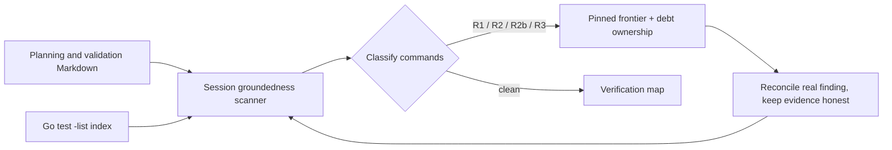

# Phase 20: Nyquist, D-13-34, and the Frontier Fixture — Research

**Researched:** 2026-09-25  
**Domain:** Go compiler validation infrastructure, project evidence/debt records, refused Lang source fixtures  
**Confidence:** HIGH for repository state, implementation seams, and the source-derived 13-item PRC-02 start population

## User Constraints

No Phase 20 `CONTEXT.md` was present when research began. The phase scope and gates below come from the roadmap and milestone requirements.

## Summary

Phase 20 is a repository-evidence phase, not a library or language-runtime build phase. Use the existing Go standard-library test harness and Phase 14's executable groundedness instrument to reconcile the specified archived evidence. Keep `go test ./...` and targeted package tests as the verification path; do not install dependencies. Phase 14's validation file identifies the stdlib `go test` harness and gives the full suite command. [VERIFIED: `.planning/phases/14-evidence-instrument-and-honest-scoping/14-VALIDATION.md:15-25`]

At research start, the Phase 14 instrument passed with **R1=0, R2=0, R3=0, R2b=23 post-reconciliation**, across **639 enforced-tier documents and 708 verification commands**. Its raw per-branch discovery subtest reported **24 R2b findings**; the reconciliation test excluded one already reconciled record. These are historical research-time numbers, not a required Phase 20 execution-start state. After Phase 20 planning documents were added, a 2026-09-25 scan measured **R2=10, R2b=25, 651 documents, 737 commands** and the global pin was red. Re-run the scan immediately before execution, preserve both snapshots separately, and assert a green exact pin only after the Phase 20 findings are reconciled. The original passing research run and its log fields are in `verification_groundedness_test.go`. [VERIFIED: `internal/compiler/session/verification_groundedness_test.go:1137-1145,2060-2083,2190-2222`]

There are currently **11 VALIDATION files with `status: draft`** under `.planning`, not just the specifically named 07/08/11 plus the inline 12/13 files. A filesystem scan found Phase 14, 17, 18, 19, and several archived M001/M002 validation files among them. The plan must account for every remaining draft file or explain from authoritative evidence why the criterion's scope excludes it; do not silently report the criterion met after touching only five files. The draft inventory is reproduced in this research's Evidence Baseline section.

**Primary recommendation:** Start the implementation plans with the exact EVD-01 frontier and 13-item debt baseline; reconcile and verify old evidence against current tests and language reachability; check in the exact checksum-intent source already replayed against the M003-open and current checkers, with its historical reconstruction labeled truthfully; make the 112-program closure key depend on every declared input while never caching a pass/fail verdict; and keep only D-13-34's durable choice behind the explicit human checkpoint.

## Architectural Responsibility Map

| Capability | Primary Tier | Secondary Tier | Rationale |
|------------|-------------|----------------|-----------|
| Validation-command discovery and R1/R2/R2b/R3 classification | Go test/session evidence harness | `.planning` Markdown | The executable scanner, classifiers, pinned frontier, and reconciliation ownership map live in `internal/compiler/session/verification_groundedness_test.go`. |
| VALIDATION status and evidence reconciliation | Planning documents | Go session test gate | Docs carry commands and lifecycle metadata; the instrument classifies evidence and guards the frontier. |
| Held-out move/borrow structural distinctness | Go session test harness | `testdata/phase6` Lang corpus | `session_phase6_injectors_test.go` reads both fixture classes and computes an identifier-independent summary. |
| Refused checksum frontier | Lang source fixture | Go session test harness / checker | `examples/checksum.lang` is the planned long-term source path; a Go test should pin the current refusal and prove it differs from the M003-open diagnostic. |
| Enumerated-closure proof reuse | Go session test harness | Existing stdlib cache package | The expensive `enumerated-closure` subtest currently walks the generated closure and runs three-engine agreement; `internal/compiler/cache` already exposes declared-input content keys and artifact-only storage. |
| Unowned debt cap | Debt registers and generated claims view | Go session debt-register gate | The register parser already validates item shape and ownership vocabulary, but research found no PRC-02 count assertion in that gate. |

## Evidence Baseline and Required Start Counts

### EVD-01 frontier

- Targeted baseline passed: `GOCACHE=/private/tmp/phase20-gocache go test ./internal/compiler/session -run 'TestVerificationGroundedness(FrontierIsPinned|ThreeClassesAreEmpty)$' -count=1 -v`.
- The logged post-reconciliation measure is **R1=0, R2=0, R3=0, R2b=23**; the same run reports **639 enforced-tier documents and 708 verification commands**. [VERIFIED: `internal/compiler/session/verification_groundedness_test.go:2190-2222`]
- The raw branch scan reports **24 R2b**. This is discovery before reconciled-record exclusions, not a substitute for the pinned 23 residual. [VERIFIED: `internal/compiler/session/verification_groundedness_test.go:2060-2083`]
- The current 23 residuals include Phase 19's new command cells (lines 48–55 of its validation map), so Phase 20 must re-run the lint after each documentation change and update the pinned frontier/ownership map only from the newly measured set. [VERIFIED: `internal/compiler/session/verification_groundedness_test.go:1292-1299,2139-2146`]

### VALIDATION lifecycle

A scan of `.planning/**/*-VALIDATION.md` found **19 files with a `status` field: 11 draft, 4 validated, 3 complete, and 1 planned**. The draft paths at phase start are:

```text
.planning/phases/14-evidence-instrument-and-honest-scoping/14-VALIDATION.md
.planning/phases/17-return-type-parameter-type/17-VALIDATION.md
.planning/phases/18-branch-on-a-computed-value/18-VALIDATION.md
.planning/phases/19-numeric-literals-and-opconst/19-VALIDATION.md
.planning/milestones/M002-phases/07-calls-signatures-and-call-graph-refusal/07-VALIDATION.md
.planning/milestones/M002-phases/08-interprocedural-loan-liveness-in-check/08-VALIDATION.md
.planning/milestones/M002-phases/11-multi-function-native-emission-and-interprocedural-equivalen/11-VALIDATION.md
.planning/milestones/M002-phases/12-result-payloads/12-VALIDATION.md
.planning/milestones/M002-phases/13-agent-loop-for-interprocedural-defects/13-VALIDATION.md
.planning/milestones/M001-phases/05-native-equivalence-and-adversarial-evidence/05-VALIDATION.md
.planning/milestones/M001-phases/06-agent-feedback-and-performance-ratification/06-VALIDATION.md
```

This inventory is a live filesystem observation, not a committed test output; refresh it before planning/execution. Roadmap criteria explicitly call out reconciliation for 07/08/11 and inline metadata flips for 12/13, but the absolute criterion says zero draft files. [VERIFIED: `.planning/ROADMAP.md:634-639`]

### Debt baseline and denominator risk

- Phase 14's generated `.planning/UNREACHABLE-CLAIMS.md` currently contains **8 table rows with an `UNOWNED(...)` landing value** (among the visible WIRED claim rows); this is one useful live-claim count, not proven to be PRC-02's complete denominator.
- Parsing every historical `*-DEBT.md` table row in the current tree found **40 `UNOWNED(...)` cells** across 19 registers. That broader number includes archival M001/M002 rows which predate the M003 well-formedness rules and conflicts with the roadmap's statement that M002 closed with ten. Do not substitute the raw 40 for PRC-02 without resolving this scope mismatch.
- The current PRC-01 gate `TestDebtRegistersAreWellFormed` validates register shape and ownership-field syntax; its source contains no explicit five-item count assertion. The milestone audit and current `STATE.md` record **10 open, unowned debt items entering M003**. [VERIFIED: `internal/compiler/session/session_test.go:3039-3071`; `.planning/STATE.md:531-533`; `.planning/ROADMAP.md:655-657`]
- **Resolved A1, 2026-09-25:** the M002 audit §4 names the authoritative starting cohort of ten IDs. Current register rows show six of those still `UNOWNED`: D-10-C04, D-11-02, D-11-27, D-12-36, D-12-43, D-13-34. D-11-51 and D-12-21 are `CLOSED(15ee061)`; D-13-02b and D-13-10a have P17 landings. The live M003 register adds seven distinct `UNOWNED` IDs: D-14-45, D-14-46, D-14-47, D-14-50, D-14-51, D-14-52, D-14-54. **Qualified current start count: 13 distinct open-unowned items**, subject to fresh machine re-derivation when execution starts. The eight generated claims are a probe-backed subset; 40 raw historical cells include frozen archival rows outside the audit's current liability set. The PRC-02 machine rule must take the audit cohort plus newly opened live M003 items, deduplicate by ID, apply current CLOSED/P<NN>/UNOWNED disposition, and fail on unknown or duplicate current provenance. This is the denominator that preserves the ten-item M002 baseline without dropping new M003 debt.
- **Concrete cap route:** Phase 16's roadmap explicitly says it closes D-11-02, D-12-36, D-11-27; verify those closure claims against Phase 16 evidence and update stale rows (13→10). QLT-10's reconciliation must repair the cited rows for D-14-50/51/52/54 and close those four on executed evidence (10→6). Phase 21's already-recorded foreign/native ownership includes the one-TU/LTO limitation; explicitly accept D-14-45 as a P21 native/LTO work item in the Phase 21 roadmap and source register only if that linkage survives evidence review (6→5). If that ownership is not supported, work an additional real counted item to reach five; the cap may not be waived. D-13-34's human branch can reduce the count further but is not relied on to satisfy PRC-02.

## Phase Requirements

| ID | Description | Research Support |
|----|-------------|------------------|
| QLT-10 | Phases 07, 08, and 11 reconcile against the post-M003 surface, with EVD-01's lint doing the finding; no VALIDATION file remains `draft`. | Phase 14 instrument and start frontier counts; live status inventory; current checker/lint implementation path. |
| QLT-11 | A refused frontier fixture for `examples/checksum.lang` is checked in with its refusing diagnostic pinned, and the milestone moved that diagnostic. | Phase 19's fixture/refusal test pattern and Phase 20's explicit compared-to-M003-open criterion. |
| QLT-12 | The enumerated-closure proof is content-addressed rather than re-run every commit. | Existing `EnumeratePhase5Closure` / `enumerated-closure` test seam, deterministic serialization precedent, and existing cache key API. |
| PRC-02 | M003 does not close with more than 5 open, unowned debt items. | Current M002 baseline of 10; live generated-view count 8; PRC-01 parser currently lacks a numerical cap. |

## Project Constraints (from AGENTS.md)

- Start file-changing work through a GSD workflow; this Phase 20 work is being planned under `$gsd-plan-phase` and execution must use the resulting phase plan.
- Use `$gsd-quick` for small fixes/docs, `$gsd-debug` for investigation/bug fixing, and `$gsd-execute-phase` for planned phase work; do not directly edit outside GSD unless the user explicitly bypasses it.
- Project priorities: deterministic evidence, standard-library-first, explicit costs, cross-platform behavior, source authority in text, and no weakened soundness/evidence claims.

## Standard Stack

### Core

| Library / Tool | Version | Purpose | Why Standard |
|----------------|---------|---------|--------------|
| Go testing and the standard-library test runner | Project toolchain in `go.mod` | Run the existing session, cache, and compiler tests | Phase 14's validation contract identifies the root module and the repository-wide test suite. No additional test framework is needed. [VERIFIED: `.planning/phases/14-evidence-instrument-and-honest-scoping/14-VALIDATION.md:15-25`] |
| `internal/compiler/cache` | In-repository | Content-address expensive proof inputs while rerunning verdict checks | Provides declared input `cache.Input`, content `cache.ComputeKey`, and artifact-only `Store`; do not add an external cache dependency. [VERIFIED: `internal/compiler/cache/cache.go:1-21,52-86`] |
| Lang checker/session test helpers | In-repository | Parse/check fixture source and pin refused diagnostics | Phase 19 already has a refusal-frontier test pattern in `session_phase19_test.go`. [VERIFIED: `internal/compiler/session/session_phase19_test.go:137-162`] |

### Alternatives Considered

| Instead of | Could Use | Tradeoff |
|------------|-----------|----------|
| Existing stdlib cache seam | New cache package/dependency | A second mechanism expands dependency and invalidation surface; existing package is designed for declared, content-bound artifact reuse. |
| Executable EVD-01 discovery | Hand-counted markdown grep | Hand counts cannot preserve the lint's classifier, line coordinates, or per-branch attribution guarantees. |

**Installation:** None. No external packages are required by this repository-only phase.

## Architecture Patterns

### Evidence flow



### Recommended Project Structure

```text
internal/compiler/session/
├── verification_groundedness_test.go   # frontier discovery, exact pin, ownership
├── session_phase6_injectors_test.go    # M001 held-out structural comparison
├── session_phase19_test.go             # refused/accepted source-frontier pattern
└── session_phase5_corpus_test.go       # 112-program closure differential
internal/compiler/cache/                 # declared-input content-addressed artifact store
testdata/phase6/                         # historical D-13-34 held-out/derivation pairs
examples/checksum.lang                   # planned refused checksum-intent fixture
```

### Pattern 1: Measure before reconciling

**What:** Run `TestVerificationGroundednessFrontierIsPinned` and `TestVerificationGroundednessThreeClassesAreEmpty` before touching evidence docs to capture the fresh scan, even if they fail on newly planned references. The first asserts set equality between the source-literal frontier and a fresh scan. The latter separately reports reconciled R1/R2/R3 and owned R2b counts. Require them to pass only after Plan 07 updates the exact findings and owners.

**When to use:** Before each reconciliation wave and after any edit to a document in the scanner's scope.

**Example:**

```sh
GOCACHE=/private/tmp/phase20-gocache go test ./internal/compiler/session -run 'TestVerificationGroundedness(FrontierIsPinned|ThreeClassesAreEmpty)$' -count=1 -v
```

Source: `internal/compiler/session/verification_groundedness_test.go:1335-1367,2155-2222`.

### Pattern 2: Pin fixture refusal by structured identity

**What:** Read fixture bytes; assert the intent marker/path is present; call `session.Check`; assert refusal; compare the diagnostic code and stable location/identity against an explicitly retained M003-open baseline. Phase 19's `TestPhase19NumericRefusalFrontiers` is the closest local pattern.

**When to use:** For `examples/checksum.lang`, which must remain a refused frontier fixture through M003 and compare as a moved diagnostic relative to the historically reconstructed M003-open checker result.

**Important:** The proposed exact fixture bytes and both observed codes/spans are recorded in `20-CHECKSUM-BASELINE.md`. No original M003-open fixture or pin exists. Plan 20-01 must copy the source byte-for-byte, verify its digest and current refusal, then pin the comparison with the explicitly reconstructed historical result. Any byte change requires both checker replays.

### Pattern 3: Cache inputs, never validation verdicts

**What:** Key proof reuse on a canonical, complete declared-input set; on a matching key, reuse only the expensive serialized closure/proof inputs (or other non-verdict artifact) and still execute the comparator/acceptance assertions. Seed a changed declared input and require recomputation.

**When to use:** To prevent re-running the 112-program, 58.33-second enumerated closure on every commit.

**In-repo precedent:** `internal/compiler/cache` says its structural property is “It stores ARTIFACTS ONLY, never a verdict, judgement, or pass/fail outcome.” `cache.ComputeKey` sorts input names, rejects duplicate names and empty digests, and hashes canonical JSON. [VERIFIED: `internal/compiler/cache/cache.go:12-23,52-86`]

## Don't Hand-Roll

| Problem | Don't Build | Use Instead | Why |
|---------|-------------|-------------|-----|
| Test-pattern truth | A new regex/name inventory detached from Go's test runner | Phase 14's groundedness index and Go's test-name listing | Ground the claim to actual test names and preserve non-inertness behavior. |
| Closure content keys | Ad-hoc concatenated hash strings | Existing `cache.ComputeKey` with named, complete declared inputs | Duplicate/empty input rejection and canonical sorted JSON already exist. |
| Verdict caching | Store “passed” as a reusable cache result | Cache only non-verdict inputs/artifacts; run validation assertions fresh | Existing cache package structurally prohibits cached judgment; caching a verdict would allow stale proof. |
| Fixture distinctness | Byte inequality or identifier spelling | `phase6StructuralSummary` and the existing structural distinctness assertion | The current defect is exactly that different bytes can represent alpha-renames with identical structure. |

## Common Pitfalls

### Pitfall 1: Fixing docs before recording the starting frontier

**What goes wrong:** Evidence gets edited before the exact EVD-01 findings are measured, making it impossible to show what moved or how much work the reconciliation required.

**How to avoid:** Capture the exact pre-edit test output and counts first, including expected failures from Phase 20 planning documents; retain the test's set-equality discipline when updating the final pin.

### Pitfall 2: Treating R2b as an R1/R2 failure

**What goes wrong:** The existing contract intentionally allows per-branch records to remain pinned and owned; mechanically forcing the whole R2b class to zero changes policy rather than reconciling the requested validation corpus.

**How to avoid:** Keep R1/R2/R3 and R2b distinct. Every remaining R2b row needs a valid owner in `r2bLandingPhases`; the current P20 assignment is established in source.

### Pitfall 3: Narrow interpretation of “zero draft VALIDATION files”

**What goes wrong:** Only the explicitly named phases are flipped while 11 other draft frontmatters remain, and QLT-10's absolute criterion still fails.

**How to avoid:** Use a script or test over all `.planning/**/*-VALIDATION.md` frontmatters, then inspect each status transition for earned evidence. Do not make a blind `sed` sweep that labels unverified docs green.

### Pitfall 4: Miscounting debt

**What goes wrong:** Counting every `UNOWNED` text occurrence yields 40 historical table rows; counting only the generated claims view gives 8. The source-derived qualified current count is 13: six still-unowned IDs from M002's exact ten-item audit cohort plus seven distinct live M003 rows.

**How to avoid:** Define the machine-counted population by reference to the authoritative M002 baseline and PRC-01 parser before asserting the cap. Preserve the generated view as a consistency check; do not suppress or rewrite legacy history to meet the number.

### Pitfall 5: Caching a pass result

**What goes wrong:** A cache hit skips the very semantic/differential comparison meant to justify evidence, allowing inputs not represented in the key to serve stale green.

**How to avoid:** Use complete, named content inputs; cache only reusable inputs or artifacts, then run the comparison and assertions fresh. Test both unchanged-key reuse and changed-input invalidation.

### Pitfall 6: Ratifying the old D-13-34 weakness as permanent without reconsidering the new surface

**What goes wrong:** D-13-34 was accepted when the move/borrow pairs were alpha-renames; Phase 20's criterion says the structurally distinct program is now constructible and requires replacement or an explicit re-ratification with named owner.

**How to avoid:** Use a blocking human decision checkpoint before modifying shipped M001 fixture history or declaring the weakness permanent again. Preserve the five-component predicate and D-06-29's independent anti-overfitting rationale whichever branch is chosen.

## Validation Architecture

### Test Framework

| Property | Value |
|----------|-------|
| Framework | Go standard-library testing |
| Config file | `go.mod` at repository root |
| Quick run command | `GOCACHE=/private/tmp/phase20-gocache go test ./internal/compiler/session -run 'TestVerificationGroundedness(FrontierIsPinned|ThreeClassesAreEmpty)$' -count=1 -v` |
| Full suite timing command | `GOCACHE=/private/tmp/phase20-gocache go test ./... -count=1` |

The temporary `GOCACHE` override is needed in this Codex sandbox because the default user cache path returned `operation not permitted`; it is environment handling, not a repository setting.
Phase 14's roadmap rounds the reference to 192.7 seconds; its QLT-02 manifest records a clean `go test ./... -count=1` observation of 191.89 seconds. The Phase 20 timing comparison must cite both and disable Go's test-result cache on each sample.

### Phase Requirements → Test Map

| Req ID | Behavior | Test Type | Automated Command | File Exists? |
|--------|----------|-----------|-------------------|-------------|
| QLT-10 | Groundedness frontier exactness, reconciliation, and no draft validation metadata | unit/integration | Existing EVD-01 tests; lifecycle check is planned and not yet runnable | Existing EVD-01 tests; lifecycle corpus check to confirm/create |
| QLT-11 | `examples/checksum.lang` is refused at a pinned, moved diagnostic | unit | Checksum-frontier test is planned and not yet runnable | ❌ New test and fixture needed |
| QLT-12 | unchanged closure reuses content-bound evidence; changed input reruns; outcomes still compared fresh | unit/integration | Enumerated-closure evidence test is planned and not yet runnable | ❌ New test needed; related Phase 5 corpus test exists |
| PRC-02 | Open unowned debt count is at most five at close, mechanically derived | unit | Unowned-debt test is planned and not yet runnable | Partial: parser test exists; numeric assertion/close measurement needed |

### Wave 0 Gaps

- Add tests for checksum refusal/movement, closure key reuse/invalidation, and machine-counted debt population.
- Preserve the reconstructed M003-open checksum diagnostic and its absent-original-pin limitation from `20-CHECKSUM-BASELINE.md`.
- Existing session, checker, and cache test infrastructure is in place; no framework install is needed.

### EVD-01 snapshots for Phase 20

Keep the research-time snapshot distinct from the execution-start measurement.
The historical snapshot from the completed Phase 19 research recorded
R1/R2/R3=0, reconciled R2b=23, raw R2b=24, 639 enforced-tier documents, and
708 verification commands. At the start of Plan 20-02, before any archive
edits, the live `TestVerificationGroundednessFrontierIsPinned` and
`TestVerificationGroundednessThreeClassesAreEmpty` run measured 7 unreconciled
R2 findings, 25 residual R2b findings, 651 enforced-tier documents, and 737
commands. The old exact pin failed as expected; Plan 07 owns the final exact
pin after the new planned tests land.

The execution-start output also identified these Phase 20 findings and
provisional owner P20 (QLT-10):

| Classification | File and line | Exact command or finding | Provisional owner |
|---|---|---|---|
| unparseable | 20-RESEARCH.md:90 (two occurrences) | go test | P20 |
| unparseable | 20-RESEARCH.md:165 | go test -list | P20 |
| unparseable | 20-RESEARCH.md:214 | go test | P20 |
| R2b | 20-RESEARCH.md:226 | go test ./internal/compiler/session -run 'TestVerificationGroundedness(FrontierIsPinned|ThreeClassesAreEmpty)$' -count=1 -v | P20 |
| R2 | 20-RESEARCH.md:228 | go test ./internal/compiler/session -run 'TestPhase20.*EnumeratedClosure.*(Cache|Evidence)' -count=1 -v | P20 |
| R2b | 20-RESEARCH.md:229 | go test ./internal/compiler/session -run 'TestDebtRegistersAreWellFormed|TestPhase20.*Unowned' -count=1 -v | P20 |
| R2 | 20-VALIDATION.md:44 | go test ./internal/compiler/session -run '^TestPhase20ValidationLifecycle$' -count=1 | P20 |
| R2 | 20-VALIDATION.md:46 | go test ./internal/compiler/session -run '^TestPhase20EnumeratedClosure' -count=1 | P20 |
| R2 | 20-VALIDATION.md:48 | go test ./internal/compiler/session -run '^TestDebtRegistersAreWellFormed$' -count=1 && go test ./internal/compiler/session -run '^TestPhase20UnownedDebtPopulation$' -count=1 | P20 |
| R2 | 20-VALIDATION.md:49 | go test ./internal/compiler/session -run '^TestDebtRegistersAreWellFormed$' -count=1 && go test ./internal/compiler/session -run '^TestPhase20UnownedDebtPopulation$' -count=1 | P20 |
| R2 | 20-VALIDATION.md:50 | go test ./internal/compiler/session -run '^TestDebtRegistersAreWellFormed$' -count=1 && go test ./internal/compiler/session -run '^TestPhase20UnownedDebtPopulation$' -count=1 && go test ./internal/compiler/session -run '^TestPhase20UnownedDebtCapRule$' -count=1 | P20 |
| R2 | 20-VALIDATION.md:54 | go test ./internal/compiler/session -run 'TestPhase6HeldoutPairs' -count=1 && go test ./internal/compiler/session -run '^TestPhase6DefectCorpusIsHeldOut$' -count=1 && go test ./internal/compiler/session -run '^TestDebtRegistersAreWellFormed$' -count=1 && go test ./internal/compiler/session -run 'TestPhase20UnownedDebt' -count=1 | P20 |

The bare Go command names above were documentation text in tool/framework
descriptions, not executable verification rows; they have been rewritten as
plain prose. The prospective Phase 20 tests remain named by their owning plan
tasks and are not represented as runnable research commands before those tests
exist. The Phase 20 validation map remains a separate live planning artifact;
its exact R2 findings are preserved above for later plan reconciliation.

After Plan02's archived-record edits and the current Phase20 source edits, a
second live scan before the Plan02 summary measured R1=0, R2=1, R3=0, R2b=23, 655 enforced-tier
documents, and 726 verification commands. The remaining exact finding is
`20-VALIDATION.md:44`, command
`go test ./internal/compiler/session -run '^TestPhase20ValidationLifecycle$' -count=1`;
its disposition belongs to the later Phase20 reconciliation plan because
20-02 does not own that validation file. Plan 07 owns the final pin. The
Phase11 historical guard-ledger row was rewritten as an awk inventory command
to avoid an R3 scanner false positive on grep's escaped alternation syntax.
After adding this Plan02 summary, the enforced-document floor is 656; the
remaining frontier and command counts are unchanged.

## Security Domain

This phase has no authentication, session, access-control, or cryptographic feature surface. It edits evidence documents and tests that read checked-in source fixtures and planning files. Treat fixture/document content as untrusted test input, keep path resolution rooted through existing project test helpers, and retain the existing cache rule that digests are content identity rather than authenticity proofs. [VERIFIED: `internal/compiler/cache/cache.go:25-29`; `.planning/config.json:49-51`]

## Assumptions Log

| # | Claim | Section | Risk if Wrong |
|---|-------|---------|---------------|
| A1 — resolved | PRC-02 starts from the M002 audit's exact ten IDs plus distinct newly opened live M003 rows; the currently qualified unowned count is 13. | Evidence baseline / Pitfall 4 | Execution re-derives the set mechanically and retains the three different scope counts. |
| A2 — resolved with evidence limit | No M003-open checksum fixture or contemporaneous pin exists; an identical proposed source was replayed against M003-open revision `d21db90` and current code, and its first refusal moved. | Pattern 2 / Wave 0; `20-CHECKSUM-BASELINE.md` | The replay proves historical movement, but must never be presented as a pin that existed at M003 open. |

## Resolved Questions and Decision Gate

1. **PRC-02 population — resolved:** the audit's exact ten-ID M002 liability cohort plus distinct newly opened live M003 rows, with current register dispositions applied, yields 13 open-unowned IDs at planning time. The generated view's eight and raw archive scan's 40 have narrower/broader scopes and are cross-checks, not substitutes.
2. **Checksum diagnostic — original artifact absent; historical replay resolved:** `git log --all -- examples/checksum.lang` has no commits. The exact 663-byte proposed source in `20-CHECKSUM-BASELINE.md` has SHA-256 `ae95e550df67114c3464dda9cc24779f8a2efd69bd2b99dd0ccb2acc235cc154`. M003-open revision `d21db90e67750bb19976c4206f4c23c68cd06207` refuses its first numeric literal at `syntax.unexpected_byte` span 512–513; the Phase 19-complete checker refuses at the later loop with `syntax.expected_rbrace` span 521–527. Both checks ran through `cmd/lang --json check` on identical bytes. This is a **reconstructed baseline**, not a contemporaneously pinned diagnostic; Plan 20-01 must preserve that distinction, and any fixture-byte change requires both replays.
3. **D-13-34 outcome — explicit human decision:** current move/borrow held-out pairs are alpha-renames. Plan 20-06 prepares concrete replacement and re-ratification options, then stops at `gate="blocking-human"` before selecting one. D-06-29's inference is restored or explicitly written off accordingly.

## Environment Availability

Step 2.6 skipped for product dependencies: this is a code/docs-only phase with no external packages, services, databases, or compiler runtime beyond repository Go tests. `go test` is present; its default build cache was inaccessible in this sandbox, while an explicit cache under `/private/tmp` worked. No install is required.

## Sources

### Primary (HIGH confidence)

- `.planning/ROADMAP.md:625-673` — Phase 20 goal, requirements, detailed gates, frontmatter rule, start-of-phase count requirement, and overflow handling.
- `.planning/STANDING-VERDICTS.md` — standing dependency verdicts and process constraints; zero-external-dependency posture, test-lane discipline, and anti-patterns.
- `.planning/LANGUAGE-MATURITY.md` — current surface calibration and machine-checked corpus/guard inventory; read alongside Phase 19's new numeric literal/constant evidence.
- `.planning/research/M003/ADVERSARIAL-SYNTHESIS.md:212-218,408-414,451-459` — reconciled contradiction rulings, P20 scope, and constructibility gate.
- `.planning/phases/14-evidence-instrument-and-honest-scoping/14-VALIDATION.md:15-25,48-89` — test commands, real validation map, and Phase 14 evidence pattern.
- `internal/compiler/session/verification_groundedness_test.go:1137-1325,1335-1367,2060-2083,2119-2146,2155-2222` — exact frontier, raw and reconciled R2b measurement, ownership map, output count.
- `internal/compiler/session/session_test.go:3039-3071` — PRC-01 debt table/ownership checks and the current lack of an explicit count assertion in this test.
- `.planning/phases/14-evidence-instrument-and-honest-scoping/PHASE-14-DEBT.md` and `.planning/UNREACHABLE-CLAIMS.md` — current debt rows and generated-claim view.
- `.planning/milestones/M002-MILESTONE-AUDIT.md` §4 and `.planning/STATE.md:531-540` — exact M002 count and carry-forward cluster context.
- `.planning/milestones/M002-phases/13-agent-loop-for-interprocedural-defects/PHASE-13-DEBT.md` — recorded D-13-34 adjudication.
- `internal/compiler/session/session_phase6_injectors_test.go:93-219` — current move/borrow pair tests, five-field structure predicate usage, and D-13-34 probe behavior.
- `internal/compiler/session/session_phase19_test.go:137-162` — local source refusal pinning pattern.
- `internal/compiler/session/session_phase5_corpus_test.go:553-569` — expensive enumerated-closure test seam.
- `internal/compiler/cache/cache.go:1-29,52-86` — existing stdlib content-addressed artifact cache and no-verdict constraint.
- `.planning/REQUIREMENTS.md:166-193` — verbatim Phase 20 requirement IDs and descriptions.
- `.planning/config.json:22-55` — Nyquist validation/security defaults and enabled status.

## Metadata

**Confidence breakdown:**
- Standard stack: HIGH — existing repository tests and cache APIs were opened directly.
- Architecture and evidence counts: HIGH — measured with current EVD-01 tests and filesystem scan.
- PRC-02 denominator: HIGH for the 13-item planning snapshot — derived from the audit's ten exact IDs and seven distinct live M003 rows; the execution test must rederive it after edits.
- D-13-34 outcome: MEDIUM — roadmap permits alternatives, and user authorization requires the durable choice to remain a checkpoint.

**Research date:** 2026-09-25  
**Valid until:** 2026-10-25, or until a new phase changes the validation corpus, debt inventory, or source language surface.
