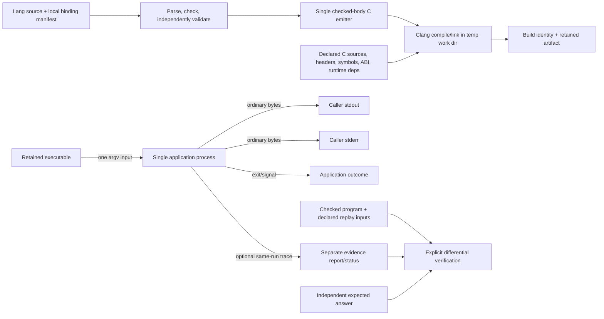

# Phase 22: Native Application Build and Single Execution — Research

**Researched:** 2026-09-27  
**Domain:** Native application build/run boundary, scalar process input, FFI build inputs, and execution evidence  
**Confidence:** MEDIUM

<user_constraints>
## User Constraints (from CONTEXT.md)

### Locked Decisions

- **D-22-01:** Keep Go 1.24, standard-library-first Stage 0, readable C17,
  installed Clang, and the independent interpreter. No new VM/backend/runtime.
- **D-22-02:** Separate ordinary application execution from conformance replay.
  Build performs no application effects; application run launches once.
  Do not interpret or run both optimization tiers against ordinary user effects.
- **D-22-03:** Produce a retained executable that works outside its temporary
  build directory, with declared runtime dependencies and build identity.
- **D-22-04:** Accept real bounded caller input. Define ordinary stdout, stderr,
  exit/signal outcomes and a separate evidence channel. Disabled, incomplete or
  exhausted evidence must not be mistaken for verified success.
- **D-22-05:** Local C sources/headers, symbols and ABI inputs are explicit
  trusted build inputs. Resolve paths reproducibly across checkout relocation;
  relevant changes invalidate artifacts/evidence. Do not generalize hardcoded
  fixture-symbol lookup or runtime.Caller paths into the application interface.
- **D-22-06:** Differential verification uses controlled isolated/replayable
  inputs, declared foreign outcomes, and independent expected answers. Modeled
  foreign success does not prove actual host IO or physical cleanup.
- **D-22-07:** Deliver a runnable gain in this phase, with the source/input/output
  frontier established before implementation. Each additional plan must serve a
  named witness or safety obligation. Preserve existing conformance contracts
  where needed; both application and evidence routes share checked body lowering.

### the agent's Discretion

The user authorized following the reviewed recommendations automatically.
The planner should choose the smallest coherent CLI syntax, scalar/input
encoding, size limits, evidence transport, output encoding, artifact layout,
local C build-description format, and process failure policy that satisfy
these requirements. Settle them explicitly in phase planning using inspected
code and targeted research. Do not present an unchosen representation as a
user decision. Ask only for genuinely missing user intent, not to repeat
milestone approval.

The input design must accommodate Phase 23's caller-selected file path without
implementing its resource semantics early. Fixed scalar output here does not
require a general String runtime or arithmetic.

### Deferred Ideas (OUT OF SCOPE)

Real owned allocation/local discharge is Phase 23; call/error transfer is 24;
shared/exclusive read-copy pointer admission and integrated acceptance are 25.
No arithmetic/loops, owning aggregates, fallible implicit destruction, unwind,
callbacks, retained pointers or broad pointer mutation in Phase 22. No change to
Phase 21's completed UAT or historical verification scope.
</user_constraints>

<phase_requirements>
## Phase Requirements

| ID | Description | Research Support |
|----|-------------|------------------|
| APP-02 | A developer can build a retained native executable from an admitted Lang source using a documented public command; building does not execute application effects, and the artifact runs outside the compiler's temporary build directory with its runtime dependencies declared. | Separate `native.Build` from `native.Run`; retain output at a caller-selected path and bind an explicit build description/toolchain identity. |
| APP-03 | A developer can supply bounded input through the public application route; two caller-selected scalar inputs produce independently specified results, and malformed or oversized input is rejected with a defined outcome. | Use a decimal U64 argv token for the first witness; document the 20-digit/value bound, parse rejection, and independent `7 → 7`, `42 → 42` expectations. |
| APP-04 | One application-run request launches the selected native artifact exactly once, without prior interpretation or hidden optimization-tier replay of application effects. | Application route must bypass `runNative` and directly start the retained artifact once; differential execution stays on an explicit verification route. |
| APP-05 | An application has defined stdout, stderr, and process-exit behavior; ordinary output and successful stderr are not parsed as or rejected for violating compiler execution JSON. | Pass application stdout/stderr through as ordinary streams; report normal exit, nonzero exit, signal, timeout, and launch errors distinctly. |
| APP-06 | A developer can obtain compiler execution evidence separately from application streams, with explicit disabled, incomplete, and capacity-exhausted states that cannot be reported as successful verification. | Keep a separate evidence/report file or channel with a closed status field; never infer successful verification from an absent or partial trace. |
| FFI-02 | A developer declares the local C sources/headers, symbols, and ABI inputs required by a build; path resolution survives checkout relocation, missing/incompatible inputs fail clearly, and relevant input changes invalidate the artifact/evidence identity without fixture-symbol lookup or ambient repository paths. | Use a small local manifest with paths anchored to its own directory, explicit symbols/ABI records, and a content-bound build identity over declared inputs and toolchain facts. |
| EVD-11 | Explicit differential verification uses isolated or replayable inputs and declared foreign outcomes, compares against independent expected answers, and never claims that modeled foreign success proves actual host IO or that process reclamation proves cleanup. | Retain a verification-only path that uses disposable/scripted foreign outcomes and expected answers; label modeled behavior and actual native run evidence separately. |
</phase_requirements>

## Summary

Phase 22 is an application-boundary change around the existing checked program, not a new execution engine. The public `run --engine=native` is currently a conformance-style route: it synthesizes fixture inputs, interprets each input, and runs native O0 and O3; the native runner compiles in a temporary directory, decodes stdout as an execution document, and rejects successful stderr. [VERIFIED: internal/compiler/session/session.go:1037-1093] The code says: `inputs, ok := interpreterInputs(checked.Program)`, `interpreted = append(interpreted, execution)`, `runNativeInputs(..., "-O0", ...)`, and `runNativeInputs(..., "-O3", ...)`. [VERIFIED: internal/compiler/native/native.go:464-468, 581-642] The runner says: `directory, err := os.MkdirTemp(...)`, `defer os.RemoveAll(directory)`, then `decodeExecution(...)`; it also returns `native.run_stderr` for successful stderr. This behavior remains useful for explicit conformance checks but cannot serve a side-effecting application command.

Add a retained build product and a single-launch application command that share checked-body validation/emission with conformance execution. The smallest witness is an identity entry over U64, caller input as one bounded decimal argv token, and one canonical decimal result line. The independent expected pairs are `7 → 7` and `42 → 42`; verify them outside ordinary app execution so expected-value checking does not trigger a second launch. [CITED: .planning/ROADMAP.md#L64-L72]

**Primary recommendation:** Introduce `lang build <source> --manifest <bindings.json> --output <artifact>` and `lang app run <artifact> -- <scalar> [--evidence <path>]`. Keep the first manifest deliberately small and local; keep evidence separate from stdout/stderr; bind the retained artifact and any evidence to source, declared C inputs/headers/bindings, ABI declarations, compiler/target/flags, and runtime dependency declarations. These syntax and representation choices are recommendations for planning, not prior locked decisions. [ASSUMED]

## Architectural Responsibility Map

| Capability | Primary Tier | Secondary Tier | Rationale |
|------------|-------------|----------------|-----------|
| CLI command parsing and input bounds | API / Backend (compiler tool) | Browser / Client — | `cmd/lang` owns public command dispatch; scalar parsing belongs in the native entry contract. |
| Source validation and C body generation | API / Backend | — | Reuse `session` validation and the single `cgen.EmitNative` authority. [CITED: .planning/research/M004/ARCHITECTURE.md#L69-L75] |
| Native compilation/link and retained artifact | API / Backend | CDN / Static — | `native` invokes installed Clang, manages temporary intermediates, and places the final artifact at an explicit destination. |
| Application execution and ordinary streams | API / Backend | — | Tool process launches the artifact once and treats stdout/stderr/exit as application behavior. |
| Execution evidence and differential verification | API / Backend | Database / Storage — | The verification route compares model/native outcomes; evidence is separately serialized and status-bearing. |
| Local C input resolution and build identity | API / Backend | Database / Storage — | The manifest declares trusted build inputs; content identity prevents stale artifacts after input edits. |

## Project Constraints (from AGENTS.md)

- Keep Go 1.24 and its standard library as Stage 0; emit readable C17 and use installed Clang. Do not add a VM/backend/runtime. [VERIFIED: AGENTS.md; exact project constraint quoted from the supplied file: “Go 1.24 standard library hosts Stage 0; readable C17 emitted to installed Clang is the development native path.”]
- Prefer standard-library-only and shallow audited dependency boundaries; any added dependency needs a concrete justification. [VERIFIED: AGENTS.md; quote: “Prefer standard-library-only and shallow audited boundaries; every dependency must earn more than copy-local implementation.”]
- Keep the independent interpreter and do not replay ordinary application side effects as hidden conformance work. [VERIFIED: .planning/phases/22-native-application-build-and-single-execution/22-CONTEXT.md; quote: “Do not interpret or run both optimization tiers against ordinary user effects.”]
- Treat local C and ABI declarations as trusted explicit build inputs; do not add ambient authority, implicit package resolution, or broad sandbox work. [VERIFIED: .planning/REQUIREMENTS.md:80-83; quote: “Foreign C implementations and their declarations remain trusted/audited build inputs.”]
- Define explicit bounds for untrusted caller input and keep host/target facts portable across macOS and Linux. [VERIFIED: AGENTS.md; quote: “macOS and Linux are the initial host priorities; wire contracts and target facts must not accidentally encode the current Apple arm64 host.”]
- Keep compiler evidence deterministic and separate from application output; independently specified answers and negative controls answer distinct questions. [VERIFIED: AGENTS.md; quote: “Deterministic fixtures, negative controls, properties, mutation, differential execution, and sanitizers answer distinct questions and have explicit cost lanes.”]
- During planning transitions, check PRODUCT-ROADMAP and LANGUAGE-MATURITY against current witnesses/refusals and surface three next capabilities. Do not report historical receipts as newly executed evidence. [VERIFIED: AGENTS.md; quote: “Distinguish source inspection, newly executed checks, and historical receipts.”]
- Do not run implementation tests for this research task; no test command was run. Do not rerun Phase 21 UAT. [VERIFIED: 22-CONTEXT.md; quote: “No change to Phase 21's completed UAT or historical verification scope.”]
- Project skill review found only `.claude/skills/spike-findings-ai-lang/SKILL.md`; its differential-verification reference was reviewed. It requires independent implementations, stable identities, ordered traces, armed fault injection, explicit expected escapes, compact default reports, and separating semantic events from measurements. [CITED: .claude/skills/spike-findings-ai-lang/references/differential-verification-harness.md]

## Standard Stack

### Core

| Component | Version | Purpose | Why Standard |
|-----------|---------|---------|--------------|
| Go | 1.24.0 installed in this environment | CLI, manifest decoding, hashing, subprocess orchestration, diagnostics | Locked Stage 0 stack; standard library already owns these needs. [VERIFIED: AGENTS.md; quote: “Go 1.24 standard library hosts Stage 0.”] |
| C | C17 (`-std=c17`) | Readable generated application translation unit and declared local C translation units | Existing native runner compiles local code with strict C17 warning flags. [VERIFIED: internal/compiler/native/native.go:506-510; exact argument fragment: `[]string{"-std=c17", "-Wall", "-Wextra", "-Werror", "-pedantic", optimization}`] |
| Clang | Apple clang 21.0.0 on current Darwin arm64 host | Compile/link retained executable | Installed tool detected locally; this is an environment observation, not a supported-minimum claim. |
| Go standard library | Go 1.24.0 | `encoding/json`, `crypto/sha256`, `os/exec`, `path/filepath` for a small versioned manifest and command orchestration | No new library is needed for the bounded manifest/build seam. [ASSUMED] |

### Supporting

| Component | Version | Purpose | When to Use |
|-----------|---------|---------|-------------|
| Independent interpreter | In-repository | Deterministic expected/model outcome for explicit verification only | Run against isolated or scripted inputs, never as a hidden step in app run. |
| `internal/compiler/cache` identity patterns | In-repository | Content-bound build/evidence invalidation | Reuse only after a complete dependency closure is represented; current native cache is Darwin-specific. [VERIFIED: internal/compiler/native/native.go:156-162; quote: `if runtime.GOOS != "darwin" { return nil, false // linker and SDK dependency discovery is host-specific }`] |
| `os/exec` process status | Go standard library | Launch once, pass streams, distinguish exit failure from signal/timeout | Application run. Existing `adjudicateExit` uses `syscall.WaitStatus`. |

### Alternatives Considered

| Instead of | Could Use | Tradeoff |
|------------|-----------|----------|
| JSON binding manifest | CLI flags repeated for each C source/header/symbol/ABI fact | Flags suit one tiny demo but are awkward to version and bind into reusable identity. A small JSON manifest stays dependency-free and explicit. [ASSUMED] |
| Decimal U64 argv | stdin line or JSON input document | stdin can later be used by programs, but line framing/encoding and Phase 23 path forwarding add extra policy. One argv token is already the generated entry convention. [ASSUMED] |
| Evidence sidecar file | stdout/stderr multiplexing or a new inherited file descriptor | Sidecar avoids corrupting ordinary streams and avoids platform-specific descriptor plumbing; atomic write can mark incomplete output on failure. [ASSUMED] |
| Streaming stdout/stderr to caller | Capture both fully in memory | Streaming preserves arbitrary application output without the existing execution-document cap; a separate report can record byte counts/status without retaining all bytes. [ASSUMED] |
| Retained standalone artifact | “build then run” only inside temporary runner | Direct build/run separation makes the executable movable and makes one launch observable; it requires an explicit output location and dependency contract. [ASSUMED] |

**Installation:** No external packages. Use the existing Go standard library and installed Clang. Do not add package-manager resolution to the local C build path. [CITED: .planning/research/M004/STACK.md]

**Package Legitimacy Audit:** Not applicable; this phase should install no external packages. [VERIFIED: .planning/research/M004/STACK.md; quote: “No production dependency, VM, LLVM binding, global tracing heap, SMT solver, package manager, or service runtime is needed for this milestone.”]

## Architecture Patterns

### System Architecture Diagram



### Recommended Project Structure

```text
cmd/lang/                         # public build and app-run subcommands
internal/compiler/session/        # check/validate, build plan, verification seam
internal/compiler/native/         # retained Build API and one-shot Run API
internal/compiler/cgen/           # shared checked function-body lowering
examples/phase22/                 # identity source, explicit build manifest, expected pairs
```

### Pattern 1: Build and Run Are Separate Operations

**What:** A build operation validates, emits C, compiles/links and copies or links the final executable to the chosen retained path. It must never execute that artifact. App run opens the selected artifact and invokes it once with caller input. [CITED: .planning/ROADMAP.md#L56-L67]

**When to use:** Every ordinary application invocation. Keep current `runNative` behavior for conformance and differential lanes. [VERIFIED: internal/compiler/session/session.go:1086-1093; quote: `runNativeInputs(..., "-O0", ...)` and `runNativeInputs(..., "-O3", ...)`]

**Example (recommended public syntax):** [ASSUMED]

```sh
lang build examples/phase22/identity.lang \
  --manifest examples/phase22/identity.bindings.json \
  --output ./out/identity
lang app run ./out/identity -- 7
lang app run ./out/identity -- 42
```

For the U64 subset, accept a non-empty base-10 digit token, at most 20 digits and no value above `18446744073709551615`; reject signs, non-digits, overflow, missing/extra values, and tokens over the bound before Lang body execution. Preserve existing leading-zero acceptance unless the plan explicitly tightens canonical input syntax: current generated parser checks digits and U64 overflow but does not reject leading zeroes. [VERIFIED: internal/compiler/cgen/cgen_program.go:951-955; exact code: `if (*cursor < (unsigned char)'0' || *cursor > (unsigned char)'9') return 0;` and `if (value > (UINT64_MAX - digit) / UINT64_C(10)) return 0;`]

The generated process entry already accepts decimal `uint64_t` from `argv[1]` and formats U64 returns through a bounded JSON writer; the app entry should reuse the checked scalar conversion but emit the selected ordinary output form (recommend decimal digits followed by `\n`) rather than JSON. [VERIFIED: internal/compiler/cgen/cgen_program.go:882-884, 902-917; exact existing values: `if (argc != 2) return 64;`, `return 65;`, and `return 74;`]

### Pattern 2: Small Manifest, Source-Relative Paths, Content Identity

**What:** Add a versioned JSON manifest at the application boundary, not a repository fixture table. Its minimum entries should be: schema/version; local source files; header/include roots; declared external symbol names and C ABI facts (even while Phase 22 still refuses foreign calls); and declared runtime dependencies. Resolve relative paths against the manifest file's directory, reject paths that escape that root in the first version, and report the missing file/symbol or compile/link incompatibility by input name. [ASSUMED]

**When to use:** Any retained build with local C inputs or external runtime dependencies. Check in one sample manifest and a relocation fixture. [CITED: .planning/ROADMAP.md#L56-L56]

**Identity contents:** Bind the Lang source bytes, manifest bytes after canonical parsing, normalized manifest-relative input names and contents for each declared C/header file, symbols and ABI fields, Clang executable/version, target triple, host ABI, all compile/link flags, emitted C, and runtime dependency declarations. Omit absolute checkout paths from the identity so a moved checkout can resolve the same inputs. Record output path separately from content identity. If any dependency cannot be discovered or hashed, mark identity non-cacheable/incomplete rather than claiming reuse. Existing cache dependency discovery explicitly disables reuse on non-Darwin because its linker/SDK resolution is host-specific. [VERIFIED: internal/compiler/native/native.go:159-162; exact guard: `if runtime.GOOS != "darwin" { return nil, false // linker and SDK dependency discovery is host-specific }`]

Headers must be represented even when not compiled as separate sources. Local C implementation declarations remain trusted build authority; a manifest records what is compiled and its claimed ABI, not that arbitrary C obeys the ABI or ownership contract. [CITED: .planning/REQUIREMENTS.md#L80-L83]

### Pattern 3: Application Stream Contract and Separate Evidence

**What:** Route native app stdout/stderr directly to the caller, preserve the child exit code, distinguish signal termination and timeout in the command outcome, and do not call `decodeExecution` on application output. `os/exec` must receive explicit argv and no shell expansion. [ASSUMED]

Recommend app stdout as decimal result plus one newline for the initial identity witness; successful stderr is preserved byte-for-byte. A nonzero app exit remains an application outcome, not a compiler error; tool errors (missing executable, failed start, timeout, report write failure) are separately diagnosed. For signals, report `signaled` and the signal name in the structured run report; if the CLI must return a numeric status, use a documented stable mapping (e.g. 128+signal) and keep that mapping distinct from the raw child status. [ASSUMED]

**Evidence route:** `--evidence <path>` should write a sidecar containing build identity, input identity, evidence status, and any available execution document. Keep status as a closed vocabulary such as `complete`, `disabled`, `incomplete`, `capacity_exhausted`; a non-complete state can never set verification success. Decide whether the command always writes a run report or only writes one when requested; the disabled state must remain observable to a caller requesting evidence. Instrument evidence from this one process (or report disabled); never silently launch a second app to obtain evidence. [ASSUMED]

For explicit differential verification, model foreign outcomes through a declared replay world, compare both implementations to independent expected answers, and state where the comparison stops. Model success is not actual host IO; process exit/reclamation is not proof of Lang resource cleanup. [CITED: .planning/REQUIREMENTS.md#L54-L54]

### Anti-Patterns to Avoid

- **Reuse `runNative` as the application command:** it interprets plus invokes O0 and O3; that repeats effects and violates one-launch semantics. [VERIFIED: internal/compiler/session/session.go:1053-1093; quote: `interp.Run(...)`, `"-O0"`, and `"-O3"`]
- **Keep strict execution-document stdout for applications:** ordinary text and successful stderr are valid application behavior and must not be decoded/rejected as compiler protocol. Existing `native.Runner.Run` calls `decodeExecution` and rejects non-empty success stderr. [VERIFIED: internal/compiler/native/native.go:635-642; quote: `if len(runStderr.bytes()) != 0` and `decodeExecution(runStdout.bytes(), expect)`]
- **Use a runtime.Caller fixture-symbol lookup as app linkage:** explicit paths and declarations must follow the build description through relocation; no hard-coded symbol-to-repository-file mapping. [CITED: .planning/research/M004/ARCHITECTURE.md#L156-L158]
- **Hash only the Lang source:** header/C edits, ABI declarations, flags, target and runtime dependencies can alter the linked program; omit any identity dependency only with an explicit non-cacheable result. [ASSUMED]
- **Report missing evidence as pass:** disabled, incomplete, and capacity-exhausted are distinct non-verification outcomes; capacity is not an ordinary app semantic failure. [CITED: .planning/REQUIREMENTS.md#L22-L22]
- **Use interpreter agreement as the sole expected answer:** shared mistakes can agree; pin the identity result independently for both `7` and `42`. [CITED: .planning/research/M004/PITFALLS.md, “A shared wrong result”]
- **Treat a linked C file as FFI admission:** Phase 22 linking/build declaration does not admit foreign resource calls. [VERIFIED: .planning/ROADMAP.md:69-72; quote: “Declaring/linking C inputs does not admit foreign resource calls.”]

## Don't Hand-Roll

| Problem | Don't Build | Use Instead | Why |
|---------|-------------|-------------|-----|
| Native process creation | Shell command string quoting/escaping | Go `os/exec` with argv vector and explicit working directory | Shell parsing adds injection and platform quoting behavior; current runner already uses `exec.CommandContext`. [CITED: internal/compiler/native/native.go:732-736] |
| U64 decimal parsing | Host-sized integer parsing or unchecked `atoi` in C | Existing overflow-checked decimal parser logic, generalized behind one shared entry codec | U64 must be portable and reject overflow before Lang code. [VERIFIED: internal/compiler/cgen/cgen_program.go:951-955; exact overflow guard quoted above] |
| Content hashing | Hand-maintained build fingerprint list detached from actual manifest inputs | Existing SHA-256/cache primitives with explicit complete-input inventory | Avoid stale artifact/evidence when any declared input changes; unknown closure means no cache claim. [CITED: internal/compiler/native/native.go:455, 202-239] |
| Compiler execution document validation | New permissive JSON parser for app streams | Keep `decodeExecution` exclusively for compiler evidence; do not parse app stdout/stderr | Compiler evidence has strict duplicate-key/schema/trailing-data checks; ordinary streams need a different contract. [VERIFIED: internal/compiler/native/native.go:782-818; exact decoder calls: `decoder.DisallowUnknownFields()` and `rejectDuplicateJSONKeys(stdout)`] |
| Manifest support | New parser dependency / package ecosystem | Go `encoding/json` with a versioned closed schema and path validation | Manifest shape is small; standard library matches dependency policy. [ASSUMED] |

**Key insight:** Most of Phase 22's complexity comes from ownership of process boundaries and evidence identity. A separate build API and single-process app route can deliver the runnable scalar gain without broadening Lang semantics or creating a second compiler backend. [ASSUMED]

## Common Pitfalls

### Pitfall 1: Build accidentally runs application code

**What goes wrong:** Build accepts foreign-linked programs and observes effects while preparing output, or uses the existing compile-and-run function as a shortcut.  
**Why it happens:** Existing `native.Runner.Run` combines temporary compilation and process execution. [VERIFIED: internal/compiler/native/native.go:457-468, 581-590]  
**How to avoid:** Add a compile/link-only operation that publishes the artifact only after a successful build. Test with a side-effecting marker C input and assert no marker appears during build.  
**Warning signs:** Build path calls `.Run(ctx,...inputs)` or public `runNative`.

### Pitfall 2: Artifact depends on temporary files or checkout location

**What goes wrong:** The output cannot run after temp cleanup, or manifest resolution breaks after moving the checkout.  
**Why it happens:** Current runner removes its temporary directory on return. [VERIFIED: internal/compiler/native/native.go:464-468; verbatim: `defer os.RemoveAll(directory)`]  
**How to avoid:** Link to a temp output, then atomically place the executable at the requested final path; resolve manifest-relative paths from the manifest itself; record runtime dependencies and target identity.  
**Warning signs:** Artifact path points into `lang-native-*`; generated/runtime code or C input lookup relies on repository root/runtime.Caller.

### Pitfall 3: Evidence channel collides with application output

**What goes wrong:** A normal print or stderr message causes protocol failure, or evidence JSON becomes an extra line in program output.  
**Why it happens:** Current runner's stdout is reserved for strict execution JSON and successful stderr must be empty. [VERIFIED: internal/compiler/native/native.go:635-642]  
**How to avoid:** Keep streams transparent; place optional evidence in a separate file/report. Test text on both channels and a successful nonzero? (nonzero is separately adjudicated) Keep evidence capacity failures in report status, not as silent success.  
**Warning signs:** Any application route calls `decodeExecution`, redirects evidence to stdout, or drops stderr.

### Pitfall 4: “Exactly once” means once per optimization or per input fixture

**What goes wrong:** App run first interprets, recompiles, or executes multiple tiers; application performs side effects more than once.  
**Why it happens:** The current `runNative` route loops through synthetic inputs and has separate O0/O3 invocations. [VERIFIED: internal/compiler/session/session.go:1053-1093]  
**How to avoid:** Build separately; one app-run invocation performs one `Start`/`Wait` on selected artifact. Keep differential replay behind explicit `verify`/`conformance` command. Add a child counter or marker file to count launches.  
**Warning signs:** Execution count derived from number of evidence pairs or `len(inputs)*3` is reused for app metrics.

### Pitfall 5: Size limit and failure semantics are conflated

**What goes wrong:** Extremely long argv strings or integer overflow cause ambiguous parse outcomes; evidence overflow appears to be an app failure or pass.  
**Why it happens:** Existing parser rejects invalid digits/overflow but has no explicit token-byte cap. [VERIFIED: internal/compiler/cgen/cgen_program.go:951-955]  
**How to avoid:** Bound input token bytes before numeric parse (recommend 20 digits for U64); define malformed/out-of-range as a stable input error outcome and define evidence capacity exhaustion separately. Ensure the input limit also fits Phase 23's later path transport, with path-byte bounds specified then.  
**Warning signs:** C-string parsing runs before length check; truncation yields a valid prefix; capacity status collapses into verified success.

## Code Examples

Verified current seams for the planner to extend:

```go
// Current conformance route: keep this behavior behind the verifier path.
inputs, ok := interpreterInputs(checked.Program)
if !ok {
	return NativeResult{}, nil, os.ErrInvalid
}
for _, input := range inputs {
	execution, err := interp.Run(checked.Program, entry.Name, input)
	// ...
}
o0, err := runNativeInputs(ctx, runner, cSource, "-O0", inputs, interpreted)
o3, err := runNativeInputs(ctx, runner, cSource, "-O3", inputs, interpreted)
```

Source: [internal/compiler/session/session.go:1053-1093](../../../internal/compiler/session/session.go). The quoted `"-O0"`/`"-O3"` values are current implementation values, not a recommended app-run behavior.

```go
// Current generated U64 parser rejects non-decimal digits and overflow.
if (*cursor < (unsigned char)'0' || *cursor > (unsigned char)'9') return 0;
digit = (unsigned int)(*cursor - (unsigned char)'0');
if (value > (UINT64_MAX - digit) / UINT64_C(10)) return 0;
```

Source: [internal/compiler/cgen/cgen_program.go:951-955](../../../internal/compiler/cgen/cgen_program.go). Add the byte-count limit before invoking the parser; do not rely on integer overflow to bound argv size.

```sh
# Proposed Phase 22 public shape — a planning recommendation, not existing CLI.
lang build examples/phase22/identity.lang --manifest examples/phase22/identity.bindings.json --output ./out/identity
lang app run ./out/identity -- 7
lang app run ./out/identity -- 42
```

[ASSUMED] Expected output contract recommendation: `7\n` and `42\n`; expected answers should live in a fixture/test oracle independent of generated output and interpreter output.

## State of the Art

| Old Approach | Current Approach | When Changed | Impact |
|--------------|------------------|--------------|--------|
| Public `run --engine=native` synthesizes inputs and compares interpreter/O0/O3 | Separate application build/run-once boundary plus explicit verification route | Phase 22 target, not implemented yet | Normal application effects run once; verifier can keep replaying controlled inputs. [CITED: .planning/LANGUAGE-MATURITY.md, “What prevents ordinary programs”] |
| Temporary native executable removed after command | Retained user-selected artifact and declared dependency identity | Phase 22 target, not implemented yet | App can run outside build temp folder and after checkout relocation. [CITED: APP-02 and FFI-02] |
| stdout exclusively carries execution JSON | Ordinary app stdout/stderr plus separate optional evidence report | Phase 22 target, not implemented yet | Application streams are not protocol documents. [CITED: APP-05, APP-06] |

**Deprecated/outdated for applications:** Treating current native conformance `run` as a general app command is incompatible with exactly-one effects and ordinary streams. Keep it only where current comparison behavior is wanted. [VERIFIED: .planning/LANGUAGE-MATURITY.md; quote: “The current public native runner supplies fixture inputs and executes O0 and O3.”]

## Living Roadmap Check

These are the current three recommendations from PRODUCT-ROADMAP, restated with the required blocker/slice/checker/evidence/owner and reprioritization signal. This is a source review; no new implementation or product check was run.

1. **Build/run-once scalar application:** User-visible program is the identity witness (caller supplies 7 or 42; result differs accordingly). Blocker: current canned inputs, execution-JSON-only output, O0/O3 replay. Smallest complete slice: retained executable, bounded U64 input/output, transparent process outcome, separate evidence status. Checker/guarantee changes: entry ABI/input validation and separation of app effects from evidence; no new ownership semantics. Evidence/debt: APP-02–06, FFI-02, EVD-11; negative cases for malformed/oversized values, build side effects, launch count, stderr, exits/signals, and evidence states. Owner/next action: Phase 22 planner. Change priority if the agreed Phase 23 file-path input cannot fit the selected argv contract or a concrete consumer requires stdin/framing first. [CITED: .planning/PRODUCT-ROADMAP.md, “Current three recommendations”; .planning/ROADMAP.md#L64-L72]
2. **Live owned allocation:** User-visible program is a bounded file-byte utility. Blocker: native foreign refusal, first-symbol contract, current C adapter frees before return, and cleanup tracking does not arise from successful acquisition. Smallest slice: explicitly linked C adapter returns a real live allocation; Lang uses/transfers/releases it; failed/empty/max/oversize paths are defined. Checker/guarantee changes: acquisition-seeded ownership obligation and per-operation foreign contract across check/corevalidate/originvalidate/pathoracle/interp/cgen. Evidence/debt: RES-04–09, FFI-03, EVD-09/10/11 and a physical destructor observer. Owner/next action: Phase 23, then Phase 24 transfer/error completion. Change priority if the scalar build/evidence seam cannot run the retained artifact independently. [CITED: .planning/PRODUCT-ROADMAP.md, “Current three recommendations”; .planning/REQUIREMENTS.md#L31-L36]
3. **FizzBuzz next:** User-visible program is FizzBuzz with exact output; blocker: arithmetic, comparison, continuation branching, scalar iteration, fixed text and decimal output. Smallest complete slice: defined numeric semantics plus scalar loops and bounded output, with resources/loans across back edges refused if not proven. Checker/guarantee changes: numeric definedness, CFG fixed-point/back-edge admission, dynamic occurrence and evidence-budget distinction. Evidence/debt: future requirements in `.planning/REQUIREMENTS.md`, named loop-spike questions in PRODUCT-ROADMAP; source-level expected output, boundary cases, and a wrong-result control. Owner/next action: following milestone after M004. Change priority if a concrete file/byte consumer requires byte views before computation. [CITED: .planning/PRODUCT-ROADMAP.md, “Checker and guarantee activation map” and “Current three recommendations”]

## Assumptions Log

| # | Claim | Section | Risk if Wrong |
|---|-------|---------|---------------|
| A1 | CLI syntax `lang build …` and `lang app run …` is the smallest clear public command. | Summary / Architecture Patterns | Documentation and routing would be reshaped; no semantic impact. |
| A2 | A versioned local JSON binding manifest is preferable to repeated flags for C/header/symbol/ABI/runtime dependencies. | Architecture Patterns | Alternate manifest format changes parsing and docs; keep manifest source-relative and content-bound. |
| A3 | Initial public scalar encoding is a max-20-byte decimal U64 argv token with overflow rejection; stdout is canonical decimal plus newline. | Architecture Patterns | Language/input/output tests and Phase 23 path accommodation may need an explicit tagged input representation. |
| A4 | Evidence is captured to a separate sidecar/report and uses statuses complete/disabled/incomplete/capacity_exhausted. | Architecture Patterns | A separate status protocol/channel must be selected before implementation; failure to expose disabled is an APP-06 gap. |
| A5 | App stdout/stderr are streamed through; timeout defaults to the existing 30-second subprocess default unless planning picks another policy. | Architecture Patterns | Output buffering/resource policy or legitimate long-running applications may require a different contract. |
| A6 | Manifest-relative paths should be confined to the manifest directory for v1. | Architecture Patterns | This may restrict legitimate shared/local source trees; if relaxed, explicit root declarations and traversal policy are needed. |

## Open Questions

1. **What is the evidence side-channel interface and how is disabled observable?**
   - **Status: RESOLVED DURING PLANNING — authoritative decision: 22-03-PLAN.md, “Planning decisions” and task 22-03-T1.**
   - What we know: application stdout/stderr cannot carry compiler documents; APP-06 requires explicit disabled, incomplete and capacity-exhausted distinction.
   - What's unclear: whether a report is always written, requested via `--evidence`, or selected by a machine-readable run report; how evidence collection can share one application execution.
   - Recommendation: choose one report-file interface and status schema in plan task 1; state whether statuses describe capture completeness or actual differential verification (they are not synonyms).
   - Planning resolution: `--report REPORT` opts into a `lang.app-evidence/1` sidecar; optional `--evidence=events` captures bounded events from the same child. The closed statuses are `disabled`, `complete`, `incomplete`, and `capacity_exhausted`; all reports say `verified:false`, and `complete` means structurally complete capture only. Missing or invalid requested capture fails closed without a second launch.
2. **What exactly is meant by “declared runtime dependencies” in the retained artifact?**
   - **Status: RESOLVED DURING PLANNING — authoritative decision: 22-02-PLAN.md, “Planning decisions” and task 22-02-T1.**
   - What we know: explicit local C build inputs and runtime dependencies are acceptance conditions; native cache currently cannot fully resolve toolchain/link dependencies off Darwin.
   - What's unclear: whether this phase records the C/system runtime and target triple, bundles local libraries, or supports only statically linked/local source dependencies.
   - Recommendation: keep linking local source/object inputs only, record compiler, target, flags and declared runtime library names in the build receipt; fail clearly for undeclared `-l`/framework/link-time search dependencies. Do not promise cross-host identity from the current Darwin-only cache path.
   - Planning resolution: the manifest declares `platform-c-runtime`; receipts record compiler, target, fixed flags, runtime declarations, and dependency-closure status. Unknown host linker/SDK closure is `incomplete`, disallows cache reuse and complete-provenance claims, and does not expand into arbitrary libraries or frameworks.
3. **Does FFI-02's `symbols` declaration mean exported symbols in the manifest or resolved source-level FFI operations?**
   - **Status: RESOLVED DURING PLANNING — authoritative decision: 22-02-PLAN.md, “Planning decisions” and task 22-02-T1.**
   - What we know: Phase 22 may declare/link C inputs but foreign resource operations remain refused; Phase 23 adds the actual adapter contract.
   - What's unclear: the minimum executable declaration needed now without accidentally admitting a foreign body.
   - Recommendation: manifest can inventory provided/required symbol and ABI records, while checker/emitter retain current foreign-call refusal; add operation-level semantic binding in Phase 23 under FFI-03.
   - Planning resolution: `lang.local-c/1` inventories symbol name, header, and typedef-backed function ABI and verifies declaration/link compatibility. Linking remains build authority only; the checked Lang body retains foreign/by-pointer refusal until Phase 23.
4. **How should a signal be represented at the CLI level?**
   - **Status: RESOLVED DURING PLANNING — authoritative decision: 22-01-PLAN.md, “Planning decisions” and task 22-01-T1.**
   - What we know: current native execution can distinguish a signaled child via `syscall.WaitStatus`; Phase 21 cleanup promises exclude process termination.
   - What's unclear: whether `lang app run` should return the conventional `128+signal` integer, a tool-defined status, or re-raise the signal after cleanup.
   - Recommendation: preserve the child's raw signal in the report and document one stable CLI mapping; avoid re-raising in the compiler driver unless shell-level signal fidelity is explicitly required.
   - Planning resolution: preserve the signal name in `RunOutcome` and use CLI status `128+signal`; timeout maps to 124 and launch/tool failures to 125, with structured outcomes and diagnostics distinguishing these from child exit codes.

## Environment Availability

| Dependency | Required By | Available | Version | Fallback |
|------------|-------------|-----------|---------|----------|
| Go toolchain | Stage 0 CLI/build orchestration | ✓ | `go1.24.0 darwin/arm64` | None needed |
| Clang | C17 native compile/link | ✓ | `Apple clang 21.0.0 (clang-2100.1.1.101)` | None on this host; Linux host evidence still required by later native-family receipts |
| C17 runtime/linker | Retained native executable | ✓ (via installed Clang on this host) | Host-specific | Fail with a named toolchain diagnostic if absent |

These are environment probes only, not Phase 22 behavior tests or Linux verification. No implementation tests were run. [VERIFIED: environment probe, 2026-09-27]

## Validation Architecture

### Test Framework

| Property | Value |
|----------|-------|
| Framework | Go `testing` package (source inspection; no test command run) |
| Config file | `go.mod`; no external test framework required |
| Quick run command | `GOCACHE=/tmp/ai-lang-verification-gocache go test ./internal/compiler/native ./internal/compiler/session ./internal/compiler/cgen` (recommended for execution after implementation; not run in this research) |
| Full suite command | `GOCACHE=/tmp/ai-lang-verification-gocache go test ./...` (recommended at phase gate; not run in this research) |

### Phase Requirements → Test Map

| Req ID | Behavior | Test Type | Automated Command | File Exists? |
|--------|----------|-----------|-------------------|-------------|
| APP-02 | Build retained artifact, does not execute side-effect marker, executable still runs after temp-dir removal and checkout relocation | integration | Focused native/session Go tests | ❌ Wave 0/new tests |
| APP-03 | Inputs `7` and `42` yield independently pinned outputs; reject empty, non-digit, overflow, too-long and extra args | unit + CLI integration | Focused cgen/native/session Go tests | ❌ Wave 0/new tests |
| APP-04 | One public request starts artifact exactly once; no interpreter/O0/O3 app replay | integration | CLI/session fake-command counter + one real smoke | ❌ Wave 0/new tests |
| APP-05 | Preserve exact stdout/stderr; represent exit/signal/timeout separately; do not decode execution JSON | integration | Native process contract tests | ❌ Wave 0/new tests |
| APP-06 | Evidence sidecar status distinguishes complete/disabled/incomplete/capacity_exhausted and never marks incomplete as verified | unit + mutation/control | Evidence/session tests | ❌ Wave 0/new tests |
| FFI-02 | Manifest paths survive relocation; missing/incompatible files fail; input edits change identity; no repo fixture-symbol lookup | unit + integration | Manifest/native build identity tests | ❌ Wave 0/new tests |
| EVD-11 | Explicit replay is isolated/replayable, compares independent expected results, labels foreign modeling and does not run on app path | integration + negative controls | Session verification tests | ❌ Wave 0/new tests |

### Sampling Rate

- **Per task commit:** focused package test(s) covering the changed seam.
- **Per wave merge:** focused native/session/cgen suite plus phase-specific CLI integration checks.
- **Phase gate:** full Go suite and documented retained-artifact smoke; the smoke checks output pairs, malformed input, app launch count, artifact relocation, streams, and evidence states.

### Wave 0 Gaps

- [ ] Add identity `.lang` source and independent input/output oracle for `7 → 7` and `42 → 42`.
- [ ] Add sample local binding manifest and relocation fixture with declared source/header/symbol/ABI/runtime dependency entries.
- [ ] Add process-boundary test harness recording build process execution count and app launch count.
- [ ] Add evidence status schema/status transition tests, including injected capacity exhaustion and missing/partial report writes.
- [ ] Add build identity invalidation cases for source, C source, header, manifest ABI, flags/compiler/target, and runtime dependency declarations.

## Security Domain

> Security enforcement is enabled in `.planning/config.json` (ASVS level 1); this section is required.

### Applicable ASVS Categories

| ASVS Category | Applies | Standard Control |
|---------------|---------|-----------------|
| V2 Authentication | no | Local compiler invocation has no user authentication surface. [ASSUMED] |
| V3 Session Management | no | No web/session state in this phase. [ASSUMED] |
| V4 Access Control | yes | Treat an explicit local C manifest as build authority; reject undeclared/out-of-root paths unless roots are explicitly declared. [ASSUMED] |
| V5 Input Validation | yes | Bound source, manifest, scalar argv token and path metadata; reject malformed U64 before executing Lang body. [ASSUMED] |
| V6 Cryptography | yes | Use Go standard-library SHA-256 for content identity; do not invent custom hashing. [ASSUMED] |

### Known Threat Patterns for Go/C17 Native Build

| Pattern | STRIDE | Standard Mitigation |
|---------|--------|---------------------|
| Manifest path traversal or symlink escape | Tampering / Elevation of privilege | Resolve and validate local inputs against declared roots; include resolved content and manifest-relative names in build identity. [ASSUMED] |
| Shell injection via user paths/flags | Tampering / Elevation of privilege | Invoke Clang with argv using `os/exec`; no shell; constrain flags to manifest schema/allowlist. [ASSUMED] |
| Stale artifact after header/C/ABI change | Tampering | Identity includes every declared input and flags; unknown dependency closure is non-cacheable. [ASSUMED] |
| Oversized/malformed scalar input | Denial of service / Tampering | Check byte length before parse, then validate digits and U64 overflow. [ASSUMED] |
| Evidence truncation reported as verified success | Repudiation / Tampering | Sidecar has explicit status and identity; incomplete/capacity-exhausted cannot map to success. [ASSUMED] |
| Trusted C violates declared ABI/ownership | Tampering / Elevation of privilege | Keep C source/header/symbol/ABI declarations reviewable and explicitly trusted; Phase 22 does not claim to prove C correctness. [CITED: .planning/REQUIREMENTS.md#L80-L83] |

## Sources

### Primary (HIGH confidence)

- `.planning/phases/22-native-application-build-and-single-execution/22-CONTEXT.md` — locked decisions, delegated choices, input frontier and deferred scope.
- `.planning/ROADMAP.md` — Phase 22 goal, owned requirements, five criteria, witness and planning boundary.
- `.planning/REQUIREMENTS.md` — exact APP-02–06, FFI-02 and EVD-11 statements and scope constraints.
- `cmd/lang/main.go`, `internal/compiler/session/session.go`, `internal/compiler/native/native.go`, `internal/compiler/cgen/cgen_program.go` — current CLI, comparison route, process lifecycle, input parser and emitter admission.
- `.planning/config.json` — Nyquist validation and security enforcement are enabled.

### Secondary (MEDIUM confidence)

- `.planning/research/M004/SUMMARY.md`, `ARCHITECTURE.md`, `FEATURES.md`, `STACK.md`, `PITFALLS.md`, `KICKOFF-VERIFICATION.md` — milestone decisions, architecture seams, process/evidence pitfalls, and explicitly bounded historical receipts. Historical checks cited there were not rerun.
- `.claude/skills/spike-findings-ai-lang/SKILL.md` and `references/differential-verification-harness.md` — in-project evidence design requirements; relevant ref loaded because app/evidence separation is phase scope.
- `.planning/PRODUCT-ROADMAP.md` and `.planning/LANGUAGE-MATURITY.md` — living capability status and next three recommendations, cross-checked against current code.

### Tertiary (LOW confidence)

- Proposed command syntax, JSON manifest, token limits, output encoding, sidecar status vocabulary, path confinement, timeout policy and signal mapping are planning assumptions listed in the Assumptions Log. No external library/API claim is needed; no package will be added.

## Metadata

**Confidence breakdown:**
- Standard stack: HIGH — locked project stack and local Go/Clang probes; no new package recommendation.
- Architecture: HIGH — current source and phase acceptance describe concrete boundaries; particular command/manifest/report representations remain assumptions.
- Pitfalls: HIGH — current interpreter/O0/O3 flow, temp lifecycle, JSON decoding and stderr rejection were directly inspected.

**Research date:** 2026-09-27  
**Valid until:** 2026-10-27 for architecture; recheck installed compiler/toolchain versions at implementation.
