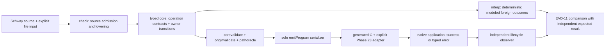

# Phase 24: Ownership Transfer Through Calls and Errors - Research

**Researched:** 2026-09-30  
**Domain:** Go compiler, typed ownership core, bounded C17 foreign resource ABI  
**Confidence:** HIGH for current architecture and constraints; MEDIUM for recommended successor representation until implemented

<user_constraints>
## User Constraints (from CONTEXT.md)

### Locked Decisions

#### Owner transitions and identity

- **D-24-01:** A move or owning return transfers the live resource identity and release obligation to its new owner without running the destructor. A borrow leaves ownership and the obligation with the current owner. The final owner invokes the declared consuming destructor exactly once.
- **D-24-02:** Acquisitions from separate dynamic activations of one static site are distinct semantic resources. Their identities remain stable across transfer and must not use raw host addresses as portable IDs.
- **D-24-03:** Copying an owner, using a moved-from owner, and returning an owning result from process entry without an external receiver are refused before execution with source-attributed diagnostics.

#### Typed errors and cleanup

- **D-24-04:** A failed acquisition creates no owner. On admitted normal and typed-error paths, release every still-owned resource in reverse successful acquisition completion order before returning or propagating the error. Preserve the declared infallible consuming destructor contract.
- **D-24-05:** Reuse Phase 23's `0x43` `UseError.UnsupportedByte` outcome as the later typed failure after multiple successful acquisitions. The expected failure and the reverse destruction sequence must be observable through the ordinary application entry. This is a derived fixture choice from the existing Phase 23 contract, not a new user answer.
- **D-24-06:** Cleanup guarantees cover admitted normal and typed-error paths. Defects and process termination remain outside the guarantee; do not add unwind, cancellation, callbacks, or nonlocal transfer behavior.

#### Runnable evidence

- **D-24-07:** Keep the positive witness on caller-selected one-byte files: `0x41` and `0x42` must still produce independently expected values `65` and `66`. A helper acquires and returns the owner; its caller uses and releases the returned owner.
- **D-24-08:** Repeated calls to the same helper must create separately identified activations. An independent native observer proves allocation, use after transfer, and physical destruction before exit; reached omitted, premature, duplicate, wrong-resource, and identity-collision controls must fail even when compiler events remain plausible.
- **D-24-09:** Extend EVD-11's deterministic foreign-outcome model for the new admitted operation shapes. Model results do not claim physical IO or cleanup; physical cleanup requires the independent native observer and required host evidence.

### the agent's Discretion

- Choose the smallest source syntax, internal activation/resource identity representation, and evidence schema that preserve the decisions above and existing checked-core contracts.
- Choose how to split the positive transfer and repeated-activation error entries while preserving the existing one-path application boundary.
- Extend the affected checker, independent validators, interpreter, native emitter, observer, and host CI evidence only as required by the witness. Keep `emitProgram` the sole production serializer and fail unsupported shapes before C serialization.
- Keep source inspection, newly executed checks, and historical CI receipts distinct; do not run project suites locally because STATE explicitly forbids that for this checkout.

### Deferred Ideas (OUT OF SCOPE)

- Separate shared/exclusive read-copy pointer families and the integrated utility remain Phase 25.
- U64 arithmetic, loops, `sum_to_n`, and FizzBuzz remain next-milestone work.
- General owning aggregates, fallible implicit destructors, unwind, cancellation, callbacks, escaped pointers, and broader foreign-call shapes remain refused unless a later phase explicitly owns them.
</user_constraints>

<phase_requirements>
## Phase Requirements

| ID | Description | Research Support |
|----|-------------|------------------|
| RES-05 | Exact consuming destructor once; borrow preserves owner; transfer preserves resource without destruction. | Model owner and resource identity separately; transfer through call/return edges; validate exact release pairing. |
| RES-06 | Reverse successful-acquisition completion order on normal and typed-error paths. | Acquisition-seeded path state and per-edge cleanup across frames; test later 0x43 failure after successful repeated acquisitions. |
| OWN-10 | Move through call/return; reject copy, moved-from use, and owning entry result without receiver. | Source checker admission/refusal plus independent core checks and emitter preflight. |
| OWN-11 | Distinct activation identities for repeated acquisition sites, stable over transfer. | Composite semantic identity: static acquisition operation plus dynamic activation identity. |
| OWN-12 | Typed error propagation discharges all remaining obligations with actual entry-to-error execution. | Extend call result/error behavior and native cleanup lowering; keep defects/process exits outside contract. |
| EVD-09 | Independent physical allocation/use/destruction evidence and reached negative controls. | Extend Phase 23 observer with multiple pointer identities, event ordering, outstanding-allocation assertion, and collision controls. |
</phase_requirements>

## Summary

Phase 24 should extend the existing Phase 23 local-owner proof into the already-existing multi-function call and typed-result model. The implementation is not a new runtime or a package addition: the key work is to carry an acquisition-derived obligation across `OpCall`, `OpMove`, and `OpReturn`, and to discharge it on ordinary typed-error edges in both the checked model and emitted C. Keep the Phase 23 one-byte file adapter, public one-run route, and independent observer as the concrete boundary. [VERIFIED: `.planning/phases/24-ownership-transfer-through-calls-and-errors/24-CONTEXT.md`; `.planning/phases/23-live-local-allocation-and-discharge/23-VERIFICATION.md`; `.planning/research/M004/ARCHITECTURE.md`]

The smallest complete slice is two entries over the same bounded adapter contract: a positive helper-acquire/owning-return/caller-use-and-release path for `0x41` and `0x42`, then an entry that calls the same acquisition helper more than once and reaches the real typed `0x43` use failure. Semantic resource identity should be `(static acquisition operation, dynamic activation identity)`, with the Phase 23 one-activation case as the base case. The activation identity remains stable when ownership moves; it is neither the owner place nor a host address. [VERIFIED: `.planning/phases/24-ownership-transfer-through-calls-and-errors/24-CONTEXT.md`; `.planning/research/M004/ARCHITECTURE.md`]

**Primary recommendation:** Make ownership state acquisition-derived and activation-qualified across the entire call stack; teach each independent peer to derive and compare the transitions, then extend the single `emitProgram` serializer and Phase 23 physical observer. Keep per-operation foreign contracts on each call operation and refuse unsupported ownership shapes before serialization. [VERIFIED: `.planning/research/M004/ARCHITECTURE.md`; `internal/compiler/cgen/cgen_program.go`; `internal/compiler/corevalidate/corevalidate.go`]

## Architectural Responsibility Map

| Capability | Primary Tier | Secondary Tier | Rationale |
|------------|-------------|----------------|-----------|
| Source admission and owner-state diagnostics | API / Backend (compiler checker) | — | `check` lowers source constructs to typed core and owns source attribution. |
| Semantic identity and ownership transfer | API / Backend (typed core) | — | Core is the shared checked representation consumed by interpreter, validators, and emitter. |
| Independent acquisition/path proof | API / Backend (validation peers) | — | `corevalidate`, `originvalidate`, and `pathoracle` separately validate facts and path obligations. |
| Deterministic foreign outcomes | API / Backend (interpreter/session model) | — | The interpreter models contract outcomes and must keep model evidence distinct from host IO. |
| Cleanup execution | API / Backend (native emitter) | Native executable | `emitProgram` emits cleanup control flow; generated program actually invokes the paired C destructor. |
| Physical lifecycle observation | Native executable | Native test observer | The independent observer sees actual allocations, uses, frees, and outstanding resources. |

## Project Constraints (from AGENTS.md)

- Optimize feedback over the full generate/verify/run/observe/repair loop; do not report one flattering latency number in place of distributions.
- Safe code has defined behavior; optimizer and FFI guarantees must derive from checked facts.
- Ownership, borrowing, deterministic cleanup, target layout, and C interop are milestone requirements.
- No mandatory global tracing heap or service runtime; use stack/inline values and explicit resources.
- Go 1.24 standard library hosts Stage 0; readable C17 emitted to installed Clang is the native path.
- Prefer standard-library-only dependencies and shallow audited boundaries.
- Keep source Git-friendly and formatter-owned; parsing preserves comments and stable recovery.
- Keep deterministic fixtures, negative controls, properties, mutation, differential execution, and sanitizers as distinct evidence lanes with explicit cost.
- Prioritize macOS/Linux; do not encode current Apple arm64 host facts into portable IDs or wire contracts.
- Keep untrusted input, unsafe operations, FFI, secrets, and build authority explicit.
- Read `.planning/PRODUCT-ROADMAP.md` and `.planning/LANGUAGE-MATURITY.md` at planning transitions and compare their claims with source witnesses, refusals, and named evidence. [VERIFIED: `AGENTS.md`; `.planning/STATE.md`]
- Do not run project suites locally for this checkout. [VERIFIED: `.planning/STATE.md`; `.planning/phases/24-ownership-transfer-through-calls-and-errors/24-CONTEXT.md`]

## Standard Stack

### Core

| Library / tool | Version | Purpose | Why Standard |
|---------|---------|---------|--------------|
| Go standard library | Go 1.24 (project baseline) | Checker, typed core, validators, interpreter, session and tests | Stage 0 host is explicitly standard-library-only. [VERIFIED: `AGENTS.md`; `go.mod`] |
| Clang | Installed C17 compiler | Compile generated C and explicit adapter sources | Current native development path and Phase 23 native evidence path. [VERIFIED: `AGENTS.md`; `internal/compiler/native/native_app.go`] |
| C standard library / POSIX host interfaces | Target-host provided | Existing bounded adapter allocation, file input, and destruction | Keep the foreign boundary shallow; preserve the Phase 23 adapter policy. [CITED: https://pubs.opengroup.org/onlinepubs/9799919799/functions/free.html; `.planning/phases/23-live-local-allocation-and-discharge/23-CONTEXT.md`] |

### Supporting

| Library / tool | Version | Purpose | When to Use |
|---------|---------|---------|-------------|
| Go `testing` | Toolchain standard library | Focused checker/peer/interpreter/native regression and mutation tests | For each changed seam; run only under the project's approved CI/workflow because this checkout forbids local suites. [VERIFIED: `go.mod`; `.planning/STATE.md`] |
| Existing `examples/phase23` adapter and binding manifest | In-repo | Reuse input boundary and per-operation ABI contracts | Extend the existing fixture for transfer; do not make fixture-name dispatch part of production behavior. [VERIFIED: `examples/phase23/adapter.c`; `examples/phase23/file_byte.bindings.json`] |
| Existing independent native observer fixture | In-repo | Prove physical resource identity/lifecycle and kill reached mutations | Extend for multiple activations and reverse cleanup. [VERIFIED: `internal/compiler/native/phase23_observer_test.go`] |

### Alternatives Considered

| Instead of | Could Use | Tradeoff |
|------------|-----------|----------|
| Activation-qualified semantic ID | Raw pointer address | Rejected by D-24-02; host address is not a portable semantic identity and cannot be trusted as the core contract. |
| One full-program global owner ledger | Per-frame IDs combined with a stable call activation path | A global monotonically assigned activation counter is simpler operationally; a deterministic call-path identity is easier to compare across model/native evidence. Research recommends identity be explicit in the semantic event stream and independent from host addresses. The precise encoding remains a planner/implementation choice. [ASSUMED] |
| One generalized unwinder | Explicit normal-return and typed-error cleanup edges for the admitted shapes | General unwind introduces defect, cancellation, foreign unwind, callback, and nonlocal-control semantics that context excludes. |

**Installation:** None. This phase adds no external package. [VERIFIED: project stack and phase scope]

## Package Legitimacy Audit

No external packages are recommended or installed by this phase. Package legitimacy checks are not applicable.

## Architecture Patterns

### System Architecture Diagram



The model comparison and native observation are separate evidence paths. The model can establish deterministic semantic behavior for declared foreign outcomes; only the observer establishes physical cleanup. [VERIFIED: `internal/compiler/session/session_phase23_model_test.go`; `internal/compiler/native/phase23_observer_test.go`; `.planning/phases/24-ownership-transfer-through-calls-and-errors/24-CONTEXT.md`]

### Recommended Project Structure

No new subsystem is justified. Keep changes within the named existing seams and the Phase 23 fixture family:

```text
internal/compiler/check/                 # source admission and refusal diagnostics
internal/compiler/core/                  # typed transition/activation facts
internal/compiler/corevalidate/           # independent ownership/path derivation
internal/compiler/originvalidate/         # independent source-origin derivation
internal/compiler/pathoracle/             # acquisition-derived path oracle
internal/compiler/interp/                 # dynamic call/activation model
internal/compiler/cgen/cgen_program.go    # sole production serializer
internal/compiler/native/                 # observer and native lifecycle tests
internal/compiler/session/                # EVD-11 model fixture/report
examples/phase23/                         # source/adapter/binding witness
scripts/verify-phase23.sh + existing CI   # focused host evidence ownership
```

### Pattern 1: Per-operation foreign contract

**What:** Resolve symbol, ABI signature, operand mode, acquisition/failure behavior, allocator, and release pairing for every foreign operation. Keep those facts attached to the operation/core contract rather than inheriting a function's first foreign symbol. Existing `core.ForeignOperationContract` is the seam; current `checkResourceLifecycle` and `emitProgram` contain narrow Phase 23 assumptions. [VERIFIED: `internal/compiler/core/core.go`; `internal/compiler/check/check.go`; `internal/compiler/cgen/cgen_program.go`]

**When to use:** Every acquire, borrowed use, and consuming release, including when the operation occurs inside a helper reached from another function.

**Example:** Conceptual only; identifiers below are not a source syntax proposal. An acquired value carries `(acquire-op, activation-id)`; a move/call/return changes its owner place while retaining that pair; a borrow reads it without changing the owner; release consumes it exactly once. [ASSUMED]

### Pattern 2: Activation-qualified identity

**What:** Name a resource by its static acquisition operation plus the dynamic activation that executed it. Treat this composite key as primary semantic identity. Call frame owner places are locations, not identities; an owner transfer updates the location/owner fact while the semantic identity remains stable.

**When to use:** Every acquisition in a callable body, including the simpler one-activation Phase 23 case. Repeated helper invocations must yield separate identity keys even though the acquisition operation ID is the same.

**Recommended activation representation:** Use a deterministic invocation path composed from caller activation and call operation identity, or an equivalent stable invocation identity already available to all semantic evidence consumers. Avoid using a process-global scheduling counter unless it is reset/deterministic and explicitly included in evidence. The exact encoding is discretionary; semantic distinction and transfer stability are mandatory. [ASSUMED]

### Pattern 3: Independent acquisition-derived obligations

**What:** Each independent validator discovers successful acquisition obligations from contract semantics, propagates owner/borrow/move/return facts over admitted paths, and verifies path-complete cleanup or ownership transfer. Do not infer obligations from existing release operations; deleting all candidate releases must still leave obligations to reject.

**When to use:** `corevalidate`, `originvalidate`, and `pathoracle` must each rederive the facts they own instead of trusting checker's release list or each other's success flag. Existing Phase 23 tests establish mutation style for omitted, duplicate, premature, wrong-resource, and fabricated releases. [VERIFIED: `internal/compiler/corevalidate/corevalidate.go`; `internal/compiler/pathoracle/pathoracle.go`; `internal/compiler/native/phase23_observer_test.go`]

### Pattern 4: Cleanup as edge semantics

**What:** For each admitted `OpReturn` and typed `OpFail`/error propagation edge, determine which activation owns each live resource. Transfer only the explicitly returned/moved value. Release every other live owner in reverse successful acquisition completion order. On a helper error, drain helper-owned obligations before propagating; caller-owned resources remain live and are drained by the caller's corresponding error edge.

**When to use:** Ordinary return and typed error only. Do not make defect, process exit, unwind, cancellation, callback, or nonlocal transfer look like cleanup edges.

**Caution:** A cleanup list in a core operation is not independent proof. Keep executable cleanup lowering and an independent peer that computes expected obligations. [VERIFIED: `.planning/research/M004/ARCHITECTURE.md`; `internal/compiler/corevalidate/corevalidate.go`; `.planning/phases/24-ownership-transfer-through-calls-and-errors/24-CONTEXT.md`]

### Anti-Patterns to Avoid

- **Keying by acquisition operation alone:** Same static site called twice aliases distinct resources. Include the dynamic activation component.
- **Keying semantic identity by pointer address:** Violates portability and lets host implementation details become language identity.
- **Treating move/return as release then reacquire:** Can cause premature destruction and changes identity.
- **Function-level first-symbol foreign contract:** Wrong operation ABI can be silently applied to sibling foreign operations.
- **Seeding obligations from `OpRelease`:** Removal of every release erases the validator's premise.
- **Global-only cleanup stack without frame ownership:** Can release caller resources inside callee or fail to preserve an owner transferred to caller.
- **Generalizing cleanup into unwind semantics:** Out of scope and would make unsupported abrupt exits appear covered.
- **Emitter-only support:** Does not satisfy source refusal, independent derivation, deterministic model, or physical-observer obligations.
- **Treating plausible compiler events or process reclamation as physical cleanup:** EVD-09 requires a separately implemented observation of actual free and outstanding resources.

## Don't Hand-Roll

| Problem | Don't Build | Use Instead | Why |
|---------|-------------|-------------|-----|
| Native emitter selection | Second serializer for helper/resource programs | Extend `emitProgram` only | Single production authority is a locked constraint; parallel emitters drift in safety behavior. |
| Foreign runtime | General FFI runtime or tracing heap | Existing explicit adapter binding and C17 output | Project runtime posture requires explicit resource control without mandatory global heap. |
| Resource proof | Compiler-produced release-event ledger treated as proof | Independent acquisition-derived peer plus native physical observer | Semantic intent and actual destruction answer different questions. |
| Evidence oracle | Shared transition helper between implementation and oracle | Separately implemented derivations sharing inert core fixtures only | Shared mutable logic yields tautological agreement; spike evidence guidance requires implementation independence. |

**Key insight:** Three distinct identities must not collapse: static operation identity, dynamic activation identity, and current owner place. The resource identity is the first two together; the place changes during transfer. The observer may use pointer equality to associate actual allocations internally, but must map observations to stable semantic IDs without publishing the address as the portable ID. [CITED: `.planning/research/M004/ARCHITECTURE.md`; `.claude/skills/spike-findings-ai-lang/references/differential-verification-harness.md`]

## Minimal Vertical Runnable Slice

1. **Positive transfer:** Keep the existing one-path app input boundary. A helper performs the Phase 23 acquisition and returns the owner. The entry receives it, calls borrowed use, reports 65 or 66 for input 0x41/0x42, and consumes it with the declared release. Observer trace establishes allocation → use after helper return → matching free → zero outstanding before exit.
2. **Repeated activation typed-error path:** An entry calls the same acquisition helper at least twice with distinct file inputs, then performs the use that receives 0x43 and propagates the declared typed error. Before propagation, release all still-owned resources in reverse successful-acquisition completion order. Assert exact error boundary and observer identity/order.
3. **Refusal frontier:** Add source-attributed pre-execution negatives for owner copy, use-after-move, double/mismatched consumption as applicable to available syntax, and owning process-entry result. Include a core mutation that removes every release, and activation-ID collision/wrong-resource observer mutations.
4. **Evidence lanes:** Extend deterministic model cases for call/return and typed-error operation shapes with explicit expected outcomes and `actual_host_io=false` / `physical_cleanup=false`; separately execute public native app and observer on macOS/Linux CI. Do not imply local tests were run in this research pass.

The two witnesses should remain minimal and discriminating: each must fail if its relevant fact (identity transfer, activation distinction, or reverse cleanup) is removed. [VERIFIED: `.planning/phases/24-ownership-transfer-through-calls-and-errors/24-CONTEXT.md`; `.planning/phases/23-live-local-allocation-and-discharge/23-VERIFICATION.md`; `.claude/skills/spike-findings-ai-lang/references/differential-verification-harness.md`]

## Common Pitfalls

### Pitfall 1: Static IDs collide across activations

**What goes wrong:** Two acquisitions at one operation site share a ledger entry; one release can appear to discharge both, or release of the wrong allocation passes semantic matching.

**Why it happens:** Existing local-resource tracking can use static operation IDs because the Phase 23 body admits one activation. Multi-function calls require dynamic activation identity.

**How to avoid:** Make activation-qualified identity primary from the first admitted helper; preserve it across `OpMove`, `OpCall`, and `OpReturn`. Test repeated calls, then inject a deterministic activation collision.

**Warning signs:** Duplicate activation reports, observer pointer p2 attributed to semantic resource 1, or model/native event traces disagree about which release belongs to which acquisition. [VERIFIED: `internal/compiler/interp/interp.go`; `internal/compiler/native/phase23_observer_test.go`; `.planning/phases/24-ownership-transfer-through-calls-and-errors/24-CONTEXT.md`]

### Pitfall 2: Per-operation contracts collapse at function level

**What goes wrong:** The helper's acquisition, caller's use, and release can accidentally inherit a single symbol/signature/allocator policy; checker and emitter may disagree about the actual contract.

**Why it happens:** The Phase 23 checker/emitter explicitly recognize a bounded local-owner shape, and the current emitter refuses multi-function foreign bodies/contracts.

**How to avoid:** Resolve and validate the complete binding for each foreign operation in the program. Keep unsupported contracts refused before any C is serialized.

**Warning signs:** Reordering declarations changes contract selection; a helper passes because another function declared the expected symbol; ABI manifests omit an invoked symbol. [VERIFIED: `internal/compiler/check/check.go`; `internal/compiler/cgen/cgen_program.go`; `.planning/phases/24-ownership-transfer-through-calls-and-errors/24-CONTEXT.md`]

### Pitfall 3: Error cleanup only drains the current frame or wrong order

**What goes wrong:** A callee leaks its second acquisition, destroys a transferred owner, or release order is based on static site order rather than successful dynamic completion order.

**Why it happens:** Per-frame lists and static source order appear adequate until nested calls and repeated activations interact.

**How to avoid:** Specify the error transition as a sequence of frame-local ownership transfers and cleanup edges. Track acquisition completion order dynamically; order cleanup by reverse completion over the resources still owned in that frame/edge. Verify caller/callee responsibilities separately.

**Warning signs:** `0x43` path has a failure result but observer shows outstanding storage, caller resource freed by callee, or frees ordered by lexical function definition. [VERIFIED: `.planning/research/M004/ARCHITECTURE.md`; `.planning/phases/24-ownership-transfer-through-calls-and-errors/24-CONTEXT.md`]

### Pitfall 4: Model success overclaims physical evidence

**What goes wrong:** A deterministic replay or `resource.released` event is presented as proof that the generated program called `free`.

**Why it happens:** Model outcomes and compiler events are easy to inspect, while physical observer integration costs more.

**How to avoid:** Keep model report explicitly model-only. Observer records actual pointer lifecycle and checks no outstanding allocations before normal/error process exit. Keep plausible semantic events in all reached mutation controls.

**Warning signs:** Evidence report marks cleanup complete with no independent observer receipt or no host execution. [VERIFIED: `internal/compiler/session/session_phase23_model_test.go`; `internal/compiler/native/phase23_observer_test.go`; `.planning/phases/24-ownership-transfer-through-calls-and-errors/24-CONTEXT.md`]

### Pitfall 5: Entry transfer has no receiver

**What goes wrong:** An owner is returned from process entry and appears valid in core while no external program component owns the obligation.

**How to avoid:** Reject this return in `check`, repeat the invariant in the core peer and emitter preflight, and retain a source-attributed diagnostic. The app boundary accepts scalar result/error only. [VERIFIED: `.planning/phases/24-ownership-transfer-through-calls-and-errors/24-CONTEXT.md`; `.planning/research/M004/ARCHITECTURE.md`]

## Code Examples

Verified patterns are architectural descriptions because final source syntax is a phase discretion. [ASSUMED]

### Transfer invariant

```text
acquire(op, activation) -> resource_identity
move/call/return: owner_place changes; resource_identity and release_contract do not
borrow: owner_place and release obligation remain unchanged
release(owner_place, resource_identity): consume once using its paired destructor
```

This is pseudocode, not a proposed Schway grammar. [ASSUMED]

### Typed-error cleanup invariant

```text
on admitted typed error in activation A:
  propagate any explicitly transferred error payload
  release each still-owned resource in reverse successful-acquisition completion order
  return/propagate the original typed error
```

Only the bounded infallible destructor is covered; cleanup failure, unwind, and process termination remain excluded. [VERIFIED: `.planning/phases/24-ownership-transfer-through-calls-and-errors/24-CONTEXT.md`; `.planning/REQUIREMENTS.md`]

## State of the Art

| Old Approach | Current Approach | When Changed | Impact |
|--------------|------------------|--------------|--------|
| Phase 23 tracks one local activation and refuses ownership transfer through Lang functions. | Phase 24 must carry activation-qualified identity and obligation through call/return, then clean remaining owners on typed errors. | Phase 24, 2026-09-30 context | Extends existing core/runtime seams; does not justify wider pointer admission. |
| Per-function first foreign symbol selection or one local-owner shape gate. | Per-operation foreign contracts and whole-program preflight before C serialization. | M004 research; implementation pending Phase 24 | Every called operation must have its own ABI/ownership facts. |
| Static acquisition operation ID as local resource key. | `(acquisition operation, dynamic activation identity)` semantic key. | Locked D-24-02 | Same static site called repeatedly is distinct; identity survives transfer. |

**Deprecated/outdated:** Treating transfer as destructor invocation followed by a fresh resource acquisition is invalid under D-24-01; it changes physical lifetime and identity. [VERIFIED: `.planning/phases/24-ownership-transfer-through-calls-and-errors/24-CONTEXT.md`]

## Assumptions Log

| # | Claim | Section | Risk if Wrong |
|---|-------|---------|---------------|
| A1 | Invocation path (or equivalent deterministic dynamic activation key) is the simplest portable encoding for activation identity. | Architecture Patterns | If existing invocation IDs have unstable/model-only semantics, peers and native evidence may not compare identities consistently. |
| A2 | Two source entries can share the same one-path application runner while using separate inputs/witnesses. | Minimal Vertical Runnable Slice | If the runner only admits one input shape, syntax/entry fixture split may require a small public boundary adjustment. |
| A3 | Current toolchain-installed Clang and existing CI host lanes are sufficient; no new dependency is needed. | Standard Stack | Host lane or target availability changes could require CI/tooling work, but not a library. |

## Open Questions (RESOLVED)

1. **What canonical dynamic activation identity is already exposed to all evidence consumers?**
   - What we know: Interpreter frames already carry invocation context; semantic operation IDs are static. [VERIFIED: `internal/compiler/interp/interp.go`]
   - Resolution: Use the pair `(static acquisition operation, deterministic dynamic invocation identity)` as the semantic resource identity. Preserve the same identity through move, call, return, and error propagation; each independent peer derives its own obligations. Native observation may keep raw pointers private for allocation/use/free matching, but pointer addresses are never semantic IDs. The plans add repeated same-site calls and a reached identity-collision control.

2. **How should typed foreign results cross helper call boundaries in source/core?**
   - What we know: `OpCall`, `OpReturn`, `OpFail`, and foreign success/error edges already exist in core, but the current native emitter refuses multi-function foreign contracts. [VERIFIED: `internal/compiler/core/core.go`; `internal/compiler/cgen/cgen_program.go`]
   - Resolution: Use two narrow source witnesses: an owning helper return received by an ordinary caller whose process result remains U64, and a bounded typed-error path that propagates the existing `0x43` `UseError.UnsupportedByte` after repeated helper acquisitions. Keep general owning payloads and unsupported control transfers refused; reject unsupported shapes before C serialization.

3. **What evidence aggregation command owns new repeated-activation host cases?**
   - What we know: Phase 23 has an independent observer and existing macOS/Linux CI evidence lane. [VERIFIED: `.github/workflows/ci.yml`; `internal/compiler/native/phase23_observer_test.go`]
   - Resolution: Add one named `scripts/verify-phase24.sh` focused runner to the existing `evidence-aggregate` job on its Ubuntu/macOS matrix. The runner owns Phase 24 source, peer, model, emitter, public-app, observer, and reached-mutation groups. Do not add a second host matrix or duplicate the full/race suites.

## Environment Availability

| Dependency | Required By | Available | Version | Fallback |
|------------|------------|-----------|---------|----------|
| Go toolchain | Compiler, focused validation and native tests | Present per repository baseline; not probed by this research run | Go 1.24 baseline | Existing host CI installs project Go version. |
| Clang | C17 generated application and adapter compile/link | Not probed in this research run | — | Existing macOS/Linux CI lanes; host receipts remain required. |
| Linux host | Independent cross-host native evidence | Not available locally by task constraint | — | Ubuntu CI lane; do not report as local execution. |
| External packages | None | N/A | — | None |

No project suites were run, per `.planning/STATE.md` and Phase 24 context. Environment versions above are intentionally not claimed as freshly probed.

## Validation Architecture

Nyquist validation is enabled in `.planning/config.json`; security enforcement is enabled at ASVS level 1. [VERIFIED: `.planning/config.json`]

### Test Framework

| Property | Value |
|----------|-------|
| Framework | Go standard-library `testing`; native cases compile via installed Clang. |
| Config file | `go.mod`; no external test framework is required. |
| Quick run command | Planner should assign focused tests by package to CI/authorized execution; local execution is prohibited by current STATE. |
| Full suite command | Existing CI owns project suite, race, vet, build and evidence aggregate. Do not duplicate or run locally. |

### Phase Requirements → Test Map

| Req ID | Behavior | Test Type | Automated Command | File Exists? |
|--------|----------|-----------|-------------------|-------------|
| RES-05 / OWN-10 | Helper owner return, borrow without owner loss, receiver use/release exactly once; source refusals | Checker/core unit + native integration | Focused Go tests in check/corevalidate/cgen/native via approved CI | New Phase 24 cases required |
| RES-06 / OWN-12 | Successful acquisitions cleaned reverse completion order on normal and 0x43 typed-error path | Independent path mutations + interpreter model + native integration | Focused Go tests in corevalidate/pathoracle/interp/native/session via approved CI | New Phase 24 cases required |
| OWN-11 | Same static acquisition site in distinct activations remains distinct across transfer | Core peer and observer mutation | Focused Go tests in core/corevalidate/pathoracle/native via approved CI | New Phase 24 cases required |
| EVD-09 | Real allocation, post-return use, physical free; omitted/premature/duplicate/wrong-resource/identity-collision controls fail | Native public-process observer | Extend existing Phase 23 observer test and focused script on both hosts | Observer infrastructure exists; multi-resource extension required |
| EVD-11 | Deterministic operation-specific outcomes and independent expected result; no IO/cleanup overclaim | Session replay | Extend model fixture tests in session/interp via approved CI | Phase 23 model-only infrastructure exists; new shapes required |

### Sampling Rate

- **Per source/core task:** Focused checker and independent peer tests; include at least one mutation that deletes every release and one activation collision.
- **Per runtime/emitter task:** Focused model and generated-C compile tests; exercise a positive transfer and typed error.
- **Per integration wave:** Phase 24 public application and independent observer cases on the designated macOS/Linux evidence lane.
- **Phase gate:** Existing CI suite and both host receipts; no claim of physical cleanup from model replay.

### Wave 0 Gaps

- [ ] Constructible helper-acquire/owning-return source fixture plus owner-copy/moved-from/entry-owner refusal fixtures.
- [ ] Repeated activation and typed-error fixture with fixed expected error and reverse completion-order receipt.
- [ ] Independent activation-qualified derivation in each affected validator; all-release-deleted and wrong-identity mutations.
- [ ] Interpreter model fixture for each newly admitted call/return/typed-error foreign operation shape.
- [ ] `emitProgram` admission and C cleanup for helper transfer/error, with unsupported shapes refused before serialization.
- [ ] Multi-allocation physical observer and reached omitted, premature, duplicate, wrong-resource, and identity-collision controls.
- [ ] Focused macOS/Linux CI evidence addition with one named aggregate owner.

## Security Domain

Security enforcement is enabled at ASVS level 1. ASVS is web-oriented; apply only relevant input validation, memory/lifetime, and FFI boundary controls without claiming web-app compliance. [VERIFIED: `.planning/config.json`; CITED: https://github.com/OWASP/ASVS/blob/master/5.0/en/0x02-Preface.md]

### Applicable ASVS Categories

| ASVS Category | Applies | Standard Control |
|---------------|---------|-----------------|
| V1 Encoding and Sanitization | Adapted | Keep caller path as bounded opaque application input; never splice it into generated C or shell source. |
| V2 Validation and Business Logic | Yes | Validate each operation against its own declared ABI, ownership mode, failure behavior, and release pair. |
| V4 Access Control | No | No new network/API authority boundary is introduced. |
| V5 File Handling | Narrowly adapted | Preserve Phase 23 file-size/type/error contract and adapter-side partial acquisition cleanup. |
| V6 Cryptography | No | No cryptographic behavior is introduced. |

### Known Threat Patterns for Go/C17 native resource programs

| Pattern | STRIDE | Standard Mitigation |
|---------|--------|---------------------|
| Use-after-move, double release, or wrong-resource release | Tampering / Elevation | Affine owner state, activation-qualified IDs, per-operation release contract, independent acquisition-derived checks and physical observer. |
| Same-site activation collision | Tampering | Stable dynamic activation identity independent of pointer address; reached collision mutation. |
| C ABI mismatch across functions | Tampering | Resolve every operation's binding/signature; explicit header/manifests; reject unsupported shapes before serialization. |
| Path/input injection into build or C source | Tampering / Elevation | Preserve argv-to-adapter boundary; do not build C text or shell commands from caller path bytes. |
| Cleanup guarantee accidentally includes nonlocal exit | Denial of Service / Tampering | Limit guarantee to ordinary return and typed errors; structurally refuse unwind/callback/cancellation/nonlocal paths. |

## Sources

### Primary (HIGH confidence)

- Phase 24 context, roadmap and requirements — locked scope, requirements, witness and refusals.
- Phase 23 context and verification — bounded file-byte adapter, `0x43` failure, observer and prior host evidence.
- M004 `SUMMARY.md`, `ARCHITECTURE.md`, `FEATURES.md`, and `PITFALLS.md` — accepted resource identity, transfer, cleanup, independent evidence architecture.
- `AGENTS.md`, `.planning/STATE.md`, `.planning/config.json` — project restrictions, no-local-suite rule and validation/security toggles.
- Source inspection: `internal/compiler/check/check.go`, `core/core.go`, `corevalidate/corevalidate.go`, `originvalidate/originvalidate.go`, `pathoracle/pathoracle.go`, `interp/interp.go`, `cgen/cgen_program.go`, `session/session_phase23_model_test.go`, `native/phase23_observer_test.go`, Phase 23 example and `.github/workflows/ci.yml`.
- `.claude/skills/spike-findings-ai-lang/SKILL.md` and `references/differential-verification-harness.md` — independent implementation, stable IDs, ordered traces and fault-injection guidance.

### Official external references (MEDIUM confidence)

- POSIX `free()` specification — allocator pairing and invalid/double-free boundary: https://pubs.opengroup.org/onlinepubs/9799919799/functions/free.html
- OWASP ASVS 5.0.0 preface — scope and applicability limitation: https://github.com/OWASP/ASVS/blob/master/5.0/en/0x02-Preface.md

No external technology packages or framework APIs are introduced; no package or internet search was necessary for this codebase-focused phase.

## Metadata

**Confidence breakdown:**
- Standard stack: HIGH — project instructions and current Go/native source inspected; no packages needed.
- Architecture: HIGH for existing ownership/validator/emitter boundaries; MEDIUM for proposed activation-key encoding and exact source result shape.
- Pitfalls: HIGH — current Phase 23 observer, model boundary and refusal behavior inspected; new multi-activation behavior is unimplemented.

**Research date:** 2026-09-30  
**Valid until:** 2026-10-30 for stable internal architecture; re-check source and CI ownership during planning if the tree changes.

**Research activity:** Source and historical receipt inspection only. No project suites or local host checks were run, as required by STATE/context.
