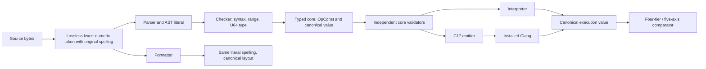

# Phase 19: Numeric Literals and `OpConst` - Research

**Researched:** 2026-09-24
**Domain:** Go-hosted compiler front end, typed core IR, interpreter, and C17 native lowering
**Confidence:** HIGH for repository seams and locked requirements; MEDIUM for C exact-width target bridge

## User Constraints (from CONTEXT.md)

### Locked Decisions

The user asked for recommendations after a broad, adversarial review across
language design, compiler, backend, portability, security, product, and
operations perspectives, then explicitly approved following the
recommendations automatically.

#### Unsigned type and bounds

- **D-19-01:** Use one architecture-independent `U64` type with values from 0
  through 18,446,744,073,709,551,615. Reject a literal outside this range with
  a source diagnostic before it reaches executable core; never truncate or
  wrap it. Native targets must provide an exact 64-bit unsigned representation
  or fail closed. Do not make the source type width target-dependent.

#### Literal spelling and formatting

- **D-19-02:** Accept decimal, `0x` hexadecimal, and `0b` binary integer
  literals. Permit `_` separators only between digits. Do not accept octal
  forms or type suffixes. Preserve the literal's original token spelling in
  formatted source while canonicalizing whitespace and layout.

#### Literal typing and source use

- **D-19-03:** Support direct initialization such as `let count = 42`. Every
  numeric literal has the single `U64` type. Do not add literal suffixes,
  contextual numeric inference, or a general untyped/arbitrary-precision
  constant system. Existing signature and type-checking rules remain the
  authority at function boundaries.

#### Runtime representation and evidence

- **D-19-04:** Serialize a numeric scalar's execution value as a canonical
  decimal string, independent of its source radix or separators. Preserve
  D-12-18's byte-identical scalar projection for existing values. If any
  serialized execution golden must move, justify that movement explicitly.
- **D-19-05:** Keep `OpConst` honest at all six dispatch sites and retain the
  four-tier literal-bearing differential fixture required by the roadmap.
  Treat successful registration alone as insufficient evidence; the literal
  must execute end to end.

### the agent's Discretion

Parser/core representation, helper boundaries, fixture names, diagnostic text
and exact test factoring are open to the planner, provided the decisions above,
the existing independent admission peers, the six-site exhaustive controls,
the five-axis semantic comparison, and the zero-external-production-dependency
constraint remain intact.

### Deferred Ideas (OUT OF SCOPE)

None — discussion stayed within Phase 19's boundary. Signed types, more widths,
floating point, arithmetic, and comparisons remain deferred per the roadmap.

<phase_requirements>
## Phase Requirements

| ID | Description | Research Support |
|----|-------------|------------------|
| VAL-01 | A numeric literal can be written, checked, interpreted, and lowered. | Front-end token/AST changes, checker-produced typed `OpConst`, interpreter representation, exact-width C emission, formatting preservation, and boundary tests. |
| VAL-02 | Every operation kind is handled at all six dispatch sites, proven by the exhaustive-dispatch control. | Add `OpConst` as a distinct kind; register it in `AllOperationKinds`; update `check`, `corevalidate`, `interp`, `cgen`, `pathoracle`, `originvalidate` and both exhaustive/mutation controls with a real literal fixture. |
| VAL-03 | A literal-bearing program agrees across interpreter, `-O0`, `-O3`, and `-O3 -flto`. | Extend the existing phase 11/16 four-tier harness and `Phase5CompareProgramEngines` using a fixture whose returned scalar visibly depends on `OpConst`. |
</phase_requirements>

## Summary

This phase is a vertical compiler feature across a lossless lexer/parser, source AST, checker, typed core operation, two execution engines, and the existing validation/evidence peers. The repository already separates source token storage from semantic projections: the syntax tree retains source bytes and trivia, while the AST binding currently describes a named place or call RHS. The least surprising extension is a numeric token retaining its exact spelling, an AST literal operand carrying spelling/value facts needed by checking, then a checker-owned canonical U64 fact on a new `OpConst`. [VERIFIED: internal/compiler/syntax/tree.go:5-19] [VERIFIED: internal/compiler/ast/ast.go:165-192] [VERIFIED: internal/compiler/core/core.go:627-680]

Keep one exact semantic domain end to end. Parse radix and separators with checked accumulation against the U64 maximum, report malformed spelling and overflow as source diagnostics before executable core, and normalize only the runtime/wire payload to decimal. In native C, use an exact-width unsigned type and reject compilation if the target does not expose that type; do not substitute `unsigned long`, `unsigned long long`, host word size, or a truncating cast. The `uint64_t` typedef is optional in C17 implementations, while when supplied it denotes an exact-width unsigned type; this supports the locked fail-closed requirement. [CITED: https://www.open-std.org/jtc1/sc22/wg14/www/docs/n1570.pdf, §7.20.1.1] [ASSUMED]

**Primary recommendation:** Implement `OpConst` as a new value-producing operation with a canonical decimal semantic payload; retain source token spelling only in the lossless syntax/AST path, and drive it through the existing six-site exhaustive controls, prior scalar-golden replay, and the five-axis four-tier comparator.

The planning baseline is M003 Phase 19 after Phase 18 completion. `STATE.md` records that the full `go test ./...` suite already has unrelated red Phase 11 gate fixtures, stale corpus counts/validation digest, and unpinned groundedness findings; plans should distinguish this known baseline from regressions introduced by Phase 19 and rely on focused package and phase-specific gates. [VERIFIED: .planning/STATE.md:3-18,59-66,516-520]

## Architectural Responsibility Map

| Capability | Primary Tier | Secondary Tier | Rationale |
|------------|-------------|----------------|-----------|
| Numeric tokenization, parsing, and source spelling retention | API / Backend | — | The compiler front end owns language source admission and formatting. |
| Literal range/type checking and `OpConst` construction | API / Backend | — | The checker and core IR define admitted semantics. |
| Interpreter constant execution | API / Backend | — | `interp` is a semantic engine consuming validated core. |
| Native constant representation and emission | API / Backend | — | `cgen` is the production lowering boundary; C17 target facts must be checked there. |
| Dispatch completeness and differential evidence | API / Backend | — | Independent peers and session comparators own admission and semantic evidence. |

## Project Constraints (from AGENTS.md)

- Go 1.24 standard library hosts Stage 0; C17 emitted to installed Clang is the development native path.
- Prefer standard-library-only and shallow audited boundaries; every dependency must earn more than copy-local implementation.
- Source text is Git-friendly and formatter-owned; parsing is lossless enough to preserve comments and provide stable recovery.
- Safe code has defined behavior; optimizer attributes and FFI guarantees derive from checked facts.
- Low-level ownership, borrowing, deterministic cleanup, target layout, and C interop remain milestone requirements.
- Runtime uses stack/inline values and explicit resources; no mandatory global tracing heap or service runtime.
- Evidence uses deterministic fixtures, negative controls, properties, mutation, differential execution, and sanitizers in explicit cost lanes.
- macOS and Linux are initial host priorities; wire contracts and target facts must not encode the current Apple arm64 host.
- Security keeps untrusted input, unsafe operations, FFI, secrets, and build authority explicit; no generic `untaint` or ambient authority escape.
- Before changing files, work must enter through a GSD workflow; `$gsd-quick` is for small fixes/docs, `$gsd-debug` for investigation/fixing, and `$gsd-execute-phase` for planned phase work. [VERIFIED: AGENTS.md:21-44]

## Standard Stack

### Core

| Library / Tool | Version | Purpose | Why Standard |
|---------|---------|---------|--------------|
| Go standard library | Go 1.24 (`go.mod` declares `go 1.24`) | Lexer/parser, checked radix conversion, diagnostics, IR/runtime serialization | Project bootstrap constraint; no new production dependency. [VERIFIED: go.mod:1-3] |
| C17 + installed Clang | Host probe: Apple clang 21.0.0 (darwin/arm64) | Compile emitted native U64 constants | Existing native path; target exact-width check must be emitted/compiled as part of lowering. [VERIFIED: AGENTS.md:32-35] [ASSUMED: host observation is local only] |
| Go test package | Go 1.24 | Syntax, checker, peer, interpreter, emitter, and session regression controls | Existing repository test architecture; tests should be added beside owning packages and cross-engine tests in `session`. [VERIFIED: internal/compiler/core/core_test.go:551-703] |

### Supporting

| Library / Tool | Version | Purpose | When to Use |
|---------|---------|---------|-------------|
| C `<stdint.h>` exact-width types/macros | C17 | `uint64_t`, `UINT64_MAX`, and constant construction in generated C | Emit U64 only if exact-width support is present; compile-time failure closes unsupported target. [CITED: https://www.open-std.org/jtc1/sc22/wg14/www/docs/n1570.pdf, §7.20.1.1 and §7.20.2.1] |
| Existing `session.Phase5CompareProgramEngines` | In-repo | Check equality across interpreter/native results after independent execution validation | Use for the literal-bearing four-tier fixture; do not add another comparator. [VERIFIED: internal/compiler/session/session_phase5_compare.go:66-88] |

### Alternatives Considered

| Instead of | Could Use | Tradeoff |
|------------|-----------|----------|
| One fixed-width U64 | Arbitrary-precision/untyped constants | Would require contextual conversion and an additional semantic domain explicitly excluded by D-19-03. |
| Exact C `uint64_t` availability check | `unsigned long` or host-sized integer | Those types can vary by target; they cannot meet architecture-independent source width. |
| One distinct `OpConst` | Encode literal data as a special `OpCopy`/`OpMove` case | Hides a new value-producing meaning in an existing dispatch branch and weakens exhaustive-dispatch forcing. |

**Installation:** None. No external production package is needed or recommended.

## Package Legitimacy Audit

Not applicable: this phase adds no external package.

## Architecture Patterns

### System Architecture Diagram



### Recommended Project Structure

```text
internal/compiler/
├── syntax/       # numeric tokenization, grammar, spelling-preserving format
├── ast/          # literal RHS source form and span
├── check/        # checked magnitude/type and OpConst core lowering
├── core/         # OpConst definition, typed operands, registry
├── corevalidate/ # independent core invariants
├── interp/       # scalar U64 value execution and decimal projection
├── cgen/         # target exact-width guard and native literal emission
├── pathoracle/   # OpConst-compatible traversal behavior
├── originvalidate/ # OpConst-compatible origin propagation
└── session/      # six-site controls, scalar golden replay, four-tier compare
```

### Pattern 1: Preserve source and semantic value separately

**What:** Keep original numeric token text in the lossless syntax/token path; derive a checked semantic magnitude for the AST/checker/core boundary. Do not rewrite source text to decimal during formatting. [VERIFIED: internal/compiler/syntax/tree.go:5-19] [VERIFIED: internal/compiler/syntax/format.go:66-80]

**When to use:** Every radix/separator spelling must remain stable in formatted output while execution uses one U64 meaning.

**Example (illustrative pseudocode; helper names are design guidance, not current APIs):**

```go
type NumericLiteral struct {
    Spelling string // exact token text, e.g. 0x2a or 4_2
    Value    uint64 // checked magnitude, never obtained by wrapping
}

func parseU64Literal(text string) (uint64, error) {
    // Validate radix prefix and separator placement first.
    // Remove separators only from a temporary digit buffer.
    // Parse with overflow detection against the U64 maximum.
    // Keep `text` unchanged in the syntax token for Format.
}
```

### Pattern 2: Emit exact-width C constants fail-closed

**What:** Generated C should include `<stdint.h>`, use `uint64_t` / `UINT64_C(...)`, and make missing or mismatched exact-width support a compilation error. C17 specifies exact-width typedefs as optional; no target fallback can silently narrow the Lang value. [CITED: https://www.open-std.org/jtc1/sc22/wg14/www/docs/n1570.pdf, §7.20.1.1]

**Example (C17 shape):**

```c
#include <stdint.h>

/* `uint64_t`/`UINT64_C` missing on this target must fail compilation. */
static const uint64_t lang_literal = UINT64_C(18446744073709551615);
```

The emitted decimal digits must come from the validated canonical core value, never by re-parsing a source spelling in the backend. Add a target-facing test for the maximum value and a diagnostic/compile-fail case for out-of-range source values.

### Pattern 3: Keep operation handling independently observable

Add `OpConst` to the declaration and `AllOperationKinds()` registry, then independently handle it at `check`, `corevalidate`, `interp`, `cgen`, `pathoracle`, and `originvalidate`. The in-repo control drives kinds through peers and requires fixtures to exercise them; the two less-kind-specific analysis walks currently define “handled” as completing without error. [VERIFIED: internal/compiler/core/core.go:814-822] [VERIFIED: internal/compiler/core/core_test.go:551-703]

## Don't Hand-Roll

| Problem | Don't Build | Use Instead | Why |
|---------|-------------|---------|-----|
| Overflow-safe radix parsing | Manual fixed-width multiply/add that can wrap before checking | Standard-library checked unsigned parse or explicit pre-multiply bound check | Overflow must be a source-level refusal, not an accidentally wrapped value. |
| Target integer width discovery | Infer width from `long`, host architecture, or `sizeof(void*)` | C `<stdint.h>` exact-width `uint64_t` availability and maximum | Pointer width and C fundamental integer widths are not Lang type widths. |
| Cross-engine semantic oracle | A second comparator or just interpreter-vs-`-O0` check | Existing all-pairs five-axis comparator | Existing evidence handles all four tiers and the project's established semantic axes. |

**Key insight:** The feature is safe only when the parser, core, interpreter, and C emitter agree on the same bounded unsigned value while source spelling and serialized execution representation remain intentionally different projections.

## Common Pitfalls

### Pitfall 1: Prefix/separator ambiguity

**What goes wrong:** Invalid forms such as empty radix bodies, doubled/leading/trailing separators, non-radix digits, suffix-like tails, or implicit octal become accepted or receive misleading values.
**Why it happens:** Tokenization and conversion are often split such that a permissive lexer consumes text the semantic parser silently normalizes.
**How to avoid:** Define a single lexical grammar for the three accepted bases, validate `_` strictly between valid digits for that base, preserve spans across the full token, and reject leftovers. Include `0`, `00`, `08`, `0x`, `0b`, `1_`, `_1`, `1__2`, `0x_F`, `0b2`, and suffix tails as explicit accept/refuse cases. [ASSUMED]
**Warning signs:** A malformed literal reaches core, diagnostic spans cover only the bad digit, or formatting changes spelling.

### Pitfall 2: Host-sized or signed intermediate arithmetic

**What goes wrong:** The maximum U64 is rejected on one host, truncated on another, or accepted after an overflowing intermediate.
**Why it happens:** Using `int`, signed parsing, or target-specific `long` accidentally introduces host-dependent semantics.
**How to avoid:** Parse to `uint64` with checked overflow (or check `acc > (max-digit)/base` before multiply/add); store the canonical value without conversion through signed types. Independently exercise zero, max, max+1, and each radix representation of boundary values. [ASSUMED]
**Warning signs:** Tests only use small decimal values or run solely on Apple arm64.

### Pitfall 3: U64 is exact in Go but not in emitted C

**What goes wrong:** `-O0` appears correct for small values, but large constants narrow or compiler behavior varies by target.
**Why it happens:** C's exact-width typedef names are optional and `long` widths vary; integer literal typing rules are distinct from the source language's type.
**How to avoid:** Emit exact-width `<stdint.h>` forms and force a compile failure when unavailable. Exercise the U64 maximum in source/core/emitted C and do not use casts as an overflow remedy. [CITED: https://www.open-std.org/jtc1/sc22/wg14/www/docs/n1570.pdf, §6.4.4.1 and §7.20.1.1]
**Warning signs:** Generated C uses `unsigned long` or native type assumptions without checking the target.

### Pitfall 4: Numeric serialization changes old scalar goldens

**What goes wrong:** Existing values' execution bytes change because the implementation starts serializing a new tagged structure for all scalar values.
**Why it happens:** Value-domain widening changes a shared serializer, or integers are encoded as JSON numeric values instead of the current scalar payload string projection.
**How to avoid:** Preserve the scalar projection shape and decimal string output for numeric values; replay existing execution-golden corpus before adding the operation to other sites. Only move a golden with a written reason. D-12-18's current runtime `value` has `tag` and `payload` string fields and returns payload verbatim when the tag is empty. [VERIFIED: internal/compiler/interp/interp.go:432-435] [VERIFIED: internal/compiler/interp/interp.go:466-479]
**Warning signs:** Golden diffs are broad, use radix spelling, or include Go JSON float formatting.

### Pitfall 5: Registry green without actual OpConst execution

**What goes wrong:** The exhaustive kind list sees the new kind but test fixtures never parse and execute a literal; a site can remain dead code.
**Why it happens:** A registry/count check is mistaken for dispatch completeness, or the fixture is skipped at one engine/site.
**How to avoid:** Add a fixture that uses the new kind and proves non-vacuous exercise at every required peer. Keep both deletion/mutation controls required by VAL-02; assert each control goes red when each site is removed. The current dispatch control itself records that merely unencountered kinds fail. [VERIFIED: internal/compiler/core/core_test.go:677-703]
**Warning signs:** Test only asserts kind string presence, registry length, or successful parsing.

### Pitfall 6: Four tiers run but don't prove a new semantic value

**What goes wrong:** Interpreter and native outputs agree on a constant that is disconnected from the literal-producing operation, or only one pair of tiers is compared.
**Why it happens:** The fixture doesn't return/observe the initialized binding, or direct C emission doesn't exercise the public native route.
**How to avoid:** Make the literal's value the function result; run all pairs of interpreter, `-O0`, `-O3`, and `-O3 -flto` through the established comparator. The existing helper drives all three native flags; comparator checks every pair. [VERIFIED: internal/compiler/session/session_phase11_differential_test.go:152-186] [VERIFIED: internal/compiler/session/session_phase5_compare.go:73-88]
**Warning signs:** Merely compile generated C, no value observation, or compare interpreter against only `-O0`.

## Code Examples

### Checked magnitude parsing

Recommended operation-level outline; names are schematic because no numeric literal API exists yet:

```go
func accumulate(digits []byte, base uint64) (uint64, error) {
    var value uint64
    for _, digit := range digits {
        d := uint64(decodeDigit(digit))
        if value > (math.MaxUint64-d)/base {
            return 0, errOverflow
        }
        value = value*base + d
    }
    return value, nil
}
```

This bound check avoids performing the overflowing operation. Production code should report the source span and diagnostic at the syntax/checking boundary. The example's `math.MaxUint64` and helper names are illustrative Go standard-library facts, not established in-repo values. [ASSUMED]

### Canonical execution string

Store the canonical decimal representation on the core operation (or derive it from a checked `uint64` at the projection boundary), then use the same exact decimal text in interpreter values and execution output. Do not serialize as floating point. Exact in-repo scalar behavior is: `if v.tag != "" { return v.tag }` and `return v.payload`. [VERIFIED: internal/compiler/interp/interp.go:466-479]

### C lowering

```c
#include <stdint.h>
uint64_t place_value = UINT64_C(42);
```

The generated digits should be canonical decimal digits from admitted IR; compilation on a target lacking `uint64_t`/`UINT64_C` should fail rather than lower with a narrower surrogate. [CITED: https://www.open-std.org/jtc1/sc22/wg14/www/docs/n1570.pdf, §7.20.1.1]

## State of the Art

| Old Approach | Current Approach | When Changed | Impact |
|--------------|------------------|--------------|--------|
| No numeric literals; values are moved or constructed from inputs | One fixed-width U64 literal, checked and lowered through `OpConst` | Phase 19 (planned) | First language-created scalar, no arithmetic or signed overflow surface. [CITED: .planning/ROADMAP.md §Phase 19] |
| Existing scalar projection is the `tag` / `payload` string model | Preserve old scalar bytes while numeric scalar payloads use canonical decimal text | Locked D-19-04 | No corpus-wide golden drift. [VERIFIED: internal/compiler/interp/interp.go:432-435,466-479] |

**Deprecated/outdated:**

- Host-sized integer selection for source values: incompatible with D-19-01's architecture-independent width. [CITED: .planning/phases/19-numeric-literals-and-opconst/19-CONTEXT.md]
- Arbitrary-precision untyped constants and contextual inference: explicitly excluded by D-19-03. [CITED: .planning/phases/19-numeric-literals-and-opconst/19-CONTEXT.md]

## Assumptions Log

| # | Claim | Section | Risk if Wrong |
|---|-------|---------|---------------|
| A1 | C17's `uint64_t` / `UINT64_C` availability is sufficient as the lowering capability gate on supported targets; a missing macro/type can be surfaced as a compile failure. | Standard Stack, Patterns | An implementation could expose one without the other or need a cleaner explicit generated check. Validate on CI target matrix before locking backend details. |
| A2 | Checked parsing via standard library or explicit bound-before-multiply arithmetic will fit the parser/checker architecture without a new arbitrary precision type. | Code Examples | Could mis-handle diagnostic attribution or radix/separator grammar if split across layers. |
| A3 | The native differential helper can be reused for a no-input literal-return fixture without changes to native runner plumbing. | Validation Architecture | Existing harness assumes parameter inputs in some call paths; a dedicated wrapper may be needed. |

## Open Questions

1. **Where should overflow be diagnosed: lexer/parser or checker?**
   - What we know: decisions require rejection with a source diagnostic before executable core; lexer preserves token spans, AST/checker already own semantic admission.
   - What's unclear: whether numeric token conversion belongs with syntax validation or semantic U64 range checking in `check`.
   - Recommendation: planner should assign one owner and keep malformed spelling distinct from a syntactically valid but out-of-range magnitude; both must stop before core emission.

2. **What representation should `core.OpConst` carry?**
   - What we know: operation kinds are typed and checker-produced; execution scalar serialization uses strings; source spelling must not control semantic equality.
   - What's unclear: whether canonical decimal `string` or numeric `uint64` field best preserves serialized-core stability and target generation.
   - Recommendation: prefer a single canonical value field and leave source spelling in syntax/AST; test pre-existing serialized core fixtures for byte drift before deciding if a schema change is necessary.

3. **How is exact target support reported to users?**
   - What we know: locked behavior is fail-closed on unsupported exact U64 target.
   - What's unclear: whether generated C compile errors suffice or native runner can preflight-target-check and surface a Lang diagnostic.
   - Recommendation: use the shallowest boundary that guarantees no executable is produced and preserves the target-specific cause in the build error.

## Environment Availability

| Dependency | Required By | Available | Version | Fallback |
|------------|------------|-----------|---------|----------|
| Go | compiler and tests | ✓ | go1.24.0 darwin/arm64 | — |
| Clang | native emission and four-tier evidence | ✓ | Apple clang 21.0.0 | — |
| C LTO linker support | `-O3 -flto` lane | Not independently probed | — | Existing native runner's LTO lane; planner should retain its standard lane and capture an actionable skip/failure if host toolchain lacks it. |

**Missing dependencies with no fallback:**

- None observed for Go or Clang. The LTO linker was not independently probed.

**Missing dependencies with fallback:**

- No confirmed missing dependency. `-flto` availability remains host-dependent and needs to be handled by the existing native runner lane.

## Validation Architecture

### Test Framework

| Property | Value |
|----------|-------|
| Framework | Go `testing` package (Go 1.24) |
| Config file | `go.mod` |
| Quick run command | `go test ./internal/compiler/syntax ./internal/compiler/check ./internal/compiler/core` |
| Full suite command | `go test ./...` |

### Phase Requirements → Test Map

| Req ID | Behavior | Test Type | Automated Command | File Exists? |
|--------|----------|-----------|------------------|-------------|
| VAL-01 | Valid decimal/hex/binary with separator boundaries, round-trip formatting, type checking, execution; malformed and overflow values refused before core; max U64 native result correct. | unit + integration | `go test ./internal/compiler/syntax ./internal/compiler/check ./internal/compiler/interp ./internal/compiler/cgen` | ❌ Wave 0/new phase tests |
| VAL-02 | `OpConst` processed by every named peer; exhaustive control and both mutation controls fail if any one site is removed. | integration + mutation control | `go test ./internal/compiler/core ./internal/compiler/session` | ❌ Extend existing controls |
| VAL-03 | Literal's observed return agrees across interpreter, `-O0`, `-O3`, `-O3 -flto` on all comparator pairs/five axes. | native differential | `go test ./internal/compiler/session -run 'FourTier|Phase5'` | ❌ Add literal fixture/test |
| Roadmap criterion 4 | Existing scalar execution goldens remain byte-identical or each changed golden has written justification. | regression corpus | `go test ./internal/compiler/session -run 'PayloadCorpusCharacterizationReplay'` | ✅ Existing replay seam precedent; phase should identify exact applicable corpus command. |

### Sampling Rate

- **Per task commit:** run the touched Go package tests after the relevant task (syntax/check/core, interpreter, native, or session package).
- **Per wave merge:** run `go test ./...` plus native four-tier differential for the literal-bearing fixture.
- **Phase gate:** all tests and existing scalar golden replay green; require emitted max-value result and proof that new-operation dispatch controls exercise each site.

### Wave 0 Gaps

- [ ] Add decimal/radix/separator/overflow syntax cases and formatter idempotence coverage.
- [ ] Add `OpConst` admission/value-shape tests at each independent peer and update exhaustive + removal controls.
- [ ] Add literal-bearing four-tier integration fixture and maximum-U64 native observation.
- [ ] Identify the canonical serialized-execution golden replay test/command before widening interpreter value representation.

## Security Domain

Security enforcement is enabled in `.planning/config.json`, ASVS Level 1. Numeric input is untrusted source text; it must be bounded, fully consumed, and rejected before executable core on malformed or overflowing forms. [VERIFIED: .planning/config.json:48-52]

### Applicable ASVS Categories

| ASVS Category | Applies | Standard Control |
|---------------|---------|-----------------|
| V2 Authentication | no | No authentication surface in this phase. |
| V3 Session Management | no | No session surface in this phase. |
| V4 Access Control | no | No authorization surface in this phase. |
| V5 Input Validation | yes | Strict numeric grammar, full token consumption, checked U64 bounds, source-span diagnostic. |
| V6 Cryptography | no | No cryptographic operation or secret handling in this phase. |

### Known Threat Patterns for Go compiler + C17 backend

| Pattern | STRIDE | Standard Mitigation |
|---------|--------|---------------------|
| Integer overflow or truncation from crafted source | Tampering | Checked parse before core; no wrapping; exact-width C type or fail-closed compile. |
| Malformed suffix / radix text accepted through partial parse | Tampering | Require full-token validation and reject unsupported suffixes/octal. |
| Host-target assumption changes U64 semantics | Tampering | C target exact-width guard; test macOS and Linux CI targets. |

## Sources

### Primary (HIGH confidence)

- In-repo Phase 19 context, requirements, and roadmap — locked value range, grammar, formatter, evidence and scope constraints.
- `internal/compiler/syntax/{token.go,lexer.go,tree.go,format.go}` — source token/trivia preservation and formatting pipeline.
- `internal/compiler/ast/ast.go`, `internal/compiler/core/core.go` — RHS/core operation representation and all-kinds registry.
- `internal/compiler/core/core_test.go` — six-site exhaustive control and fixture-encounter requirement.
- `internal/compiler/interp/interp.go`, `internal/compiler/session/session_phase5_compare.go`, `session_phase11_differential_test.go` — scalar projection and existing four-tier harness/comparator.

### Secondary (MEDIUM confidence)

- [WG14 N1570 C11 committee draft (the C17 exact-width wording is retained)](https://www.open-std.org/jtc1/sc22/wg14/www/docs/n1570.pdf) — §7.20.1.1 exact-width integer typedefs, §7.20.2.1 limits macros, §6.4.4.1 integer constants.

## Metadata

**Confidence breakdown:**
- Standard stack: HIGH — locked project Go/Clang/C17 stack and no new package.
- Architecture: HIGH — current repository source establishes all named extension points.
- Pitfalls: MEDIUM — implementation risks follow the locked numeric boundary; exact diagnostic ownership and target preflight remain open.

**Research date:** 2026-09-24
**Valid until:** 2026-10-24 for repository architecture; recheck compiler/toolchain availability before execution.
