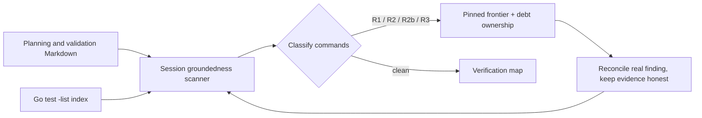

# Phase 20: Nyquist, D-13-34, and the Frontier Fixture — Research

**Researched:** 2026-09-25  
**Domain:** Go compiler validation infrastructure, project evidence/debt records, refused Lang source fixtures  
**Confidence:** HIGH for repository state and implementation seams; MEDIUM for the intended PRC-02 counting denominator

## User Constraints

No Phase 20 `CONTEXT.md` was present when research began. The phase scope and gates below come from the roadmap and milestone requirements.

## Summary

Phase 20 is a repository-evidence phase, not a library or language-runtime build phase. Use the existing Go standard-library test harness and Phase 14's executable groundedness instrument to reconcile the specified archived evidence. Keep `go test ./...` and targeted package tests as the verification path; do not install dependencies. Phase 14's validation file identifies the stdlib `go test` harness and gives the full suite command. [VERIFIED: `.planning/phases/14-evidence-instrument-and-honest-scoping/14-VALIDATION.md:15-25`]

At research start, the Phase 14 instrument passes with **R1=0, R2=0, R3=0, R2b=23 post-reconciliation**, across **639 enforced-tier documents and 708 verification commands**. Its raw per-branch discovery subtest reports **24 R2b findings**; the reconciliation test excludes one already reconciled record. Preserve both numbers and their meanings in the plan. `go test ./internal/compiler/session -run 'TestVerificationGroundedness(FrontierIsPinned|ThreeClassesAreEmpty)$' -count=1 -v` passed with a temporary `GOCACHE`; the two tests and their log fields are in `verification_groundedness_test.go`. [VERIFIED: `internal/compiler/session/verification_groundedness_test.go:1137-1145,2060-2083,2190-2222`]

There are currently **11 VALIDATION files with `status: draft`** under `.planning`, not just the specifically named 07/08/11 plus the inline 12/13 files. A filesystem scan found Phase 14, 17, 18, 19, and several archived M001/M002 validation files among them. The plan must account for every remaining draft file or explain from authoritative evidence why the criterion's scope excludes it; do not silently report the criterion met after touching only five files. The draft inventory is reproduced in this research's Evidence Baseline section.

**Primary recommendation:** Start the implementation plans with the exact EVD-01 frontier and debt baseline; reconcile and verify the named old evidence against current test names and current language reachability; add a checksum-intent refusal fixture whose diagnostic is compared against the M003-open pin; make the 112-program closure key depend on every declared input while never caching a pass/fail verdict; and keep the D-13-34 remedy and PRC-02 threshold audit behind an explicit human checkpoint where the governing record leaves a durable choice.

## Architectural Responsibility Map

| Capability | Primary Tier | Secondary Tier | Rationale |
|------------|-------------|----------------|-----------|
| Validation-command discovery and R1/R2/R2b/R3 classification | Go test/session evidence harness | `.planning` Markdown | The executable scanner, classifiers, pinned frontier, and reconciliation ownership map live in `internal/compiler/session/verification_groundedness_test.go`. |
| VALIDATION status and evidence reconciliation | Planning documents | Go session test gate | Docs carry commands and lifecycle metadata; the instrument classifies evidence and guards the frontier. |
| Held-out move/borrow structural distinctness | Go session test harness | `testdata/phase6` Lang corpus | `session_phase6_injectors_test.go` reads both fixture classes and computes an identifier-independent summary. |
| Refused checksum frontier | Lang source fixture | Go session test harness / checker | `examples/checksum.lang` is the planned long-term source path; a Go test should pin the current refusal and prove it differs from the M003-open diagnostic. |
| Enumerated-closure proof reuse | Go session test harness | Existing stdlib cache package | The expensive `enumerated-closure` subtest currently walks the generated closure and runs three-engine agreement; `internal/compiler/cache` already exposes declared-input content keys and artifact-only storage. |
| Unowned debt cap | Debt registers and generated claims view | Go session debt-register gate | The register parser already validates item shape and ownership vocabulary, but research found no PRC-02 count assertion in that gate. |

## Evidence Baseline and Required Start Counts

### EVD-01 frontier

- Targeted baseline passed: `GOCACHE=/private/tmp/phase20-gocache go test ./internal/compiler/session -run 'TestVerificationGroundedness(FrontierIsPinned|ThreeClassesAreEmpty)$' -count=1 -v`.
- The logged post-reconciliation measure is **R1=0, R2=0, R3=0, R2b=23**; the same run reports **639 enforced-tier documents and 708 verification commands**. [VERIFIED: `internal/compiler/session/verification_groundedness_test.go:2190-2222`]
- The raw branch scan reports **24 R2b**. This is discovery before reconciled-record exclusions, not a substitute for the pinned 23 residual. [VERIFIED: `internal/compiler/session/verification_groundedness_test.go:2060-2083`]
- The current 23 residuals include Phase 19's new command cells (lines 48–55 of its validation map), so Phase 20 must re-run the lint after each documentation change and update the pinned frontier/ownership map only from the newly measured set. [VERIFIED: `internal/compiler/session/verification_groundedness_test.go:1292-1299,2139-2146`]

### VALIDATION lifecycle

A scan of `.planning/**/*-VALIDATION.md` found **19 files with a `status` field: 11 draft, 4 validated, 3 complete, and 1 planned**. The draft paths at phase start are:

```text
.planning/phases/14-evidence-instrument-and-honest-scoping/14-VALIDATION.md
.planning/phases/17-return-type-parameter-type/17-VALIDATION.md
.planning/phases/18-branch-on-a-computed-value/18-VALIDATION.md
.planning/phases/19-numeric-literals-and-opconst/19-VALIDATION.md
.planning/milestones/M002-phases/07-calls-signatures-and-call-graph-refusal/07-VALIDATION.md
.planning/milestones/M002-phases/08-interprocedural-loan-liveness-in-check/08-VALIDATION.md
.planning/milestones/M002-phases/11-multi-function-native-emission-and-interprocedural-equivalen/11-VALIDATION.md
.planning/milestones/M002-phases/12-result-payloads/12-VALIDATION.md
.planning/milestones/M002-phases/13-agent-loop-for-interprocedural-defects/13-VALIDATION.md
.planning/milestones/M001-phases/05-native-equivalence-and-adversarial-evidence/05-VALIDATION.md
.planning/milestones/M001-phases/06-agent-feedback-and-performance-ratification/06-VALIDATION.md
```

This inventory is a live filesystem observation, not a committed test output; refresh it before planning/execution. Roadmap criteria explicitly call out reconciliation for 07/08/11 and inline metadata flips for 12/13, but the absolute criterion says zero draft files. [VERIFIED: `.planning/ROADMAP.md:634-639`]

### Debt baseline and denominator risk

- Phase 14's generated `.planning/UNREACHABLE-CLAIMS.md` currently contains **8 table rows with an `UNOWNED(...)` landing value** (among the visible WIRED claim rows); this is one useful live-claim count, not proven to be PRC-02's complete denominator.
- Parsing every historical `*-DEBT.md` table row in the current tree found **40 `UNOWNED(...)` cells** across 19 registers. That broader number includes archival M001/M002 rows which predate the M003 well-formedness rules and conflicts with the roadmap's statement that M002 closed with ten. Do not substitute the raw 40 for PRC-02 without resolving this scope mismatch.
- The current PRC-01 gate `TestDebtRegistersAreWellFormed` validates register shape and ownership-field syntax; its source contains no explicit five-item count assertion. The milestone audit and current `STATE.md` record **10 open, unowned debt items entering M003**. [VERIFIED: `internal/compiler/session/session_test.go:3039-3071`; `.planning/STATE.md:531-533`; `.planning/ROADMAP.md:655-657`]
- Planning implication: make the PRC-02 denominator explicit and machine-count it from the same authoritative set that supports the “M002 closed with 10” baseline. Preserve legacy/archive distinctions and avoid mass re-owning historical rows just to make a count green. Phase 20 starts with 8 current generated unowned claims as a visible lower-scope measure, above the ≤5 end target by at least 3.

## Phase Requirements

| ID | Description | Research Support |
|----|-------------|------------------|
| QLT-10 | Phases 07, 08, and 11 reconcile against the post-M003 surface, with EVD-01's lint doing the finding; no VALIDATION file remains `draft`. | Phase 14 instrument and start frontier counts; live status inventory; current checker/lint implementation path. |
| QLT-11 | A refused frontier fixture for `examples/checksum.lang` is checked in with its refusing diagnostic pinned, and the milestone moved that diagnostic. | Phase 19's fixture/refusal test pattern and Phase 20's explicit compared-to-M003-open criterion. |
| QLT-12 | The enumerated-closure proof is content-addressed rather than re-run every commit. | Existing `EnumeratePhase5Closure` / `enumerated-closure` test seam, deterministic serialization precedent, and existing cache key API. |
| PRC-02 | M003 does not close with more than 5 open, unowned debt items. | Current M002 baseline of 10; live generated-view count 8; PRC-01 parser currently lacks a numerical cap. |

## Project Constraints (from AGENTS.md)

- Start file-changing work through a GSD workflow; this Phase 20 work is being planned under `$gsd-plan-phase` and execution must use the resulting phase plan.
- Use `$gsd-quick` for small fixes/docs, `$gsd-debug` for investigation/bug fixing, and `$gsd-execute-phase` for planned phase work; do not directly edit outside GSD unless the user explicitly bypasses it.
- Project priorities: deterministic evidence, standard-library-first, explicit costs, cross-platform behavior, source authority in text, and no weakened soundness/evidence claims.

## Standard Stack

### Core

| Library / Tool | Version | Purpose | Why Standard |
|----------------|---------|---------|--------------|
| Go `testing` and `go test` | Project toolchain in `go.mod` | Run the existing session, cache, and compiler tests | Phase 14's validation contract identifies `go test` (stdlib), root `go.mod`, and `go test ./...` as full-suite command. No additional test framework is needed. [VERIFIED: `.planning/phases/14-evidence-instrument-and-honest-scoping/14-VALIDATION.md:15-25`] |
| `internal/compiler/cache` | In-repository | Content-address expensive proof inputs while rerunning verdict checks | Provides declared input `cache.Input`, content `cache.ComputeKey`, and artifact-only `Store`; do not add an external cache dependency. [VERIFIED: `internal/compiler/cache/cache.go:1-21,52-86`] |
| Lang checker/session test helpers | In-repository | Parse/check fixture source and pin refused diagnostics | Phase 19 already has a refusal-frontier test pattern in `session_phase19_test.go`. [VERIFIED: `internal/compiler/session/session_phase19_test.go:137-162`] |

### Alternatives Considered

| Instead of | Could Use | Tradeoff |
|------------|-----------|----------|
| Existing stdlib cache seam | New cache package/dependency | A second mechanism expands dependency and invalidation surface; existing package is designed for declared, content-bound artifact reuse. |
| Executable EVD-01 discovery | Hand-counted markdown grep | Hand counts cannot preserve the lint's classifier, line coordinates, or per-branch attribution guarantees. |

**Installation:** None. No external packages are required by this repository-only phase.

## Architecture Patterns

### Evidence flow



### Recommended Project Structure

```text
internal/compiler/session/
├── verification_groundedness_test.go   # frontier discovery, exact pin, ownership
├── session_phase6_injectors_test.go    # M001 held-out structural comparison
├── session_phase19_test.go             # refused/accepted source-frontier pattern
└── session_phase5_corpus_test.go       # 112-program closure differential
internal/compiler/cache/                 # declared-input content-addressed artifact store
testdata/phase6/                         # historical D-13-34 held-out/derivation pairs
examples/checksum.lang                   # planned refused checksum-intent fixture
```

### Pattern 1: Measure before reconciling

**What:** Run `TestVerificationGroundednessFrontierIsPinned` and `TestVerificationGroundednessThreeClassesAreEmpty` before touching evidence docs. The first asserts set equality between the source-literal frontier and a fresh scan. The latter separately reports reconciled R1/R2/R3 and owned R2b counts.

**When to use:** Before each reconciliation wave and after any edit to a document in the scanner's scope.

**Example:**

```sh
GOCACHE=/private/tmp/phase20-gocache go test ./internal/compiler/session -run 'TestVerificationGroundedness(FrontierIsPinned|ThreeClassesAreEmpty)$' -count=1 -v
```

Source: `internal/compiler/session/verification_groundedness_test.go:1335-1367,2155-2222`.

### Pattern 2: Pin fixture refusal by structured identity

**What:** Read fixture bytes; assert the intent marker/path is present; call `session.Check`; assert refusal; compare the diagnostic code and stable location/identity against an explicitly retained M003-open baseline. Phase 19's `TestPhase19NumericRefusalFrontiers` is the closest local pattern.

**When to use:** For `examples/checksum.lang`, which must remain a refused frontier fixture through M003 and compare as a moved diagnostic relative to the M003-open pin.

**Important:** The new fixture's exact refusing code is not yet known; determine it by running the real checker and pin the observed result. Do not guess from the roadmap prose. The M003-open code needs a durable source literal before it can be compared; research did not find an existing `examples/checksum.lang` or an obvious prior pin under the current tree.

### Pattern 3: Cache inputs, never validation verdicts

**What:** Key proof reuse on a canonical, complete declared-input set; on a matching key, reuse only the expensive serialized closure/proof inputs (or other non-verdict artifact) and still execute the comparator/acceptance assertions. Seed a changed declared input and require recomputation.

**When to use:** To prevent re-running the 112-program, 58.33-second enumerated closure on every commit.

**In-repo precedent:** `internal/compiler/cache` says its structural property is “It stores ARTIFACTS ONLY, never a verdict, judgement, or pass/fail outcome.” `cache.ComputeKey` sorts input names, rejects duplicate names and empty digests, and hashes canonical JSON. [VERIFIED: `internal/compiler/cache/cache.go:12-23,52-86`]

## Don't Hand-Roll

| Problem | Don't Build | Use Instead | Why |
|---------|-------------|-------------|-----|
| Test-pattern truth | A new regex/name inventory detached from Go's test runner | Phase 14's `go test -list` groundedness index and classifications | Ground the claim to actual test names and preserve non-inertness behavior. |
| Closure content keys | Ad-hoc concatenated hash strings | Existing `cache.ComputeKey` with named, complete declared inputs | Duplicate/empty input rejection and canonical sorted JSON already exist. |
| Verdict caching | Store “passed” as a reusable cache result | Cache only non-verdict inputs/artifacts; run validation assertions fresh | Existing cache package structurally prohibits cached judgment; caching a verdict would allow stale proof. |
| Fixture distinctness | Byte inequality or identifier spelling | `phase6StructuralSummary` and the existing structural distinctness assertion | The current defect is exactly that different bytes can represent alpha-renames with identical structure. |

## Common Pitfalls

### Pitfall 1: Fixing docs before recording the starting frontier

**What goes wrong:** Evidence gets edited before the exact EVD-01 findings are measured, making it impossible to show what moved or how much work the reconciliation required.

**How to avoid:** Capture the exact pre-edit test output and counts first; retain the test's set-equality discipline when updating the pin.

### Pitfall 2: Treating R2b as an R1/R2 failure

**What goes wrong:** The existing contract intentionally allows per-branch records to remain pinned and owned; mechanically forcing the whole R2b class to zero changes policy rather than reconciling the requested validation corpus.

**How to avoid:** Keep R1/R2/R3 and R2b distinct. Every remaining R2b row needs a valid owner in `r2bLandingPhases`; the current P20 assignment is established in source.

### Pitfall 3: Narrow interpretation of “zero draft VALIDATION files”

**What goes wrong:** Only the explicitly named phases are flipped while 11 other draft frontmatters remain, and QLT-10's absolute criterion still fails.

**How to avoid:** Use a script or test over all `.planning/**/*-VALIDATION.md` frontmatters, then inspect each status transition for earned evidence. Do not make a blind `sed` sweep that labels unverified docs green.

### Pitfall 4: Miscounting debt

**What goes wrong:** Counting every `UNOWNED` text occurrence yields 40 historical table rows; counting only the generated claims view gives 8; neither denominator is yet demonstrated as the canonical PRC-02 metric. M002's documented entry baseline is 10.

**How to avoid:** Define the machine-counted population by reference to the authoritative M002 baseline and PRC-01 parser before asserting the cap. Preserve the generated view as a consistency check; do not suppress or rewrite legacy history to meet the number.

### Pitfall 5: Caching a pass result

**What goes wrong:** A cache hit skips the very semantic/differential comparison meant to justify evidence, allowing inputs not represented in the key to serve stale green.

**How to avoid:** Use complete, named content inputs; cache only reusable inputs or artifacts, then run the comparison and assertions fresh. Test both unchanged-key reuse and changed-input invalidation.

### Pitfall 6: Ratifying the old D-13-34 weakness as permanent without reconsidering the new surface

**What goes wrong:** D-13-34 was accepted when the move/borrow pairs were alpha-renames; Phase 20's criterion says the structurally distinct program is now constructible and requires replacement or an explicit re-ratification with named owner.

**How to avoid:** Use a blocking human decision checkpoint before modifying shipped M001 fixture history or declaring the weakness permanent again. Preserve the five-component predicate and D-06-29's independent anti-overfitting rationale whichever branch is chosen.

## Validation Architecture

### Test Framework

| Property | Value |
|----------|-------|
| Framework | Go stdlib `testing` / `go test` |
| Config file | `go.mod` at repository root |
| Quick run command | `GOCACHE=/private/tmp/phase20-gocache go test ./internal/compiler/session -run 'TestVerificationGroundedness(FrontierIsPinned|ThreeClassesAreEmpty)$' -count=1 -v` |
| Full suite command | `GOCACHE=/private/tmp/phase20-gocache go test ./...` |

The temporary `GOCACHE` override is needed in this Codex sandbox because the default user cache path returned `operation not permitted`; it is environment handling, not a repository setting.

### Phase Requirements → Test Map

| Req ID | Behavior | Test Type | Automated Command | File Exists? |
|--------|----------|-----------|-------------------|-------------|
| QLT-10 | Groundedness frontier exactness, reconciliation, and no draft validation metadata | unit/integration | `go test ./internal/compiler/session -run 'TestVerificationGroundedness(FrontierIsPinned|ThreeClassesAreEmpty)$' -count=1 -v`; add/run a draft-status corpus check | Existing EVD-01 tests; lifecycle corpus check to confirm/create |
| QLT-11 | `examples/checksum.lang` is refused at a pinned, moved diagnostic | unit | `go test ./internal/compiler/session -run 'TestPhase20.*Checksum.*Frontier' -count=1 -v` | ❌ New test and fixture needed |
| QLT-12 | unchanged closure reuses content-bound evidence; changed input reruns; outcomes still compared fresh | unit/integration | `go test ./internal/compiler/session -run 'TestPhase20.*EnumeratedClosure.*(Cache|Evidence)' -count=1 -v` | ❌ New test needed; related Phase 5 corpus test exists |
| PRC-02 | Open unowned debt count is at most five at close, mechanically derived | unit | `go test ./internal/compiler/session -run 'TestDebtRegistersAreWellFormed|TestPhase20.*Unowned' -count=1 -v` | Partial: parser test exists; numeric assertion/close measurement needed |

### Wave 0 Gaps

- Add tests for checksum refusal/movement, closure key reuse/invalidation, and machine-counted debt population.
- Establish the durable M003-open checksum diagnostic literal if it is not already available from a prior recorded test/run artifact.
- Existing session, checker, and cache test infrastructure is in place; no framework install is needed.

## Security Domain

This phase has no authentication, session, access-control, or cryptographic feature surface. It edits evidence documents and tests that read checked-in source fixtures and planning files. Treat fixture/document content as untrusted test input, keep path resolution rooted through existing project test helpers, and retain the existing cache rule that digests are content identity rather than authenticity proofs. [VERIFIED: `internal/compiler/cache/cache.go:25-29`; `.planning/config.json:49-51`]

## Assumptions Log

| # | Claim | Section | Risk if Wrong |
|---|-------|---------|---------------|
| A1 | PRC-02's count should follow the same qualified population that produced M002's ten-item carry-forward, rather than every historical `UNOWNED(...)` cell now found across all old registers. | Evidence baseline / Pitfall 4 | The implementation could satisfy the wrong denominator; resolve against the milestone audit and make the test's population explicit. |
| A2 | The M003-open diagnostic for the checksum source intent can be reconstructed or located from repository history before adding the Phase 20 comparator. | Pattern 2 / Wave 0 | QLT-11's “differs from M003 open” claim cannot be proven from a current-only pin. |

## Open Questions

1. **What exactly is the PRC-02 counted population?**
   - What we know: M002 recorded ten open unowned items entering M003; current generated unreachable-claims view has eight unowned rows; a simple historical-register scan finds 40.
   - What's unclear: the machine-counting rule that produced the milestone's “10” and whether the current view or some debt cluster subset is authoritative.
   - Recommendation: locate the audit's exact ten-item table and make the gate consume that same classification/registry, updated by explicit closures/owners; retain the three counts in the plan until the rule is nailed down.
2. **What was the exact M003-open checksum diagnostic?**
   - What we know: `examples/checksum.lang` does not currently exist; Phase 19 already pins literal syntax/range refusals.
   - What's unclear: the exact original source and code/span used for the M003-open pin.
   - Recommendation: search Phase 19 summaries/commits and establish a durable source literal or fixture-as-of-open record before claiming QLT-11's diagnostic moved.
3. **Which durable D-13-34 outcome is chosen?**
   - What we know: the current probe asserts both move and borrow held-out pairs remain structurally identical; Phase 13 explicitly records Option B, no fixture edits, as ratified then.
   - What's unclear: whether Phase 20 should replace those pairs now that the surface changed or re-ratify and assign the remaining risk to a future milestone.
   - Recommendation: a blocking human checkpoint before the one-way fixture/history or permanent-debt choice; the plan must include D-06-29's restored or explicitly written-off inference.

## Environment Availability

Step 2.6 skipped for product dependencies: this is a code/docs-only phase with no external packages, services, databases, or compiler runtime beyond repository Go tests. `go test` is present; its default build cache was inaccessible in this sandbox, while an explicit cache under `/private/tmp` worked. No install is required.

## Sources

### Primary (HIGH confidence)

- `.planning/ROADMAP.md:625-673` — Phase 20 goal, requirements, detailed gates, frontmatter rule, start-of-phase count requirement, and overflow handling.
- `.planning/STANDING-VERDICTS.md` — standing dependency verdicts and process constraints; zero-external-dependency posture, test-lane discipline, and anti-patterns.
- `.planning/LANGUAGE-MATURITY.md` — current surface calibration and machine-checked corpus/guard inventory; read alongside Phase 19's new numeric literal/constant evidence.
- `.planning/research/M003/ADVERSARIAL-SYNTHESIS.md:212-218,408-414,451-459` — reconciled contradiction rulings, P20 scope, and constructibility gate.
- `.planning/phases/14-evidence-instrument-and-honest-scoping/14-VALIDATION.md:15-25,48-89` — test commands, real validation map, and Phase 14 evidence pattern.
- `internal/compiler/session/verification_groundedness_test.go:1137-1325,1335-1367,2060-2083,2119-2146,2155-2222` — exact frontier, raw and reconciled R2b measurement, ownership map, output count.
- `internal/compiler/session/session_test.go:3039-3071` — PRC-01 debt table/ownership checks and the current lack of an explicit count assertion in this test.
- `.planning/phases/14-evidence-instrument-and-honest-scoping/PHASE-14-DEBT.md` and `.planning/UNREACHABLE-CLAIMS.md` — current debt rows and generated-claim view.
- `.planning/milestones/M002-MILESTONE-AUDIT.md` §4 and `.planning/STATE.md:531-540` — exact M002 count and carry-forward cluster context.
- `.planning/milestones/M002-phases/13-agent-loop-for-interprocedural-defects/PHASE-13-DEBT.md` — recorded D-13-34 adjudication.
- `internal/compiler/session/session_phase6_injectors_test.go:93-219` — current move/borrow pair tests, five-field structure predicate usage, and D-13-34 probe behavior.
- `internal/compiler/session/session_phase19_test.go:137-162` — local source refusal pinning pattern.
- `internal/compiler/session/session_phase5_corpus_test.go:553-569` — expensive enumerated-closure test seam.
- `internal/compiler/cache/cache.go:1-29,52-86` — existing stdlib content-addressed artifact cache and no-verdict constraint.
- `.planning/REQUIREMENTS.md:166-193` — verbatim Phase 20 requirement IDs and descriptions.
- `.planning/config.json:22-55` — Nyquist validation/security defaults and enabled status.

## Metadata

**Confidence breakdown:**
- Standard stack: HIGH — existing repository tests and cache APIs were opened directly.
- Architecture and evidence counts: HIGH — measured with current EVD-01 tests and filesystem scan.
- PRC-02 denominator: MEDIUM — current records show conflicting populations; resolve before codifying.
- D-13-34 outcome: MEDIUM — roadmap permits alternatives, and user authorization requires the durable choice to remain a checkpoint.

**Research date:** 2026-09-25  
**Valid until:** 2026-10-25, or until a new phase changes the validation corpus, debt inventory, or source language surface.
