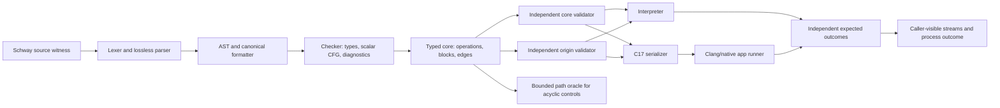

# Phase 26: Checked Scalar Sum - Research

**Researched:** 2026-10-02  
**Domain:** Lossless language frontend, scalar CFG analysis, interpreter/native execution  
**Confidence:** HIGH for repository seams and locked product boundary; MEDIUM for proposed dataflow details

<user_constraints>
## User Constraints (from CONTEXT.md)

### Locked Decisions

### Loop source form and scalar state

- **D-26-01:** Use function-local mutable scalar bindings (`var`) for the `U64` loop counter and accumulator. Keep this mutability limited to copyable `U64`/`Bool` state; it does not admit mutation of owners, resources, loans, pointers, or aggregate values. The user explicitly selected this option.
- **D-26-02:** Use a conventional pre-tested `while condition { ... }` form. Re-evaluate the Bool condition before each iteration; `n = 0` performs zero iterations. Use `if/else` block control flow with Bool conditions, without implicit truthiness. The user approved the specialist recommendation.
- **D-26-03:** Use infix `+` for U64 addition and `<` for the Phase 26 sum predicate. Keep equality and remainder with Phase 27, where FizzBuzz needs them. Do not add other arithmetic or the full relational/equality operator set without a phase requirement.

An illustrative loop shape is:

```schway
var i = 0
var total = 0
while i < n {
  i = i + 1
  total = total + i
}
```

The exact AST, type facts, lowering, and formatter mechanics remain planning work. Keep value-yielding `if`, pattern conditions, short-circuit condition chains, iterator loops, `break`, and `continue` out of this slice unless a Phase 26 acceptance criterion cannot be met otherwise.

### Checked U64 overflow and caller-visible failure

- **D-26-04:** Overflow is a defined checked failure, never a wrapped success. When it reaches the application entry, report a program-level non-success with bounded deterministic stderr and no stdout. Keep this distinct from compiler/tool failures and from evidence-capacity exhaustion. The user approved the specialist recommendation.
- **D-26-05:** Do not make arithmetic overflow a catchable source-level typed error in Phase 26. A future named consumer that must recover and continue is the observation that would justify revisiting that contract.
- **D-26-06:** The bounded `sum_to_n` inputs cannot overflow, so independently exercise overflow with a direct arithmetic witness near `U64::MAX`; pin the expected program outcome rather than inferring it from interpreter/native agreement alone.

### Scalar loop guarantees and evidence

- **D-26-07:** Accept cyclic control flow only after finite, monotone, deterministic fixed-point analysis establishes the admitted scalar state. Do not remove `check.cfg_back_edge` as a shortcut or treat the existing acyclic path enumerator as a loop proof. Independent validators must derive the admitted facts themselves.
- **D-26-08:** Keep any loop-carried owner, resource, loan, or loan-derived provenance refused with stable source-attributed diagnostics. Analysis bounds fail closed. Where loop execution can repeat an event, preserve distinguishable dynamic occurrences; evidence exhaustion is never a language-level result.
- **D-26-09:** Compare interpreter and native execution separately with independently pinned answers. Include the three accepted sum values, the rejected `1,001` boundary, direct overflow, reached wrong-result and skipped-iteration controls, and resource/loan back-edge refusal controls. Check in and exercise the `sum_to_n` source witness before broadening loop support. Source inspection and historical M004 receipts are not Phase 26 execution evidence.

### Dependencies and implementation scope

- **D-26-10:** Retain Go 1.24 standard library, the existing interpreter, readable C17/Clang emission, and the current application runner. Add no dependency or backend for this slice; copy-local code is preferred unless a concrete need outweighs its dependency-tree and audit cost.

### The agent's Discretion

- Choose the precise grammar productions and canonical formatting for `var`, `while`, `if/else`, `<`, and checked infix `+`, with source spans and stable recovery.
- Implement the resolved scalar lattice, CFG worklist and fail-closed analysis budget, independently derived validation facts, and source-attributed refusal diagnostics, while preserving D-26-07 and D-26-08.
- Implement the resolved per-`(invocation, static operation ID)` occurrence ordinal and independent peer derivation; keep occurrence identity separate from app outcome and evidence-capacity status.
- Use `if/else` as block control flow in the initial slice. Keep branch values, condition chains, `break`/`continue`, iterator forms, and nested-loop guarantees outside unless required by the approved witnesses.

### Deferred Ideas (OUT OF SCOPE)

- Phase 27 owns U64 equality and remainder, exact FizzBuzz text, shared application output bounds, and full macOS/Linux evidence.
- Catchable overflow, wrapping/saturating arithmetic, subtraction, multiplication, division, iterator/`for` loops, `break`/`continue`, arbitrary jumps, nested-loop guarantees, and owner/resource/loan/provenance state across loop back edges remain outside this phase.
- A bounded checksum module or JSON configuration reader remains after a named consumer demonstrates the need; no such capability is pulled into Phase 26.
</user_constraints>

<phase_requirements>
## Phase Requirements

| ID | Description | Research Support |
|----|-------------|------------------|
| U64-01 | A Schway program can add U64 values; an in-range result is exact, and overflow produces a defined checked failure with matching interpreter and native behavior. | Implement typed add plus dynamic overflow failure in both execution engines and separately pin a near-maximum boundary result. |
| FLOW-01 | A Schway program can use `if/else` and predicate-controlled scalar loops; the checker and independent validators derive admitted loop state through bounded CFG fixed-point analysis over U64 and Bool values. | Lower structured control to core blocks/edges and independently derive loop facts with bounded monotone analysis; keep path enumeration an oracle, not proof. |
| FLOW-02 | Values carrying ownership, resources, loans, or loan-derived provenance across a loop back edge remain explicitly refused with stable, source-attributed diagnostics; analysis bounds fail closed. | Preserve peer-specific state/provenance checks and explicit refusal controls at every back edge; distinguish budget failure from source rejection. |
| APP-07 | A caller can run `sum_to_n` from ordinary Schway source through the public application route and obtain `0 → 0`, `10 → 55`, and `1,000 → 500,500`. | Check in an ordinary `.schway` witness, route through `schway app run`, and compare exact stdout independently for each engine. |
</phase_requirements>

## Project Constraints (from AGENTS.md)

- Keep the full generate/verify/run/observe/repair loop fast; correctness and deterministic evidence outrank one attractive timing.
- Do not add a global tracing heap/service runtime; maintain stack/inline values and explicit resources.
- Host Stage 0 with Go 1.24 standard library and use readable C17 emitted to installed Clang for the development native path.
- Prefer standard-library-only, shallow audited boundaries; every dependency must justify its tree and audit cost over copy-local implementation.
- Preserve Git-friendly formatter-owned text and lossless-enough parsing/comments/recovery.
- Keep untrusted input, unsafe operations, FFI, secrets, and build authority explicit; do not introduce generic `untaint` or ambient authority.
- At planning transitions, compare product/language roadmap recommendations with source witnesses, refusal boundaries, and named tests; distinguish source inspection from newly run checks and historical receipts.
- Prefer a runnable gain in each feature phase; keep independent validation and negative controls tied to that capability. Do not require a new backend, invent completeness percentages, or expand into a general planning framework without a concrete consumer.
- GSD workflow enforcement applies: this research was initialized as Phase 26 work; keep phase ownership in `.planning/REQUIREMENTS.md` and `.planning/ROADMAP.md`.

## Summary

Phase 26 should be planned as one thin vertical capability through the existing frontend, typed core/CFG, peer validators, interpreter, native C serializer, and application runner. Context fixes the source contract: scoped mutable U64/Bool locals; pre-tested `while`; block `if/else`; only checked `+` and `<`; and a public `sum_to_n` program with bounded input. The core already has blocks, edges, source operation identities and U64 constants; cyclic CFGs are currently refused. Adding loop syntax alone, or deleting that refusal, would leave a hole in the proof boundary. [VERIFIED: `.planning/phases/26-checked-scalar-sum/26-CONTEXT.md`; `internal/compiler/core/core.go`; `internal/compiler/check/check.go`; `internal/compiler/pathoracle/pathoracle.go`]

Use a finite abstract state containing only local U64/Bool scalar facts for back-edge admission. A forward CFG worklist merges predecessor states, transfers assignments and branch predicates, and runs until no abstract state changes. The selected lattice and deterministic 65,536-transfer cap are recorded under Planning Questions Resolved; ownership/resource/loan/provenance facts stay outside the admitted loop-carried subset. Independent peers rederive facts from core rather than accept checker annotations. These are planning choices, not claims that the repo already has scalar-loop analysis. [CITED: `.claude/skills/spike-findings-ai-lang/references/ownership-kernel-semantics.md`; `.claude/skills/spike-findings-ai-lang/references/differential-verification-harness.md`; inferred from repository architecture]

**Primary recommendation:** Put the phase boundary around the runnable sum witness and its decisive controls. Implement structured scalar control flow and checked add through every semantic consumer; fail closed on unsupported carries or exhausted analysis; pin exact interpreter/native application outcomes independently. Keep Phase 27 operators, text, and cross-host closure out. [VERIFIED: `.planning/phases/26-checked-scalar-sum/26-CONTEXT.md`; `.planning/ROADMAP.md`]

## Architectural Responsibility Map

| Stakeholder lens | Main accountability | Phase 26 concern |
|------------------|---------------------|------------------|
| Language and compiler architecture | Keep one coherent source/core contract across syntax, types, CFG, and diagnostics | Structured source control lowers to the existing CFG; scalar facts use a finite monotone analysis. |
| Static analysis and formal methods | Establish sound admission and explicit refusal boundaries | Each validator derives loop facts independently; budget exhaustion fails closed. |
| Runtime and native toolchain | Preserve the same checked semantics in Go interpretation and C17 output | C unsigned wraparound cannot implement Schway checked addition; pin a direct overflow witness. |
| Security and resource safety | Prevent invalid ownership/provenance authority from crossing cycles | Loop-carried owners, resources, loans, and loan-derived provenance remain refused. |
| Test and evidence engineering | Detect common-mode errors with independent expected answers and reached controls | Pin outputs/status separately for each engine; keep evidence capacity distinct from program outcome. |
| CLI and user experience | Make accepted inputs and program failures predictable to callers | Use the existing `schway app run` route with bounded input/output and a deterministic failure surface. |

These lenses map to actual compiler and toolchain responsibilities; no browser, network service, graphics engine, or new deployment tier exists in this phase.

## Standard Stack

### Core

| Technology | Version | Purpose | Why Standard |
|---|---|---|---|
| Go | 1.24 | Stage 0 compiler, checker, independent validators, interpreter, CLI and evidence orchestration | Locked project bootstrap and existing implementation. No registry lookup applies. |
| C17 + installed Clang | C17; host toolchain version varies | Readable native lowering and execution | Locked development native path; no new backend. |
| Go standard library | Go 1.24 | Parsing support, deterministic worklists, process orchestration, bounded buffers and tests | Project explicitly favors standard library and dependency-free boundaries. |

### Supporting

| Technology | Version | Purpose | When to Use |
|---|---|---|---|
| Existing interpreter | In-repo | Independent Schway execution semantics and application outcome | Every witness and arithmetic boundary; do not implement checked addition by calling native C. |
| Existing application runner | In-repo | Public bounded-U64 input route, program streams and process outcome | User-facing `sum_to_n` acceptance path. |
| `uint64_t`/`UINT64_C` C interfaces | C standard library | Exact-width native representation for U64 facts | For generated C values, with overflow checked before a result is treated as success. This does not mean C unsigned `+` itself is checked. |

**Installation:** None. No external package or backend is justified by the phase. [VERIFIED: `.planning/phases/26-checked-scalar-sum/26-CONTEXT.md`; `.planning/PROJECT.md`]

**External dependency audit:** Not applicable; no external package is introduced. Thus no package legitimacy table is needed.

### Alternatives Considered

| Instead of | Could Use | Tradeoff |
|---|---|---|
| Checked `+` contract | Wrapping/modulo addition | C unsigned arithmetic wraps modulo its range; Rust exposes explicit checked addition returning an optional result. Those are external language precedents, not alternatives to reopen: checked failure is locked for Schway. [CITED: [C standard committee draft N1570](https://www.open-std.org/jtc1/sc22/wg14/www/docs/n1570.pdf); [Rust `u64::checked_add`](https://doc.rust-lang.org/std/primitive.u64.html#method.checked_add)] |
| Local finite CFG analysis | General solver / SMT | The admitted state is finite and deliberately narrow; adding a solver would add dependencies and a larger semantic surface without a phase consumer. [VERIFIED: `.planning/STANDING-VERDICTS.md`; `.planning/phases/26-checked-scalar-sum/26-CONTEXT.md`]
| Copy-local decimal/output logic only if needed | Formatting/runtime dependency | Phase 26 is not tasked with general strings; prefer current runner behavior and postpone shared bounded output contract to Phase 27. [VERIFIED: `.planning/phases/26-checked-scalar-sum/26-CONTEXT.md`]

## Architecture Patterns

### System Architecture Diagram



The path oracle's current acyclic enumerator must not become the loop proof; its independent role can instead remain on acyclic/control checks until a distinct bounded loop oracle is deliberately designed. Existing peer separation is documented in the code and spike findings. [VERIFIED: `internal/compiler/pathoracle/pathoracle.go`; `.claude/skills/spike-findings-ai-lang/references/differential-verification-harness.md`]

### Recommended Project Structure

```text
internal/compiler/
├── ast/                # source forms and spans
├── syntax/             # tokens, parser, formatter, stable recovery
├── core/               # typed operations, CFG blocks and edges
├── check/              # producer typing, lowering, scalar fixed point
├── corevalidate/       # independent core/type/control derivation
├── originvalidate/     # independent origin/provenance derivation
├── pathoracle/         # separate bounded path oracle; never the loop proof
├── interp/             # independent checked arithmetic and CFG execution
├── cgen/               # sole production C serializer
├── native/             # application runner and process outcomes
└── session/            # integration comparison against pinned answers
```

These are existing seams from phase context and repository paths. [VERIFIED: `.planning/phases/26-checked-scalar-sum/26-CONTEXT.md`]

### Pattern 1: Structured control lowers into explicit CFG

**What:** Parse source structure, preserve source spans, and lower `if/else` and pre-tested `while` into core blocks/edges. Keep source surface structured; keep analyses operating over explicit CFG. Rust's reference likewise specifies predicate evaluation before the body and reevaluation after successful body execution; this is a comparison only. [CITED: [Rust loop reference](https://doc.rust-lang.org/reference/expressions/loop-expr.html)]

**When to use:** Every phase 26 branch and loop, including zero-iteration behavior.

**Planning detail:** Represent mutable scalar assignment explicitly in the source/core contract. Avoid reusing affine `OpMove` as an implicit mutation primitive; preserve stable binding/operation IDs and source spans, then make each peer's transfer rules explicit. The plans select a distinct typed scalar-store operation. [VERIFIED: `.planning/phases/26-checked-scalar-sum/26-CONTEXT.md`; `.planning/phases/26-checked-scalar-sum/26-01-PLAN.md`; `internal/compiler/core/core.go`]

### Pattern 2: Bounded monotone fixed point for scalar facts

**What:** Keep the analysis facts finite: each local scalar is either a known U64 constant/abstract value, Bool fact, or unknown; merge conservatively at joins. Requeue successors only when their entry state changes. Since loop execution can update the counter, use a finite abstraction that guarantees stabilization rather than retaining unbounded exact integers. Set a deterministic work budget and fail closed on its exhaustion. This is a recommendation, not a verified existing implementation. [ASSUMED: exact scalar abstraction and numeric budget require design and confirmation during planning.]

**When to use:** Checker admission and separately implemented core/origin validation for cyclic blocks.

**Required separation:** First prove scalar-state convergence, then apply existing ownership/resource/provenance rules without allowing those categories to silently widen across a back edge. Do not treat fixed-point convergence as proof that an owner or loan is safe to carry. [VERIFIED: `.planning/phases/26-checked-scalar-sum/26-CONTEXT.md`; `.planning/STANDING-VERDICTS.md`]

### Pattern 3: Checked U64 operation with an explicit failure edge/outcome

**What:** Define overflow in Schway before lowering. Interpreter checks `rhs > MaxU64-lhs` (or an equivalent checked primitive), returns the locked program-level failure, and performs no wrapped write. Native C must test the same boundary before accepting addition; simply using `uint64_t` `+` is defined modulo arithmetic and therefore would implement a different language. Rust's `checked_add` demonstrates an explicit overflow signal, while its `while` reference documents predicate reevaluation. [CITED: [Rust `u64::checked_add`](https://doc.rust-lang.org/std/primitive.u64.html#method.checked_add); [WG14 C draft N1570 §6.2.5](https://www.open-std.org/jtc1/sc22/wg14/www/docs/n1570.pdf)]

**When to use:** Every dynamic `+`, including the separate near-maximum witness. At the app boundary, keep this program result separate from compilation/tool failure and evidence capacity.

**Native definedness constraint:** Check-before-add or use an exact wider type only where availability/width is proven; do not use signed overflow or build flags as semantics. Emit no optimizer assumptions unsupported by checked facts. [CITED: WG14 C draft N1570; `.claude/skills/spike-findings-ai-lang/references/native-lowering-ffi-contract.md`]

### Anti-Patterns to Avoid

- **Delete the cycle refusal and rely on downstream acyclic enumerators:** loop state would not be proved; add bounded fixed-point derivation in each validation peer.
- **Use a single checker-produced “loop is safe” bit:** independent validators must derive admitted facts themselves.
- **Merge linear resource/loan ownership into scalar widening:** retain explicit back-edge refusals for owners, resources, loans and loan-derived provenance.
- **Conflate analysis budget exhaustion with source overflow or app failure:** budget exhaustion is a fail-closed tool/analysis outcome, not a Schway execution value.
- **Test only interpreter/native agreement:** both may share an incorrect contract; compare each independently to hand-derived expected stdout, stderr and status and exercise reached controls.
- **Treat a repeated static event ID as a unique dynamic occurrence:** loops need distinguishable per-iteration identity or an equivalent trace coordinate; bound evidence separately from program output.
- **Assume a successful native build proves defined arithmetic:** C unsigned addition wraps; encode Schway's checked behavior explicitly.

## Don't Hand-Roll

| Problem | Don't Build | Use Instead | Why |
|---|---|---|---|
| Public application execution | A second synthetic-input/conformance CLI | Existing `schway app run` path | Context identifies it as preserving program streams and process outcomes. |
| Independent semantic validation | One shared inference helper passed to every peer | Separate derivation in `check`, `corevalidate`, `originvalidate`, and appropriate independent evidence | Shared inference makes agreement tautological and cannot catch a common derivation bug. |
| General solver for scalar loops | An SMT/solver dependency | Small finite scalar domain, monotone worklist, deterministic cap | Current admitted language slice is intentionally restricted and dependency posture rejects solver-shaped expansion without need. |
| Native overflow semantics | Host's default unsigned `+` | Explicit precondition/check with defined program failure | C unsigned arithmetic wraps modulo 2^N. |

**Key insight:** The expensive part is not the arithmetic operator but maintaining the same typed/control contract across independent consumers while refusing every unsupported state category. Reuse the existing CFG and app boundaries; do not create a parallel loop representation or third backend. [VERIFIED: phase context; spike reference files]

## Common Pitfalls

### Pitfall 1: Acyclic path enumeration is mistaken for loop evidence

**What goes wrong:** A cyclic graph is admitted but a validator sees no valid path/fixed-point fact. **Why:** Current path enumeration expressly refuses back edges. **How to avoid:** Add separate deterministic CFG worklists for the producer and independent peers; retain the path oracle's independent method where acyclic. **Warning signs:** deleting `check.cfg_back_edge`, or claiming a loop from one unrolled trace. [VERIFIED: `internal/compiler/check/check.go`; `internal/compiler/pathoracle/pathoracle.go`]

### Pitfall 2: Abstract state either never converges or loses a necessary fact

**What goes wrong:** Exact counters grow indefinitely, or widening merges known loop facts unsafely. **Why:** `i = i + 1` creates an unbounded ascending sequence if the lattice stores exact values without a top/finite bound. **How to avoid:** Use the selected finite per-place constant-or-unknown domain, conservative joins, monotone transfers, deterministic ordering, and 65,536-transfer cap. Fail closed on bound exhaustion. **Warning signs:** iteration-count heuristics that accept when stopped, iteration-order dependent results, or a silently permissive top value. [RESOLVED PLANNING CHOICE; implementation must still prove convergence and refusal controls.]

### Pitfall 3: C wraps while interpreter reports checked overflow

**What goes wrong:** Engine disagreement or incorrect native success near `U64::MAX`. **Why:** C unsigned operations are modulo-defined; that is not the locked Schway contract. **How to avoid:** independently encode the overflow predicate in interpreter and C emitter and pin a concrete near-max case. **Warning signs:** generated code is only `sum = a + b`, or tests only the safe sum inputs. [CITED: WG14 N1570; Rust `checked_add`; locked D-26-04/06]

### Pitfall 4: Analysis/resource policy accidentally widens together

**What goes wrong:** Scalar variables work but owner/loan/provenance facts cross loop edges. **Why:** A unified state merge might make every field participate in the new fixpoint. **How to avoid:** Explicitly classify carried facts and reject non-scalars at the back edge with stable source diagnostics. Keep existing controls and add a reached mutation for each relevant peer. [VERIFIED: `.planning/phases/26-checked-scalar-sum/26-CONTEXT.md`; `.planning/STANDING-VERDICTS.md`]

### Pitfall 5: Static event identities alias across iterations

**What goes wrong:** Evidence validation rejects repeated events as duplicates or treats multiple executions as one. **Why:** Existing static operation IDs name core sites, whereas an execution trace may visit them repeatedly. **How to avoid:** Preserve static site identity and add the resolved per-`(invocation, static operation ID)` occurrence ordinal; executionpeer independently checks its sequence. Cap the evidence buffer independently so exhaustion cannot alias or rewrite an occurrence. [VERIFIED: phase context; `internal/compiler/execution` and `internal/compiler/executionpeer`; resolved planning choice]

### Pitfall 6: Tests prove only success paths or the two engines' agreement

**What goes wrong:** Skipped body, wrong accumulation, overflow, or resource carry bug survives. **How to avoid:** Keep hand-derived outputs for 0, 10, 1000; rejected 1001; near-max overflow; a reached wrong-result control; a zero-iteration/skip control; and owner/resource/loan/provenance back-edge refusal cases. Test each engine independently against those answers. Do not report source inspection or old M004 receipts as Phase 26 execution evidence. [VERIFIED: `.planning/phases/26-checked-scalar-sum/26-CONTEXT.md`]

## Code Examples

Phase 26's source witness shape is fixed, though parser/AST mechanics are not:

```schway
fn sum_to_n(n: U64) -> U64 {
  var i = 0
  var total = 0
  while i < n {
    i = i + 1
    total = total + i
  }
  total
}
```

The shape follows locked D-26-01 through D-26-03. Rust's official reference is a precedent for checking the predicate before the body and reevaluating after it, not a language dependency or Schway specification. [CITED: [Rust loop reference](https://doc.rust-lang.org/reference/expressions/loop-expr.html)]

Checked U64 addition conceptually follows:

```text
if rhs > U64_MAX - lhs:
    return program-level checked failure
result = lhs + rhs
```

This pseudocode specifies the overflow predicate. The plans select an explicit checked-add core operation and the existing noncatchable defect outcome; implementation must check before accepting a native result. [CITED: [Rust `u64::checked_add`](https://doc.rust-lang.org/std/primitive.u64.html#method.checked_add); [WG14 N1570 §6.2.5](https://www.open-std.org/jtc1/sc22/wg14/www/docs/n1570.pdf)]

## State of the Art

| Old Approach | Current Approach | When Changed | Impact |
|---|---|---|---|
| No arithmetic or scalar loops in Schway; CFG cycles refused | Phase 26 adds only checked U64 `+`, `<`, Bool branch control and pre-tested scalar `while` | This phase | Requires core operation/control representation plus peer analyses, interpreter/native lowering, and app result semantics. [VERIFIED: phase context; `.planning/LANGUAGE-MATURITY.md`] |
| Treat unsigned C addition as if it were checked language arithmetic | Explicitly check before accepting result | Defined by C standard; Phase 26 contract is checked | Host-defined modulo behavior cannot define a checked source language. [CITED: WG14 N1570 §6.2.5] |

**Deprecated/outdated:** None newly identified; earlier `loop`-shaped checksum source is a refused provisional witness, not a supported language form. [VERIFIED: `.planning/LANGUAGE-MATURITY.md`]

## Assumptions Log

| # | Claim | Section | Risk if Wrong |
|---|---|---|---|
| A1 | The resolved finite per-place reachable/initialization/type/constant-or-unknown lattice is sufficient for the approved scalar witness without relational facts. | Architecture Patterns | Execution must demonstrate convergence and independent refusals; a coarse implementation may reject the witness. |
| A2 | The resolved per-invocation/per-static-site ordinal fits the existing event schema with ordinal zero omitted. | Common Pitfalls | Execution must pin canonical bytes and prove repeat identities independently. |
| A3 | Existing `RunOutcome`, `ToolError`, and capture fields can express the locked overflow outcome without a new public result type. | Standard Stack | Execution must verify exit 65, bounded deterministic stderr, empty stdout, and separate capacity/tool states. |
| A4 | A minimum cross-platform standard C implementation is available for the native exact-width U64 representation already used by the codebase. | Standard Stack | Build portability risk; inspect emitted C and host support as implementation work, without changing the locked backend. |

## Planning Questions Resolved (2026-10-02)

1. **Scalar analysis domain:** Use a finite per-place lattice of reachable state, definite initialization, exact U64/Bool type, and constant-or-unknown value. Sorted worklists and monotone joins retain only facts true on every predecessor; conflicting constants become unknown. Checker, corevalidate, and originvalidate derive facts separately. This is a compile-time admission analysis, not a termination proof.
2. **Analysis budget:** Cap each checker/peer fixed point at 65,536 transfer evaluations, with a deterministic fail-closed analysis diagnostic on exhaustion. A test-only override forces the negative case; the cap does not limit runtime loop iterations.
3. **Repeated event identity:** Use a per-`(invocation, static operation ID)` occurrence ordinal in execution order. The first occurrence is zero and omitted from canonical JSON for backward compatibility. Interpreter and native C17 derive their counters independently, and executionpeer derives the expected sequence separately. Finite evidence capacity has its own incomplete/error result and cannot alias an occurrence or change the child program outcome.
4. **Overflow result surface:** Reuse existing `RunOutcome`, `ToolError`, and evidence capture fields. A reached checked U64 addition overflow exits the child with code 65, empty stdout, and bounded deterministic stderr (`schway: U64 addition overflow\n` for the direct witness); compiler/tool failures and capacity exhaustion remain distinct. No public result-shape extension is planned.
5. **Source and core form:** Add block statements to the existing `LinearBody` AST, with mutable function-local U64/Bool `var` store, block `if/else`, pretested `while`, checked infix `+`, and U64 `<`. Reassignment lowers to a distinct typed scalar store, not affine move/copy. Parser recovery, statement/operator spans, formatting, and definite initialization remain required.

These are resolved planning choices, not implementation evidence. Phase 26 execution must still prove the witness and negative controls before any correctness claim.

## Environment Availability

| Dependency | Required By | Available | Version | Fallback |
|---|---|---|---|---|
| Go toolchain | Stage 0 and analysis | ✓ (project environment) | 1.24 required by project | None; existing toolchain is the contract. |
| Clang | Native route | Existing installed Clang by project contract; not executed/probed in this research | — | None for native acceptance; use current configured toolchain when executing phase. |

No environment probes, builds, tests, or native executions were run, per task instruction. The Clang availability/version row reflects project contract and existing setup, not a fresh machine probe. [VERIFIED: `.planning/PROJECT.md`]

## Validation Architecture

No checks were run during research. The following is the lowest-cost decisive evidence map to plan; commands and test homes are recommendations inferred from current package/test seams.

### Test Framework

| Property | Value |
|---|---|
| Framework | Go standard `testing` package (repo module Go version is 1.24) |
| Config file | None identified; Go module defaults apply |
| Quick run command | Focused package tests for touched syntax/check/corevalidate/originvalidate/interp/cgen/native/session packages; exact selectors are plan-time choices. |
| Full suite command | `go test ./...` (do not run as part of this research task) |

### Phase Requirements → Test Map

| Req ID | Behavior | Test Type | Automated Command | File Exists? |
|---|---|---|---|---|
| U64-01 | Exact in-range sum and checked near-max overflow in both engines | Unit + integration/application | Focused interpreter, C generation/native app and session tests | Existing peers; new Phase 26 cases required. |
| FLOW-01 | `if/else`, zero-iteration `while`, updating scalar loop, bounded fixed point | Unit + integration | Focused parser/formatter, checker, peer-validator tests | Existing CFG tests; new cases required. |
| FLOW-02 | Resource/loan/provenance back-edge is refused with source location; budget exhausts closed | Negative control | Focused checker and each independent validator | Existing back-edge refusal controls; extend per peer and carry category. |
| APP-07 | `sum_to_n` through public `schway app run`: 0, 10, 1000; reject 1001 | End-to-end | Focused public application/session/native app test | No Phase 26 witness yet; add fixture and command-level coverage. |

### Sampling Rate

- **Per task commit:** smallest touched-package tests, plus the targeted discriminator for each semantic change.
- **Per wave merge:** all focused Phase 26 controls against interpreter and native, then `go test ./...` before the phase verification gate.
- **Phase gate:** Independent expected-answer comparison; no unchecked success from engine agreement alone.

### Wave 0 Gaps

- [ ] Add `examples/sum_to_n.schway` or the phase's agreed witness path and check it in before general loop admission.
- [ ] Add focused syntax/formatter round trip for mutable scalar, `if/else`, `<`, `+`, and `while`, including source spans and malformed recovery.
- [ ] Add checker/core validator/origin validator tests for fixed-point admission, deterministic bound exhaustion, and resource/loan/provenance refusals.
- [ ] Add hand-pinned interpreter and native app results for all accepted inputs, 1001 rejection, near-max overflow, reached wrong-result control, and skipped-iteration control.
- [ ] Add repeated-event identity for admitted scalar-copy events and a separate application capture-capacity control.

## Security Domain

Security enforcement is enabled at ASVS Level 1 in `.planning/config.json`. This is a local compiler/runtime feature; authentication/session controls do not apply. Untrusted source and app input, resource/provenance carry, native output, and tool-vs-program outcome boundaries do apply. [VERIFIED: `.planning/config.json`; `.planning/PROJECT.md`]

### Applicable ASVS Categories

| ASVS Category | Applies | Standard Control |
|---|---|---|
| V2 Authentication | No | No identity/authentication boundary in this phase. |
| V3 Session Management | No | No user session or cookie state. |
| V4 Access Control | Yes, compiler semantic authority | Do not allow unchecked core/source facts to authorize resource/loan/provenance carry; independent validators rederive. |
| V5 Input Validation | Yes | Bound source and U64 app input using existing parser/runner checks; malformed/out-of-range input must not leak partial output. |
| V6 Cryptography | No | No cryptographic feature introduced. |

### Known Threat Patterns for Go/C compiler

| Pattern | STRIDE | Standard Mitigation |
|---|---|---|
| Malformed/unbounded source or loop analysis | Denial of service | Existing input/token bounds plus deterministic CFG transfer budget; exhaustion refuses closed. |
| Overflow accidentally wraps in native code | Tampering / integrity | Explicit checked predicate before native addition, with independently pinned near-max control. |
| Owner/loan/provenance crosses a cycle after scalar analysis change | Elevation of privilege / tampering | Separate fact classes and independently rederived back-edge refusals. |
| Evidence capacity represented as a program result | Repudiation / integrity | Keep evidence status, process result, and compiler/tool errors as separate channels. |

## Sources

### Primary (HIGH confidence)

- `.planning/phases/26-checked-scalar-sum/26-CONTEXT.md` — locked scope, evidence and deferrals.
- `.planning/ROADMAP.md` Phase 26/27 and `.planning/REQUIREMENTS.md` U64-01/FLOW-01/FLOW-02/APP-07 — phase ownership and outcomes.
- `.planning/PRODUCT-ROADMAP.md`, `.planning/LANGUAGE-MATURITY.md`, `.planning/STANDING-VERDICTS.md`, `.planning/research/SUMMARY.md` — capability sequence, source/refusal frontier and evidence posture.
- `internal/compiler/ast/ast.go`, `syntax/{lexer,parser,format}.go`, `core/core.go`, `check/check.go`, `corevalidate/corevalidate.go`, `originvalidate/originvalidate.go`, `pathoracle/pathoracle.go`, `interp/interp.go`, `cgen/cgen_program.go`, `native/native_app.go`, `cmd/schway/main.go` — current implementation seams. Read-only inspection; no test/build execution.
- [WG14 C draft N1570](https://www.open-std.org/jtc1/sc22/wg14/www/docs/n1570.pdf) §6.2.5 — unsigned integer arithmetic is modulo, not checked language arithmetic.
- [Rust `u64::checked_add`](https://doc.rust-lang.org/std/primitive.u64.html#method.checked_add) — explicit checked addition returns an overflow signal; comparison only.
- [Rust loop reference](https://doc.rust-lang.org/reference/expressions/loop-expr.html) — pre-tested predicate loop form and repeated condition evaluation; comparison only.

### Secondary (MEDIUM confidence)

- `.claude/skills/spike-findings-ai-lang/references/{ownership-kernel-semantics,differential-verification-harness,native-lowering-ffi-contract}.md` — validated historical patterns/limitations for finite lattices, independence and C lowering; apply only within each spike's stated scope.

### Tertiary (LOW confidence)

- Exact lattice, work budget, dynamic loop event coordinate, and process outcome mapping are planning resolutions dated 2026-10-02; implementation evidence remains pending.

## Metadata

**Confidence breakdown:**
- Standard stack: HIGH — locked project stack and existing seams; no external packages.
- Architecture: HIGH for current component boundaries; MEDIUM for proposed scalar-loop analysis.
- Pitfalls: HIGH for current cyclic-refusal, peer separation, and C unsigned semantics; MEDIUM for dynamic occurrence design.

**Research date:** 2026-10-02  
**Valid until:** 2026-11-01 for stable compiler architecture; refresh sooner if core/evidence schema changes.

**Evidence scope:** This report records source/document inspection and official language references only. No Phase 26 test, build, application run, or native check was executed. Prior M004/Phase 25 receipts remain historical and do not prove Phase 26 behavior.
