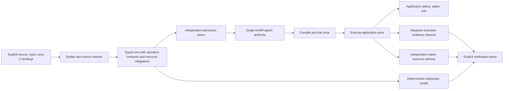

# M004 Architecture: Native Emission Ownership and Resource Discharge

**Project:** Codename Lang  
**Researched:** 2026-09-27  
**Scope:** Bounded native resource execution, public application execution, and the three NAT-09 successor families.  
**Evidence:** Direct source and archived-contract inspection; no tests executed during this research. External documentation confidence is **MEDIUM**, returned by `query classify-confidence --provider websearch --verified`.

## Recommended boundary

Keep the M004 milestone title and the completed Phase 21 archive. Deliver all three NAT-09 successors through the existing `emitProgram` authority, in a bounded sequence:

1. A public application route compiles once and executes once with explicit user input, explicit local C linkage, and a separate evidence channel. Establish an ordinary scalar application witness early.
2. An audited C adapter reads a bounded amount of a caller-selected file into a malloc-backed allocation. It transfers that live allocation to Lang. Lang uses it through a bounded borrow and invokes the paired release through generated cleanup. Establish this resource witness before final milestone closure.
3. Separate shared and exclusive read/copy-only pointer shapes become admissible without `restrict` or other additional alias attributes. Each retains its own contract, refusal controls, and actual macOS/Linux evidence.

The C adapter owns its internal file descriptor or stream and normalizes its IO errors. Lang owns the returned allocation. M004's cleanup claim concerns that allocation; it does not claim that Lang performs the adapter's internal file close. The allocation must remain live after the acquisition call returns and until Lang-generated cleanup calls its destructor.

Admit an infallible consuming release pair for this allocation. General fallible destructors, arbitrary file-handle ownership, loops, arithmetic, general resource aggregates, callbacks, retained pointers, unwinding, and broad FFI remain outside this boundary. All three successor families mean three explicitly bounded admissions, not blanket restoration of every old emitter capability.

## What exists today

| Area | Implemented behavior | Implication for M004 |
|---|---|---|
| Public C generation | `session.Phase16ControlNativeC` directly calls `cgen.EmitNative`; the fixture name cannot select another emitter. `emitProgram` refuses foreign blocks/contracts and both pointer classifiers. | Extend the one authority. Preserve refusals until the corresponding source shape and evidence exist. |
| Native resource output | `deriveProgramLiveResources` ignores the program and returns an empty collection. This matches the currently admitted resource-free subset. | Replace the resource-free assumption when a real acquisition is admitted. An empty collection is not a runtime ledger. |
| Historical foreign adapter | `_LANG_lang_res_open` mallocs and frees inside C, then returns a byte. | Its real allocation does not witness a live resource owned by Lang. Preserve the frozen adapter as historical evidence and introduce a separately scoped adapter. |
| Foreign interpreter | `OpForeignCall` copies its input value, prepares an error payload, and follows the success edge. A special nonlocal policy fabricates a later nonlocal exit. | Treat this as a semantic model. It is not IO or a foreign-call implementation. |
| Resource bookkeeping | Release-order validation and interpreter tracking are seeded from existing `OpRelease` operations; `discard` acquisitions are deliberately untracked. | Acquisition contracts must establish obligations independently of the cleanup that happens to be present. |
| Callee discharge | `peerCalleeFrameDrained` accepts a release somewhere in a function or a return reachable through a Move/Copy chain. Normal interpreter return pops a frame and binds a value. | New admitted resources need path-complete ownership state and explicit identity transfer across frames. |
| Foreign symbol binding | `checkResourceLifecycle` resolves its steps, then stores only the first symbol's contract on the function. | Bind each foreign operation to its own symbol/signature/ownership contract before admitting multiple real operations. |
| Public run | Session synthesizes Byte/Buffer inputs and runs interpretation, O0, and O3. The native runner parses stdout as one execution JSON document and rejects ordinary stderr. | Add application execution with explicit input and one execution. Verification replay must be an explicit operation over disposable inputs. |

### Code anchors

- [Sole session emission authority](../../../internal/compiler/session/session_phase5.go), `Phase16ControlNativeC`, line 24.
- [Native admission and resource assumptions](../../../internal/compiler/cgen/cgen_program.go), `deriveProgramLiveResources`, line 73; `emitProgram` refusal gates, lines 587–596; generated entry input, around line 877.
- [Frozen resource implementation](../../../native/lang_foreign_resource.c), `_LANG_lang_res_open`, line 49: release occurs at line 59 before return.
- [Foreign source lowering](../../../internal/compiler/check/check.go), `checkForeignTracer`, line 4012; `checkResourceLifecycle`, line 4433; discard exclusion, line 4521; first-symbol contract selection, line 4594.
- [Independent validation](../../../internal/compiler/corevalidate/corevalidate.go), `peerCalleeFrameDrained`, line 3147; `checkReleaseOrder`, line 3232.
- [Interpreter](../../../internal/compiler/interp/interp.go), `newBlockFrame`, around line 532; `OpRelease`/`OpForeignCall`, lines 958/962; ordinary callee return, around line 1040.
- [Direct failure-block test seam](../../../internal/compiler/interp/interptestdirect/interptestdirect.go), `RunLinearBlockDirect`, line 46. Its synthetic preceding acquisitions do not establish native entry-to-error execution.
- [Session execution](../../../internal/compiler/session/session.go), `interpreterInputs`, line 943; `runNative`, line 1039.
- [Native streams](../../../internal/compiler/native/native.go), stderr refusal, line 636; `decodeExecution`, line 782.
- [CLI shape](../../../cmd/lang/main.go), run dispatch, around line 89: current accepted invocation has no application argument channel.

Line numbers describe the inspected tree and may move during implementation.

## Component boundaries

| Component | Responsibility and owner | Boundary |
|---|---|---|
| Source contracts | `syntax`, `ast`, `check`, and ability derivation | Express the bounded foreign resource, owned acquisition, borrowed use, and paired consuming release. Produce source-level refusals for unsupported combinations. |
| Typed resource facts | `core` | Carry per-operation foreign binding, ownership mode, resource identity origin, release pairing, and admitted failure effects. Do not encode a host pointer as a semantic wire identity. |
| Independent admission | `corevalidate`, with `originvalidate` and `pathoracle` changes for affected facts | Re-derive ownership/alias/discharge obligations from core facts. Do not trust a checker-produced success flag or release list as the proof. Preserve acyclic scope and bounded work. |
| Model execution | `interp` | Implement resource identity and transfer state, ordinary error propagation, and a deterministic scripted foreign boundary for verification. Label this model evidence accurately. |
| Native lowering | `cgen` | Emit actual acquisition/use/release calls and the two bounded pointer ABIs through `emitProgram`. Preserve graph/admission/preflight ordering and fail before C serialization for unsupported shapes. |
| Application orchestration | `cmd/lang`, `session` | Accept explicit application input/linkage, choose application execution, and expose one run's streams and result. Keep differential replay in explicit verification paths. |
| Native build/run | `native` | Compile/link once, execute once, record target/compiler/binding provenance, and capture evidence separately from application streams. Resolve supplied local inputs without repository fixture-name dispatch. |
| Audited adapter | A new local C adapter and binding declaration | Own its internal file IO, return one live bounded allocation, expose bounded read-only use, and free the matching allocation on the declared release call. Preserve the old frozen fixture. |
| Evidence validation | `execution`, `executionpeer`, comparison/session lanes | Validate dynamic resource identities and observed transitions, compare defined axes, and reject incomplete evidence. Native resource observation provides an additional independent witness. |

Application and verification entry shells may differ in IO handling. They must share checked function-body lowering and resource semantics; an application route cannot introduce a second emitter law.

## Successor resource contract

The [Phase 21 contract](../../milestones/M004-phases/21-native-emission-ownership-and-resource-discharge-m004/21-RESOURCE-DISCHARGE-CONTRACT.json) says to discharge every acquired resource before returning ownership. This conflates destruction with transfer. The existing [core contract](../../../internal/compiler/core/core.go), `CalleeFrameNotDrained` documentation around line 792, already recognizes transfer to a caller as carrying the obligation outward.

Publish a successor contract with an explicit correction and a link to the archived contract. Retain Phase 21's completed contract-only evidence as historical evidence.

| Transition | Required semantics |
|---|---|
| Successful acquisition | Creates one live resource identity and one owner, with its declared release pair. |
| Failed acquisition | Creates no owned resource for this bounded adapter. Partial acquisition must be cleaned inside the adapter before it returns failure. |
| Move/return transfer | Changes the unique owner and preserves identity, liveness, and the release obligation. It invokes no destructor. |
| Shared/exclusive borrow | Grants bounded access while ownership remains with the owner. Borrowing never discharges the obligation. |
| Release | Calls the exact paired destructor for a currently owned resource, consumes the ownership, and prevents subsequent use or release. |
| Normal return | Releases locally owned resources that do not transfer through an admitted result, in reverse completion order. |
| Typed error propagation | Releases the current frame's non-transferred live resources before propagation; caller-owned resources retain their own obligations. |
| Defect/process termination | Remains outside the ordinary cleanup guarantee. A missing terminal evidence record cannot be recast as successful cleanup. |

### Ownership rules that must become explicit

- Seed obligations from successful acquisition semantics, never from existing `OpRelease` statements or divergent-edge shape alone. Omitting a release must leave an obligation that can be detected.
- Resource values are noncopyable. The historical Move/Copy reachability shortcut cannot authorize copying an owning handle.
- Identify a dynamic resource by acquisition operation plus activation identity. Repeated calls to the same callee must not share one ledger key. Keep identity stable across ownership transfers; do not expose raw addresses as portable identities.
- Reconcile ownership at each admitted return/error edge. A release somewhere else in the function is insufficient evidence for a path that skips it.
- A discarded owning success value still needs cleanup. In the first slice, refuse discarding an owning foreign result unless immediate consuming release is implemented and proved; never exempt it by syntax.
- Bind release identity, allocator family, foreign symbol, argument/return modes, and failure behavior per operation. A function-level first-symbol contract is insufficient for acquire/use/release.
- End relevant loans before release or ownership transfer. Preserve the separate source semantics of shared and exclusive borrows even when their conservative C representations are similar.
- Refuse an owning resource as the process entry result until an external ownership receiver is specified. A scalar entry result permits a meaningful zero-live-resources success condition.
- Resource payload admission remains bounded by the existing D-10-C01/D-10-C02/D-10-C04 prerequisites. Do not remove the blanket resource-payload refusal incidentally to make a fixture parse. Prefer explicit foreign success edges and a narrowly justified return form; if an owned `Result` payload is necessary, its complete affected ownership contract belongs in M004 scope explicitly.

### Cleanup failure

The initial release contract is an infallible consuming destructor over a valid matching allocation. Generic fallible implicit destructors are refused. Adapter file-read or close errors are normalized before ownership of the allocation is returned; the adapter must free any allocation it cannot return successfully.

A future fallible destructor needs a declared post-error ownership state, retry rule, primary-versus-cleanup error precedence, and behavior when multiple cleanups fail. An error result does not by itself mean the handle remains usable. C's `fclose` can report failure after disassociating the stream, whereas `free` returns no status. This distinction supports keeping M004's Lang-owned resource malloc-backed. [WG14 N1570, §§7.21.5.1 and 7.22.3.3](https://www.open-std.org/jtc1/sc22/wg14/www/docs/n1570.pdf).

## Conservative pointer admission

By-pointer representation does not require `restrict`. Lang's checker can enforce exclusive access while C receives an ordinary pointer. Adding an alias attribute asserts an additional optimizer contract; omitting it does not erase the language's ownership rules. LLVM documents distinct caller/callee obligations for `noalias`, including stronger return-value guarantees. [LLVM Language Reference](https://llvm.org/docs/LangRef.html#parameter-attributes).

Record a prospective amendment to D-16-07: M004 admits the exact supported read/copy-only shapes using ordinary pointers, with no added `restrict`, `noalias`, capture, alignment, or other unproved optimizer attributes. The old attribute-bearing probe remains an optimization-specific gate. This changes the lowering premise and preserves the separate macOS/Linux, alias, lifetime, discharge, and refusal obligations.

Shared and exclusive families require separate witnesses. Use types whose copy operation is valid; a pointer to a noncopyable owning resource cannot become a resource duplication path. Witnesses must inspect actual pointer-parameter C and execute it, so a by-value fallback cannot masquerade as pointer admission.

`EmitForeignManifest` currently reports `restrict` from the shape classifier ([cgen.go](../../../internal/compiler/cgen/cgen.go), around line 1076). On successor admission, emitted-attribute metadata must describe the actual chosen lowering. A non-empty justification string is not a proof that the emitted promise is sound.

### Admission and refusal matrix

| Shape | M004 disposition | Evidence or refusal boundary |
|---|---|---|
| Ordinary bounded foreign resource | Admit after executable gate | Real owned allocation, correct per-op binding, real destructor, normal and typed-error cleanup, explicit linkage/input. |
| Exclusive read/copy-only pointer helper | Admit after its own gate | Checked exclusive access; ordinary pointer ABI; valid lifetime; macOS and Linux; no additional alias attributes. |
| Shared read/copy-only pointer helper | Admit after its own gate | Checked shared access and alias contract; independent witness; ordinary pointer ABI; macOS and Linux. |
| Pointee mutation, multiple pointer arguments, pointer escape/forwarding | Refuse in these pointer successor shapes | Exact source/core structural fence before serialization. The resource adapter's explicitly contracted borrowed-use operation is a separate bounded FFI contract. |
| Callback, retention, volatile/atomic access, concurrency | Refuse | No implicit widening from read/copy evidence. |
| Foreign unwind, `longjmp`/nonlocal transfer, cancellation | Refuse | A process-root observation hook is not a cleanup or safe-unwind proof. |
| Resource copy, unmatched destructor, use/release after transfer or release | Refuse | Independent source/core ownership validation and negative witnesses. |
| General fallible destructor, partial initialization, owning aggregate/payload | Refuse unless separately and explicitly admitted | Do not inherit admission from a successful simple allocation witness. |
| Loops, arithmetic, generic separate compilation | Outside M004 | Preserve current refusal; iteration requires the recorded path-oracle successor spike. Explicit local C linkage does not imply a module system. |

## Public execution and usable IO

Deliver an early scalar application witness through the public command: explicit caller input changes the result; source compiles once; the application runs once; stdout/stderr and exit behavior are observable; evidence has its own channel. This proves the application boundary before resource semantics depend on it.

Then deliver the bounded allocation witness through that same route:

1. Caller provides a bounded path/input and explicit local adapter linkage.
2. Audited C performs bounded file IO and returns a live allocation, or a typed failure with no transferred allocation.
3. Lang owns the allocation, calls its bounded use operation, and produces a scalar result determined by actual file content.
4. Lang-generated cleanup invokes the paired release on normal return and after a genuinely failing later operation.
5. Independent native observation establishes resource lifetime and release before process termination.

The C adapter must not hardcode the file, hide the claimed allocation's entire lifetime inside one call, return only a canned byte, or choose behavior from the fixture name. A small prefix/first-byte example is sufficient; a checksum loop is unnecessary for this milestone.

A normal application run must not replay IO through O0/O3 or run an interpreter as a prerequisite. Verification can run the model and native variants against explicit deterministic inputs in isolated disposable contexts. Compilation may be cached if all build inputs are accounted for; runtime effects must not be skipped because a previous execution was cached.

Local C linkage must be explicitly supplied and reviewable, with bounded declarations and recorded source/header/compiler/target identity. Resolve every referenced operation's binding. Keep external code outside the language's proof claim: a checked declaration does not prove arbitrary C obeys it. Rust's FFI documentation similarly makes correct declarations and foreign behavior part of the unsafe boundary. [Rustonomicon FFI](https://doc.rust-lang.org/nomicon/ffi.html#calling-foreign-functions).

Replace the general-use dependence on `runtime.Caller` locating repository fixtures ([foreign_resource.go](../../../internal/compiler/native/foreign_resource.go), line 19). Preserve that mechanism only where historical fixture tooling requires it. Explicit application inputs must work after checkout relocation.

## Runtime evidence that earns the claim

Compiler events and a compiler-maintained ledger are useful semantic observations. They do not independently establish that a real release happened. Add a separately implemented native observer around actual allocations, uses, and destructor calls, plus sanitizer evidence where supported. Verify outstanding resources before process exit so OS reclamation cannot hide a leak.

| Positive witness | Seeded negative witness |
|---|---|
| Acquired allocation is still usable after a Lang callee returns; its caller releases it once | Release on the transfer boundary while preserving reported events; observe premature release/use-after-free. |
| A, B, C succeed and their real destructors run C, B, A | Swap actual destructor calls while retaining the original compiler event order. |
| B really fails after A succeeds; A is released before error propagation | Omit only A's real release while leaving ledger/event updates intact. |
| A repeated callee creates distinct resources and transfers each correctly | Collapse resource identities or attribute a release to the other activation. |
| Two caller-created input files yield independently expected different results | Substitute a canned result or ignore supplied input. |
| Native-side observation sees no outstanding allocations before successful completion | Keep `resource.released` JSON but omit the actual destructor; independently observe the outstanding allocation and use leak detection where available. |
| Actual pointer-parameter C runs within each admitted alias/lifetime contract | Mutate source/core to escape, forward, mutate, or conflict with the supported loan, and require refusal before serialization. |

Error injection must occur at the real adapter boundary and enter through the ordinary generated application entry. Directly invoking a cleanup block establishes a narrower fact. Record the mutation target and confirm it was reached; a dead error-path mutation cannot count as an exercised cleanup control.

Mutation of an observer must also be distinguishable from mutation of the emitter. No single self-report is a complete oracle. ASan detects some misuse; leak detection and independent allocation accounting answer different questions. Missing tools or lanes remain unavailable evidence, never pass results.

For each admitted family, run the applicable native optimization/sanitizer lanes on macOS and Linux with compiler, target, C/adapter digests, input, result, and command provenance. Cross-host evidence means native execution on both hosts. A cross-compile alone is insufficient. Retain target-derived layout/conformance checks and avoid encoding current Apple arm64 pointer facts into portable core or evidence.

O0/O3/LTO semantic agreement is a bounded result for named fixtures and toolchains. It does not prove optimizer inactivity, useful optimization, or soundness for unsupported shapes. Preserve Phase 21's one-TU measurement scope; a separately linked C adapter introduces a different evidence boundary.

## Dependency and phase recommendations

Use the existing Go standard-library Stage 0 and installed Clang C17 path. No new framework, tracing heap, general runtime, or package manager is needed. Favor one small audited C adapter with an explicit resource pair.

| Boundary | Concrete deliverable | Dependency/technical ownership |
|---|---|---|
| Early application boundary | Public scalar application with real input, compile once/run once, separate evidence | `cmd/lang`, `session`, `native`, and entry-shell support in `cgen`. Preserve existing verification behavior under an explicit verification route. |
| Executable resource spine | Successor contract plus real bounded acquisition/use/release and an actual error after acquisition, through the public route | Source contracts, abilities, `core`, independent validators, interpreter model, adapter, and `emitProgram` evolve as one vertical slice. |
| Calls and transfer | Live allocation crosses a Lang return; caller uses/releases it; errors clean each owning frame; repeated activations preserve identity | Build on acquisition-based state. Include the affected `OpCall` failure/return contract and evidence peer changes explicitly. |
| Two pointer successors | Separate shared/exclusive read-copy pointer admissions without added alias attributes | Prospective D-16-07 amendment, independent family witnesses, exact refusal fences, actual macOS/Linux evidence. |
| Closure | Public bounded file-read example, cross-host receipts, active debt mapping, truthful claim inventory | Closure collects evidence already produced by earlier executable slices; it must not be the first product or resource execution. |

Source syntax for the bounded acquisition/use/return form must be settled with constructible refused frontier fixtures before implementation planning. Existing own-parameter-only foreign calls, singular contracts, and resource-payload refusals are real dependencies. Do not hide those changes inside an emitter-only task.

## NAT-09 reconciliation

Preserve the completed M003 NAT-09 cut, its historical `cut-m004` rationale, and Phase 21's completed contract-only work. Add an active M004 successor mapping:

| Historical family | Active M004 responsibility | Completion condition |
|---|---|---|
| D-16-11 / `emitLinearForeign` | Real bounded foreign resource admission through `emitProgram` | Public actual allocation/use/release, native normal/error paths, ownership transfer, independent physical evidence. |
| D-16-12 / `emitLinearBorrowedByPointer` | Exclusive read-copy successor using ordinary C pointers | Its alias/lifetime/discharge proof, separate macOS/Linux witnesses, and precise unsupported-shape fence. |
| D-16-13 / `emitLinearBorrowedByPointerPlain` | Shared read-copy successor using ordinary C pointers | Its own shared-alias proof, separate macOS/Linux witnesses, and precise unsupported-shape fence. |

Do not rename these as new debt to reset their history. Do not resurrect the retired functions as alternative emitters. Record the prospective D-16-07 amendment and its evidence: pointer representation and optimizer alias promises can be separated, while the source and cross-host contracts remain required. If a mandatory host lane is unavailable, the affected admission remains incomplete; document refresh cannot close it.

Historical references: [M003 NAT-09 amendment](../../milestones/M003-REQUIREMENTS.md), [Phase 16 debt](../../milestones/M003-phases/16-branch-match-emitter-port/PHASE-16-DEBT.md), [Phase 16 decisions](../../milestones/M003-phases/16-branch-match-emitter-port/16-CONTEXT.md), [Phase 21 context](../../milestones/M004-phases/21-native-emission-ownership-and-resource-discharge-m004/21-CONTEXT.md), and [Phase 21 verification](../../milestones/M004-phases/21-native-emission-ownership-and-resource-discharge-m004/21-VERIFICATION.md).

## Alternatives considered

| Alternative | Assessment |
|---|---|
| Ordinary foreign family only | Most valuable first slice, but insufficient final scope for the adopted three-family M004. It would require an explicit new disposition for the two pointer debts. |
| All historical foreign/pointer behavior restored | Too broad. It would reopen nonlocal behavior, optimizer promises, and shape assumptions without the corresponding contracts or witnesses. |
| Computation before resource/application execution | Leaves the public synthetic execution boundary and NAT-09 obligations unresolved. Loops add a separate oracle redesign dependency. |
| Mandatory `restrict` for exclusive borrows | Couples valid language ownership to an optional backend optimization claim. Conservative lowering permits useful admission while preserving a future attribute gate. |
| Lang-owned raw file handle and generic fallible close | Introduces ownership-after-failure and retry semantics beyond the bounded allocation proof. The adapter can own its internal file resource while Lang owns the returned buffer. |
| More compiler-generated release events | Improves observability but cannot establish actual destruction independently. Physical native effects and preserved-event omission controls are required. |

## Research limits

No execution claims in this document come from a new test run. Code findings reflect the inspected tree; proposed behavior is requirement guidance. The fetched WG14 document is N1570, a C11 committee draft and the reference already used by the archive. A fetch of the C17 draft failed; do not describe N1570 as a newly fetched C17 standard. The current LLVM and Rust documentation was checked as primary technical precedent. Neither defines Lang's language semantics.

The remaining design questions are bounded: exact source spelling and representation of the noncopyable handle; the narrow input/evidence transport; the foreign error representation across `OpCall`; and whether a required owning result needs a limited payload admission. Resolve them during the executable slice's contract work, with source fixtures demonstrating the intended public use before implementation begins.
